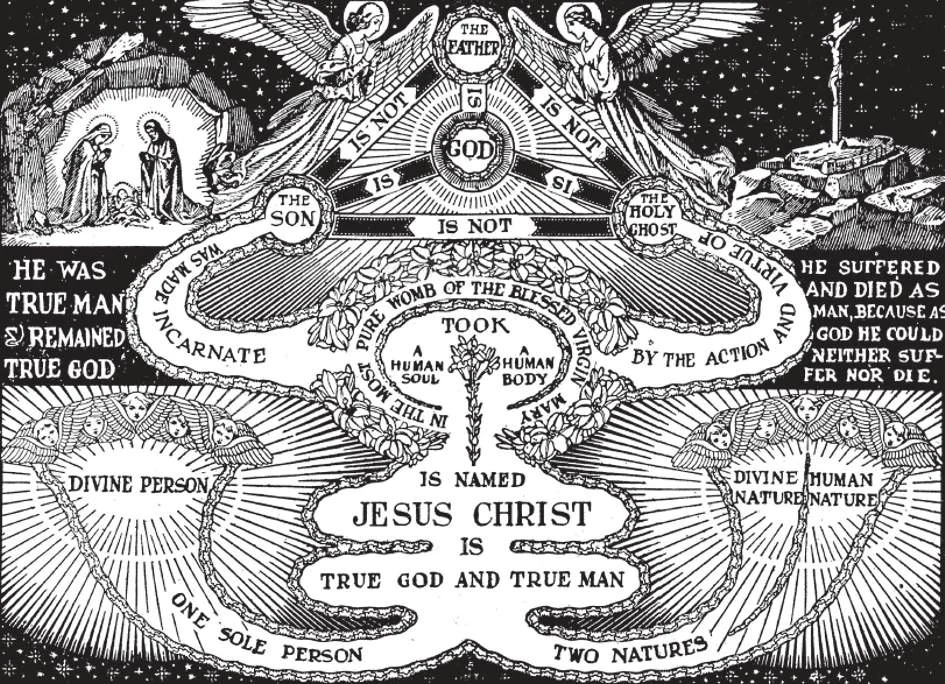

# 29. Our Lord Jesus Christ

*Our Lord Jesus Christ is true God and true Man. As God, He is equal with the Father and the Holy Ghost. He is infinite, almighty, eternal. As man, He has a body and soul like ours. Jesus Christ has two natures which cannot be separated, but which are distinct: the human, and the divine. But He is only one Person - the Divine Person. Jesus Christ is not a human Person.*

**Is Jesus Christ more than one Person?**

— No, Jesus Christ is only one Person; and that Person is the second Person of the Blessed Trinity.

> Throughout the Gospels, we can read about Jesus Christ as only one Person; eating, sleeping, talking, and dying, as only one Person.

1. A "person" is a being that is intelligent and free, and responsible for his actions. We attribute to him whatever good or evil he does in the use of his human powers, because he owns or controls those powers.

> I am a human person, and everything I do is done by a human person. But Christ is a Divine Person, since He is God. Whatever Jesus Christ did while He was on earth was of infinite dignity, since it was the work of a Divine Person.

2. Jesus Christ is Our Lord, the Son of God the Second Person of the Blessed Trinity, true God and true Man. We call Him "Our Lord" because as God He is Lord and Master of all, and as our Saviour He redeemed us with His Blood.

> Christ is our Creator, Redeemer, Lawgiver. Teacher, and judge. All these we mean when we say Our Lord. St. Paul says: "He is the Blessed and only Sovereign, the King of kings and Lord of lords ... to whom be honour and everlasting dominion. Amen" (1 Tim. 6:15,16).

3. There is only one Person, the Divine Person, in Jesus Christ. Jesus Christ is not a human person. Everything in Him even as Man is divine and worthy of adoration.

> When we adore the Sacred Heart, or the Precious Blood, we do not adore mere flesh, but the flesh united to the divinity. In Christ, the human and the divine are inseparable.

**How many natures has Jesus Christ?**

— Jesus Christ has two natures: the nature of God and the nature of man.

1. A "nature" is a substance that is complete in itself as a source of activity. It differs from "person" in that while "person" determines what an individual is, "nature" determines what an individual can do.

> In Jesus Christ Our Lord there are two natures: His divine and His human nature. Therefore He could and did act as God; He could and did act as man, while all the time He was God the Son.

2. Because of His Divine nature, Christ is truly God; because of His human nature, He is truly man. In His Divine nature He is the Second Person of the Blessed Trinity, God the Son, the Eternal Word. He took His human nature from His Mother.

> It was to the Blessed Virgin that the Archangel Gabriel announced: "And behold, thou shalt conceive in thy womb and shalt bring forth a son; and thou shalt call his name Jesus. He shall be great and shall be called the Son of the Most High" (Luke 1:32).

Therefore Jesus Christ is both God and man; He has both Divine and human powers; He has knowledge, can will and act as God and as man. For example, with His human nature Jesus worked, ate, spoke, felt pain. But it was His divine nature that enabled Him to become transfigured, walk on the waters, raise the dead.

3. These two natures were united in a Divine Person Jesus Christ, the God-Man. They were intimately united, but they remained distinct. Neither was absorbed by the other. When iron and gold are welded into one solid mass, they continue to retain all their individual properties distinct from each other. The union of the divine and human natures in Christ is called the hypostatic union.

> Christ is true God and true man; this is why we call Him God-Man. Beings obtain their nature from their origin; for this reason a child has a human nature, from its human parents. Jesus Christ, the Second Person of the Blessed Trinity, has His origin from God the Father, and hence He has a divine nature; more-over, as man He was born of the Blessed Virgin Mary, and thus His human nature. This is why Christ often referred to Himself indiscriminately as "Son of God" or "Son of Man".

4. As a consequence of these two natures, Christ had also two wills.

> We can see this very clearly in His prayer in the Garden of Olives before His Passion. He said: "Nevertheless, not My will, but Thine be done." He was referring to His human will, for His divine will was surely the same as His Father's.

**What does the name Jesus mean?**

— The name Jesus means Saviour or Redeemer.

1. Our Lord is called Jesus because He came to save men from sin, and to open the doors of heaven to them.

> Before the birth of Our Lord, an angel appeared to St. Joseph and said: "Thou shalt call His name Jesus" (Matt. 1:21). At the Annunciation the angel Gabriel had spoken the same words to Mary. "After eight days were accomplished, that the child should be circumcised, His name was called Jesus" (Luke 2:21).

2. We should say the name of Our Lord with great reverence. We should bow our head every time we utter it.

> "In the name of Jesus every knee should bow, of those that are in heaven, on earth, and under the earth" (Phil. 2:10). The symbol IHS is composed of the first three letters of the name Jesus in Greek.

**What does the name Christ mean?**

— The name Christ means "The Anointed One".

1. "Christ" is a Greek word, with the same meaning as "Messias". In the Old Law, it was the custom to anoint with oil prophets, high priests, and kings.

> Our Lord is the greatest of the Prophets. He is the High Priest Who offers Himself for all mankind. He is the King of angels and men. Therefore it is fitting that we should call Him Christ. He truly is the Anointed One.

2. We are called Christians because we are disciples of Christ. We believe in His teachings, and obey His commandments. The followers of Christ were first called Christians at Antioch.

> Those who deny the doctrines of Christ, especially His divinity, are not Christians. Unfortunately, many today are Christians only in name.

3. Jesus Christ was announced to the world through many types. By "types" we mean persons or actions which strongly suggested or foreshadowed Christ. "Types" are to the reality what a photograph is to the actual person; but for lack of the reality, types are a good substitute, to give an idea of the substance foreshadowed.

> Some of the types of Jesus Christ were: the gentle and just Abel, who was murdered by his brother; Noe, who alone persevered and saved the human race from extinction by his justice; Isaac, who willingly carried the wood on which he was to have been sacrificed; Joseph, who was sold for a few pieces of silver, but later saved his brethren from death; Moses, who freed the Jews from slavery and led them to the Promised Land; David, who was born poor, did great deeds for his people, and became King.
