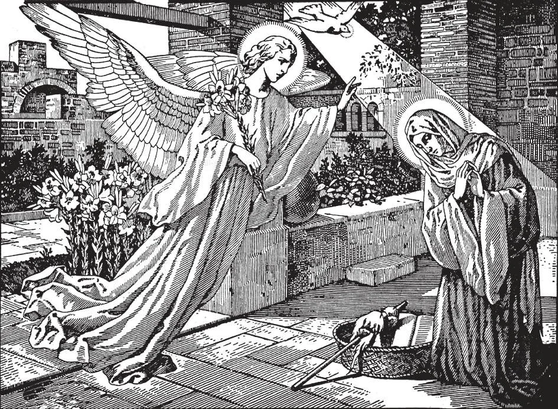

# 30. The Incarnation

"Now in the sixth month the angel Gabriel was sent from God to a town of Galilee called Nazareth, to a virgin betrothed to a man named Joseph, of the house of David, and the virgin's name was Mary. And when the angel had come to, her, he said, 'Hail, full of grace, the Lord is with thee. Blessed art thou among women.'When she had seen him she was troubled at his word, and kept pondering what manner of greeting this might be. And the angel said to her, 'Do not be afraid, Mary, for thou hast found grace with God. And behold, thou shalt conceive in thy womb and shalt bring forth a son; and thou shalt call his name Jesus'" (Luke 1: 26-31).

(THIRD ARTICLE OF THE APOSTLES' CREED)

**What is meant by the Incarnation?**

— By the Incarnation is meant that the Son of God, retaining His Divine nature, took to Himself a human nature, that is, a body and soul like ours. 1. The Incarnation is the greatest act of humility possible. By it the Son of God, eternal, almighty, infinite, voluntarily took upon Himself human nature with its weaknesses. He circumscribed Himself with a human body that would feel sickness and pain, and with a human soul that would cause Him agony.

> Incarnation means "becoming flesh". Thus the Son of God took a human body and soul and united it to His divine Person. Without ceasing to be God, the Second Person of the Blessed Trinity became man at the same time. The divine nature of Christ is from all eternity. Only His human nature began at the Incarnation.

2. By virtue of the Incarnation Jesus Christ came to earth. This is a mystery which we can never fully understand, but must be content to honour and adore.

> "The Word was made flesh and dwelt among us" (John 1: 14). Christ as man was like us in all things except sin. He could not sin, because He is God. But in all other things He was like us: he had a human body, a human soul, a human will. Can we understand this with our reason? Hardly. As St. John Chrysostom said: "I know that the Son of Gad became man. but how, I do not know." God, Who produced the universe from nothing, also caused the Incarnation.

## The Incarnation

**How was the Son of God made man?**

— The Son of God was conceived and made man by the power of the Holy Ghost, in the womb of the Blessed Virgin Mary.

> The Three persons of God cooperated in the Incarnation, but only the Second Person took on flesh: only He took to Himself a human nature.

1. The Incarnation is peculiarly the work of the Blessed Trinity. They formed a human soul and a human body, and these they united to the Second Person of the Blessed Trinity: the result was Our Lord Jesus Christ, God-Man.

> To the power of the Holy Ghost we attribute the Incarnation, because the Third Person of the Blessed Trinity peculiarly expresses the Spirit of Love: and the Incarnation is the supreme example of God's love for men.

2. It was fitting that God the Son should become incarnate, rather than the Father or the Holy Ghost; for the Son proceeds from the Father, and could be sent by Him.

> God the Son then could, as the fruit of His Redemption, send God the Holy Ghost. Thus through the Son of God we became adopted sons of God.

**When was the Son of God conceived and made man?**

— The Son of God was conceived and made man on Annunciation Day, the day on which the Angel Gabriel announced to the Blessed Virgin Mary that she was to be the Mother of God. 1. In Nazareth of Galilee lived the Blessed Virgin Mary. One day the Archangel Gabriel appeared to her and said: "Hail, full of grace, the Lord is with thee: blessed art thou among women" (Luke 1: 28).

> Mary was surprised. The angel said: "Do not be afraid, Mary, for thou hast found grace with God. And behold, thou shalt conceive in thy womb, and shalt bring forth a Son: and thou shalt call His name Jesus." This event is called the Annunciation commemorated by the feast on March 25.

2. Mary knew that the angel was sent by God. She answered: "Behold the handmaid of the Lord: be it done to me according to thy word" (Luke 1: 38)

> At these words of the Blessed Virgin, Jesus Christ became man in her womb, and the incarnation was accomplished.

3. The mystery of the Incarnation is commemorated daily by the Angelus, prayer said by Catholics morning, noon, and night, at the ringing of the Angelus bell.

> The Angelus bell is rung in a particular way: at the verse, it is sounded three times: a pause follows while the Hail Mary is recited. "This procedure is repeated three times for the three verses and three Hail Marys. Then follows continual ringing while the Prayer is said. During the Easter time, the prayer Regina Coeli (Queen of Heaven) is substituted for the Angelus. Those who do not know these prayers by heart, or who cannot read, may say five Hail Marys instead.

**Did Jesus Christ have human parents?**

— Jesus Christ had a human mother, the Blessed Virgin Mary, but He had no human father. 1. The Blessed Virgin was Christ's mother as man, but not as God.

> However, the Blessed virgin is truly the Mother of God, because the humanity and divinity of her Son are inseparable. In a similar way we call our parents mother and father, although they only gave us our body, and not our soul.

2. Christ had no human father. The Blessed Virgin remained a virgin all her life. The conception of Our Lord is a great miracle and a mystery that we cannot understand. We can only accept it as true on the word of God, Who is almighty.

> St. Joseph was the legal spouse of Mary, but both of them preserved their virginity, consecrating it to God. They always lived together as brother and sister. St. Joseph was only the guardian or foster father of Our Lord.

3. We should honour and love Saint Joseph, because Our Lord honoured and loved him. Holy Scripture calls him a just man. He was a most pure man; and this is why God selected him as the virgin spouse of Mary, to care for her and the Child Jesus.

> Jesus loved St. Joseph and obeyed his slightest wish. Mary even called Joseph the father of Jesus.

4. It seems that Saint Joseph was born in Bethlehem of Judea. But at the time of the Annunciation, he and Mary were living in Nazareth of Galilee. He was a carpenter. It appears that he died before the beginning of Christ's public life.

> The memory of Saint Joseph was venerated from the very earliest centuries. In 1870, Pope Pius IX declared Saint Joseph Patron of the Church. He is also patron of a happy death. We should invoke his protection often. His feast, kept on March 19, has been celebrated since the 15th century.
