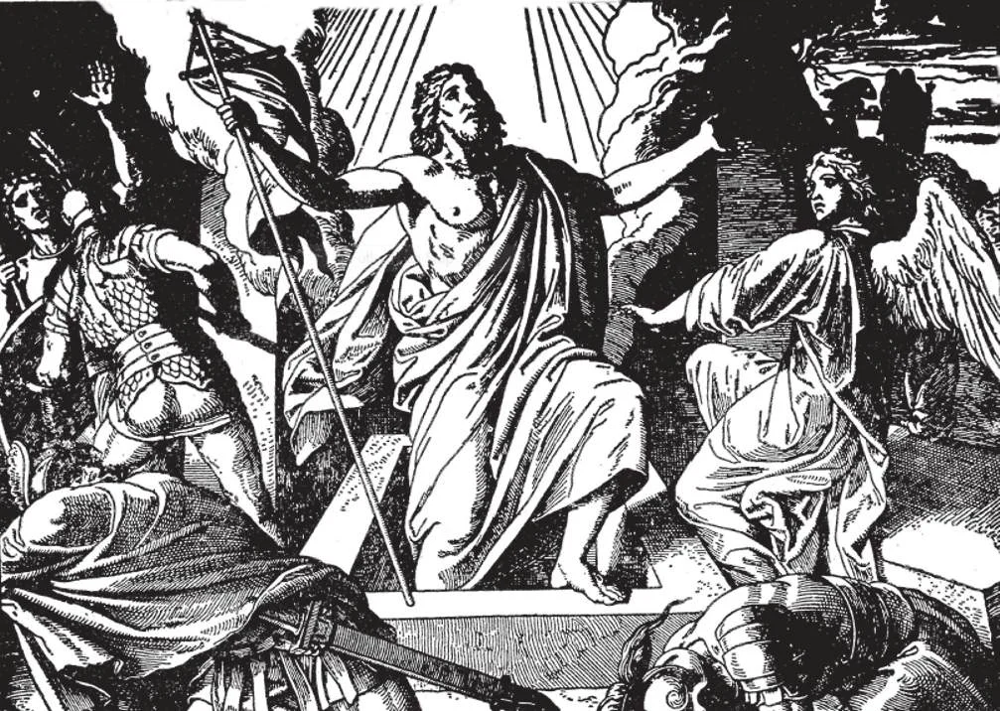

# 36. The Resurrection

"Now late in the night of the Sabbath, as it began to dawn towards the first day of the week, Mary Magdalene and the other Mary come to see the sepulchre. And behold, there was a great earthquake; for an angel of the Lord came down from heaven, and drawing near rolled back the stone, and sat upon it. His countenance was like lightning, and his raiment like snow. And for fear of him the guards were terrified, and became like dead men. But the angel spoke and said to the women; Do not be afraid; for I know that you seek Jesus, who was crucified. He is not here, for he has risen even as he said. Come, see the place where the Lord was laid'" (Matt. 28: 1-7).

(FIFTH ARTICLE OF THE APOSTLES' CREED)

**What do we mean when we say in the Apostles' Creed that Christ descended into hell?**

— When we say that Christ descended into hell, we mean that, after He died, the soul of Christ descended into a place or state of rest, called limbo, where the souls of the just were waiting for Him. 1. Christ did not go to the hell of the damned, but to the "hell" of the just. In Holy Scripture, it was called "Abraham's bosom". St. Peter called it "a prison". We call it limbo.

> Among the souls in limbo were Adam, Eve, Abel, Noe, Abraham, Isaac, Jacob; Joseph, David, Isaias, Daniel, Job, Tobias, St. Joseph, and St. John the Baptist. They went to heaven at Our Lord's entrance upon His Ascension.

2. Christ went to limbo to announce to the souls waiting there the joyful news that He had reopened heaven to mankind.

> "He was brought to life in the spirit, in which also he went and preached to those spirits that were in prison" (1 Pet. 3: 19). The souls in limbo could not go to heaven, which had been closed by Adam's sin. It was only reopened to man by the death of Our Lord, by the Redemption. The souls in limbo did not suffer pain, but they longed for heaven. After the release of these souls from Limbo, and their entrance into heaven, this Limbo for the just souls ceased to exist.

3. While His soul was in limbo, Christ's body was in the holy sepulchre. When man dies, his soul is separated from the body. When Jesus died, His body and soul were separated, but His divinity remained united to both body and soul.

> Christ's body did not corrupt in the tomb. It was in the holy sepulchre from Friday evening when He was buried, to Sunday morning, when He arose from the grave. This is why we say Christ rose on the third day, although He was in the grave for only three incomplete days.

**When did Christ rise from the dead?**

— Christ rose from the dead, glorious and immortal, on Easter Sunday, the third day after His death. 1. Christ had often foretold His resurrection.

> He said of His own body; "Destroy this temple, and in three days I will raise it up" (John 2: 19). Before entering Jerusalem He said to His Apostles that He would be put to death and "rise again on the third day" (Matt. 20: 19). On the night of the Last Supper He said: "But after I have risen, I will go before you into Galilee" (Matt. 26: 32).

2. Even His enemies knew that He had predicted His resurrection. This is why they obtained Pilate's permission to seal the sepulchre and set guards to watch it.

> They said to Pilate: "Sir, we have remembered how that deceiver said, while he was yet alive. 'After three days I will rise again'" (Matt. 27: 63).

3. Today the entire Christendom celebrates Easter Sunday in memory of the Resurrection. It is the Feast of feasts, commemorating the completion of our redemption by Christ.

> Easter is celebrated on the first Sunday following the first full moon of spring; the feast therefore is moveable, and can fall between March 22 and April 25, The Paschal season lasts till Trinity Sunday; till then the joyous alleluia resounds.

**Why did Christ remain on earth forty days after His Resurrection?**

— Christ remained on earth forty days after His Resurrection to prove that He had truly risen from the dead, and to complete the instruction of the Apostles. 1. Christ's resurrection is an undoubted fact on which rests the Christian faith.

> St. Paul says: "If Christ has not risen,"vain then is our preaching, vain too is your faith" (1 Cor. 15: 14). And according to St. John, an eyewitness: "Many other signs also Jesus worked in the sight of his disciples, which are not written in this book. But these are written, that you may believe that Jesus is the Christ, the Son of God" (John 20: 30-31)

2. In the first place, Christ really died. His death was witnessed by many, both friends and enemies. It was proved by the soldier who plunged his spear into His side. It was communicated officially to Pilate. His bones were not broken, because He was found already dead. His Mother and disciples would never have buried Him had they suspected the least chance of life.

> Some unbelievers urge that Christ was dead only in appearance and after an interval recovered from His swoon and left the grave. The loss of blood following the scourging alone would have been enough to cause death, not to mention the wounds He received on the cross.

3. In the second place, Christ really came to life. On the first Easter morning, He appeared to Mary Magdalen and the other women who sought Him at the sepulchre. Then He appeared to Peter. In the evening He walked with two disciples on the road to Emmaus. At night, He appeared to the assembled Apostles.

> Nor were these witnesses easily deceived. The Apostles did not at first believe the women who told them the Lord had risen. They would not even believe their own senses, thinking the risen Saviour was a ghost. Christ had to call for something to eat, to prove that He was not a ghost. St. Thomas refused to believe the other ten Apostles, who had seen Christ first. He only believed when Our Lord appeared to him and bade him touch His wounds.

4. The Jews bribed the guards to say that while they were asleep, the disciples had stolen the body of Christ.

> Such an act was made impossible by Christ's enemies themselves. They had sealed and guarded the tomb. "So they went and made the sepulchre secure, sealing the stone, and setting the guard" (Matt. 27: 66). Even supposing the guards to have fallen asleep, the great stone which covered the sepulchre could not have been moved without waking some at least of the guards. Finally, it is a remarkable circumstance that the guards were not punished for this breach of duty.

5. Christ really arose from the dead. For forty days, He appeared to many. He conversed, walked, and even ate with them. He spent much time instructing the Apostles.

> One of His most important appearances was to five hundred disciples on a mountain in Galilee, when He gave the Apostles the command to go forth into the world and teach. The Evangelists have recorded nine apparitions: but it is evident from their writings (for example, Acts 1: 3) that there were other and un- recorded occasions when Christ appeared. Countless of Christ's followers laid down their lives in testimony of the truth of the resurrection. "During forty days appearing to them, and speaking of the kingdom of God" (Acts 1: 3).
