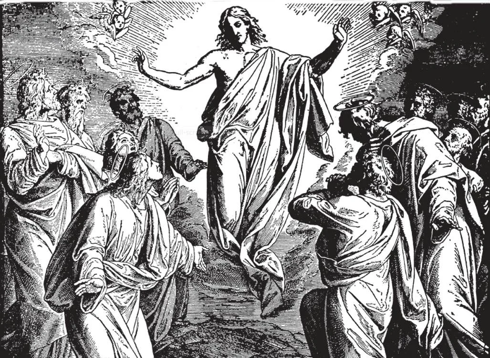

# 37. The Ascension

On Mount Olivet, a hill outside Jerusalem, forty days after His Resurrection, Our Lord spoke to the disciples, telling them how the Holy Ghost would descend upon them. "And when He had said this, he was lifted up before their eyes, and a cloud took him out of their sight, And while they were gazing up to heaven as he went, behold, two men stood by them in white garments, and said to them, 'Men of Galilee, why do you stand looking up to heaven? This Jesus who has been taken from you into heaven, will come in the same way as you have seen him going up to heaven'" (Acts 1: 9-11).

(SIXTH ARTICLE OF THE APOSTLES' CREED)

**Why did Christ rise from the dead?**

—Christ rose from the dead to show that He is true God, and to teach us that we, too, shall rise from the dead. 1. The Resurrection is the most important of Christ's miracles. He Himself chose it as the most conclusive proof of His divine mission; the Apostles appealed to it to confirm their teachings. The fact of the Resurrection, by itself alone, proves Christ is God.

> Christ said repeatedly that He is the Son of God; He said He would rise again from the grave. He did rise, unaided, by His own almighty power; therefore He is as He said, the Son of God. If He were an impostor, God would not have permitted Him to rise again. "But take courage; I have overcome the world" (John 16: 33).

2. Christ bore on His body the marks of the five wounds. The qualities of His risen body were:

> a. Agility. It could go with the quickness of thought to all places. b. Subtility or spirituality. It was free from hunger, thirst, fatigue, and other needs. It could penetrate material substances. c. Clarity or brightness. It shone with splendour. d. Impassibility. It was immune to pain, disease, and death.

3. We are fortunate in having today for veneration a number of relics of the Passion.

> The tablet with the inscription "I.N.R.I." is in the Basilica of the Holy Cross in Rome. One nail is said to have been thrown by St. Helena into the Adriatic to calm a storm; another is in the iron crown of the Lombards. Veronica's towel is in Rome. Part of the pillar of the scourging is at Rome, part in Jerusalem. The winding sheets are in Turin, and in Cadonin, France. Of the crown of thorns, part is in Paris, part in Toulouse. All these remind us of the time when "they entreated Him to let them touch but the tassel of His cloak" (Matt. 14: 36).

**Will all men rise from the dead?**

—All men will rise from the dead, but only those who have been faithful to Christ will share in His glory. 1. Like Christ, we, too, shall rise from the dead on the Last Day, and our bodies will be reunited with our souls.

> "He who raised up Jesus will raise us up also with Jesus" (2 Cor. 4: 14). "As Christ has arisen from the dead through the glory of the Father, so we also may walk in newness of life" (Rom. 6: 4).

2. Those who have been faithful to Christ will be rewarded with the glory of heaven; those that have been unfaithful will be punished in the depths of hell.

> "If you have risen with Christ, Seek the things that are above, ... not the things that are on earth." The rewards are given only to the faithful.

**When did Christ ascend into heaven?**

—Christ ascended, body and soul, into heaven on Ascension day, forty days after His Resurrection. 1. The Ascension took place from the Mount of Olives. Christ's Apostles and disciples were present. It was full daylight.

> He gave His followers His last instructions. Then He raised His hands and blessed them. He told them to preach the Gospel to all nations, and promised to be with them to the end of the world.

2. While all looked on, He was raised up, by His own power, and a cloud received Him out of their sight.

> "Now he led them out towards Bethany, and... was carried up into heaven" (Luke 24: 50 - 51).

3. The disciples returned to Jerusalem with great joy. Their Master had returned to heaven in glory, and His arrival there had opened to His followers the heavenly gates.

> He had earned for men infinite grace, so that they were now able to attain the friendship of God Himself. Christ the King had gone home to prepare a place for men in heaven (John 14: 16; 2 Cor. 1: 7). We celebrate the feast of the Ascension forty days after Easter, on Ascension Thursday.

**What do we mean when we say that Christ sits at the right hand of God, the Father Almighty?**

—When we say that Christ sits at the right hand of God, the Father Almighty, we mean that Our Lord as God is equal to the Father, and that as man He shares above all the saints in the glory of His Father, and exercises for all eternity the supreme authority of a King over all creatures. 1. Christ as God is equal to the Father in all things. But even as man Christ is only next to God. Of Himself, Christ has dominion over all creation, his authority resting on the union of His divine and human natures in the Person of the Son of God.

> He is above all the angels and saints. To sit at the right hand of anybody is a mark of honour from that person. "Sit Thou at My right hand, until I make Thy enemies Thy footstool" (Ps. 109: 1,2).

2. Christ ascended into heaven in order:

> a. To enter into the glory He had merited. b. To send down the Holy Ghost on His Church. c. To be our intercessor with the Father. d. To prepare a place for us in heaven.

**What do we mean when we say that Christ will come from thence to judge the living and the dead?**

— When we say that Christ will come from thence to judge the living and the dead, we mean that on the last day Our Lord will come to pronounce a sentence of eternal reward or of eternal punishment on every one who has ever lived in this world. (Seventh Article of the Apostles' Creed: see Chapter 81 on General Judgement) 1. Jesus Christ will be our Supreme Judge because He is "King of kings and Lord of lords" (Apoc. 17: 14).

> "For the Son of Man is to come with his angels in the glory of his Father and then he will render to everyone according to his conduct" (Matt. 16: 27).

2. Christ's teaching has changed the face of the earth. One poor young man, teaching for three years in the hills and valleys of Galilee, and dying a shameful death, has brought light, love, peace, and hope into men's lives, even the lowliest.

> Before Christ, the world was the abode of sin and vice, idolatry, polygamy, divorce, and slavery. However, the world today, although reformed by Christianity, is far from perfect. This is because many refuse to obey the teachings of Christ. It is our duty to make Christ better known and loved, so that all may "seek first the kingdom of God."
