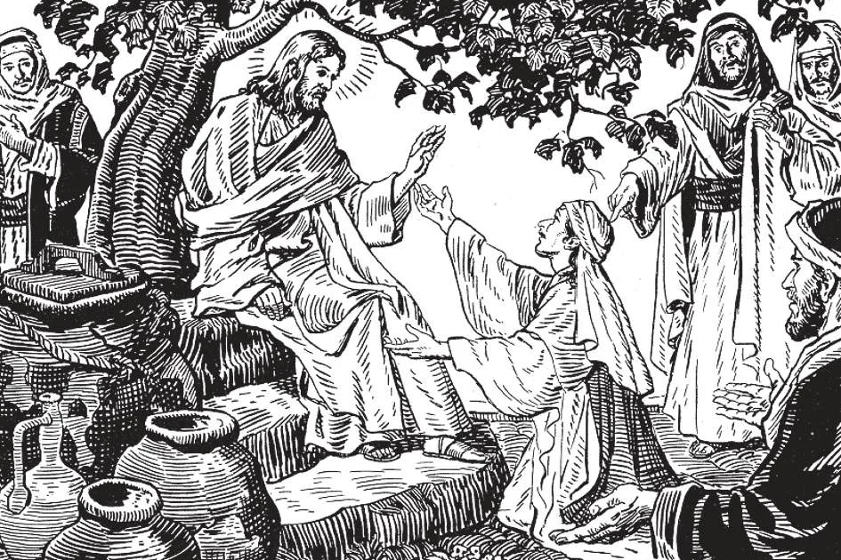

# 41. The Theological Virtues

*Faith is the foundation of all virtue, for by it God makes Himself known to men. As St. Paul says, "Now faith is the substance of things to be hoped for, the evidence of things that are not seen. . . . And without faith it is impossible to please God." (Heb. 11: 1, 6). It is this supernatural faith that the Canaanite woman proved, when she persevered in begging Jesus to cure her daughter. Having tested her, He said, "O woman, great is thy faith. Let it be done to thee as thou wilt" (Matt. 15: 28).*

**What are the chief supernatural powers that are bestowed on our souls with sanctifying grace?**

— The chief supernatural powers that are bestowed on our souls with sanctifying grace are the three theological virtues and the seven gifts of the Holy Ghost.

1. Good qualities or inclinations, whether natural or supernatural, are generally referred to as "virtues". Virtue is a habit that inclines us to whatever is good.

> A single good act does not constitute virtue. For instance, one does not have the virtue of faith if one believes in Christ only once a week.

2. Supernatural virtues enter the soul with sanctifying grace, imparted by the Holy Ghost in the Sacraments of Baptism and Penance. With sanctifying grace, the soul acquires the supernatural light of faith and hope, and burns with the fire of charity.

These virtues render us capable of being good and doing good for the love and service of God, to act for instead of against Him.

> We are not to suppose however that sanctifying grace makes us perfect in the practice of virtue. It gives us the power and the inclination to be good and do good, but to have perfection we must frequently exercise our virtues. We are given the power, but if we do not use it, it remains dormant; similarly, we are given legs to use for walking, but if we refuse to walk, the power is dormant. Virtue is a habit acquired by repeated good acts.

3. Natural virtue enables us to perform good natural acts; it deals directly with things human. Supernatural virtue enables us to perform good acts from a supernatural motive, for the glory of God.

> If we are temperate in food and drink because we wish to preserve our health, we have a natural virtue; we act according to reason.

4. Natural virtues compared to supernatural ones are like a photograph compared to the living original. It is only supernatural virtues that will profit us unto life everlasting, since it is only those whose object and life is God.

> Natural virtues mean little compared to the same virtues when supernaturalised, that is, when they flower as a result of the coming of the Holy Ghost into the soul. For instance, if we are temperate in food or drink because in that way we hope to be more pleasing to God and obey His precepts, we act from supernatural virtue.

**What are the three theological virtues?**

— The three theological virtues are faith, hope, and charity.

1. These virtues are called theological, from the Greek term *Theos* (meaning God), because their object is God.

> An appropriate symbol for the theological virtues is a living tree. Faith is the root, hope the trunk, and charity the fruit. The root and trunk are valueless if they do not find completion in the fruit. The common symbols depicting these three virtues are: the cross for faith, the anchor for hope, and the burning heart for charity.

2. He who possesses these three virtues has all other virtues in some degree. Without them, he cannot possess any other supernatural virtue nor reach heaven.

> We should make acts of these virtues every day. We can say very briefly: "O my God, I believe in Thee, I hope in Thee, I love Thee. To Thee be honour, praise, and glory forever."

**What is faith?**

— Faith is the virtue by which we firmly believe all the truths God has revealed, on the word of God revealing them, Who can neither deceive nor be deceived.

1. Faith is belief in a truth on the word of another, though that truth be not fully understood.

> In a trial, the judge believes the testimony of a witness known to be an honest man. When a fact is so obvious as "it is dark at midnight," no belief is needed; that is known and fully understood.

2. Divine faith is belief in a truth or mystery known only because God revealed it.

> We believe the testimony of God; should that be so difficult?

3. It is grace that helps us to attain faith and to persevere in it, to take God's word for whatever He has revealed.

> Faith is supernatural because we cannot by ourselves acquire it. It is a gift of God. It is, however, increased by prayer and continual exercise; the apostles prayed to the Lord, "Increase our faith" (Luke 17: 5).

4. Without faith, it is impossible to be saved.

> We must not cease praying for an increase of faith, for it is necessary for salvation. "He that believeth not shall be condemned" (Matt. 16: 16). "Without faith, it is impossible to please God" (Heb. 11: 6).

5. Our faith must be firm and complete; that is, both certain and all-encompassing.

> If we are doubtful on any matters of faith, considering opposite viewpoints as possibly true, then we deny God's authority. If we accept some truths, and deny others, then that is denying God altogether.

**What is hope?**

— Hope is the virtue by which we firmly trust that God, Who is all-powerful and faithful to His promises, will in His mercy give us eternal happiness and the means to obtain it.

1. God promised to give man eternal life, and the means to obtain it. In this promise is our hope.

> "He that putteth his trust in me shall inherit the land, and shall possess my holy mount" (Is. 57: 13).

2. Hope is necessary for salvation. Our hope must be firmly founded in God, Who promised to give us the means for salvation.

> Such firm hope, however, would not exclude reasonable fear of the loss of our soul. Very often we fall far short of the proper use of the means of salvation granted us.

**What is charity?**

— Charity is the virtue by which we love God above all things for His own sake, and our neighbour as ourselves, for the love of God.

1. Charity is the queen of virtues. It unites God and man perfectly in love. It also unites man and man, for the love of God.

> To love God above all things, we must be willing to renounce all created things rather than offend Him by sin. We should often speak to God in acts of love, opening our hearts to Him.

2. In heaven, faith and hope will cease; for we cannot need faith for what we already know; nor can we desire what we already possess. But for all eternity we shall have charity: we can love God forever.
