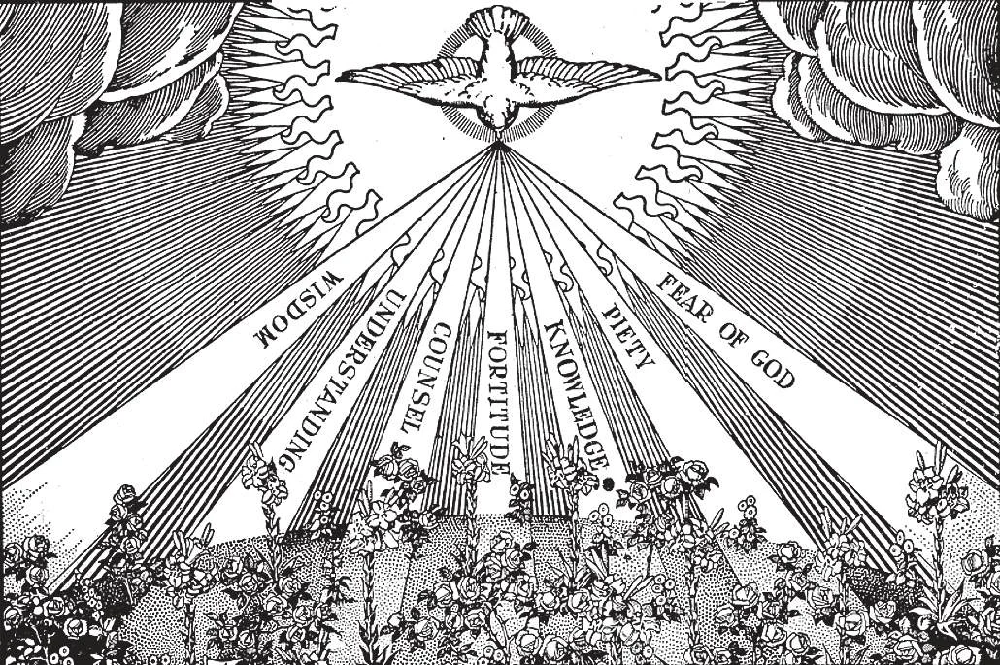

# 42. Gifts and Fruits of the Holy Ghost

In the picture, the Holy Ghost is represented by a dove. It was in that form that the Holy Ghost showed Himself visibly when St. John baptised Jesus. The dove symbolizes gentleness and peace. The Holy Ghost dispenses the graces of God. However, the Holy Ghost produces nothing beyond what Jesus Christ merited. The merits of Our Lord are infinite, for He is God. The Holy Ghost merely perfects, the works of Christ. In a somewhat similar way, the sun shining on a field does not sow new seed; it merely develops what has been sown, making it bloom and bear fruit

**Which are the seven gifts of the Holy Ghost?**

— The seven gifts of the Holy Ghost are: wisdom, understanding, counsel, fortitude, knowledge, piety, and fear of the Lord.

> The gifts are infused in our souls with sanctifying grace. With God the Holy Ghost come sanctifying grace, and inseparably, His gifts.

1. Wisdom is that gift by which we recognize the emptiness of earthly things. By it we come to regard God and spiritual things as of the highest good. Without the gift of wisdom we are indifferent to spiritual matters, avoiding all mortification.

> The best example of the effects of the gifts of the Holy Ghost are the Apostles, who after receiving the Holy Ghost became penetrated with His graces.

2. Understanding is that gift by which we are enabled to recognize the true Catholic teaching, and to detect false doctrines. Before the descent of the Holy Ghost on the Apostles, they did not understand the divine mysteries Christ revealed to them, often interpreting His words materially.

> Saint Clement Hofbauer began his studies late in life, and had just enough instruction in theology to be ordained. But he was often consulted by high officials of the Church on matters of doctrine, because he had the gift of understanding to an extraordinary degree.

3. The gift of counsel helps us to discover the will of God under difficult circumstances.

> Before they received the Holy Ghost, the Apostles were inconstant in their thoughts, desires, and actions, at one time full of high zeal, at other times despairing and weak. But Christ promised them the gift of counsel, saying: "Do not be anxious how or where with you shall defend yourselves; or what you shall say, for the Holy Spirit will teach you" (Luke 12: 11-12).

4. Fortitude is the gift by which we are strengthened under trials, to do God's will.

> Before the descent of the Holy Ghost, the Apostles were of good will, but they were weak and fearful. For instance, when Jesus was taken prisoner, they all fled.

5. The gift of knowledge enables us to grasp the teaching of the Church, to know God and Jesus Christ Whom He sent.

> Before the advent of the Holy Ghost, the Apostles were ignorant men who did not care for intellectual pursuits; neither were they expert in holiness or the things of God.

6. Piety is that gift by which we love God as our Father, ever striving to do His will.

> Before the coming of the Holy Ghost, the Apostles loved Jesus, but more for their own sakes rather than His, more for the reward He promised than for love of Him. But after Pentecost, what a change! They were ready to suffer death just because they loved Jesus and wished to declare Him everywhere.

7. The fear of the Lord makes us dread sin as the greatest of all evils, and enables us to quell fear of man and human respect.

> Eleazer, the old Jewish scribe, chose death rather than offend God by eating, or even pretending to eat, forbidden meats (2 Mach. 6).

8. Besides these seven gifts, the Holy Ghost also grants certain extraordinary gifts, which are given only on rare occasions and to selected persons. Such extraordinary graces are granted principally not for the benefit of the recipient, but of others. They were common during the early days of the Church, and helped in its rapid spread. Among them are the gift of tongues, of miracles, of visions, and of prophecy. The Apostles received the gift of tongues on Pentecost, so that although they spoke to a crowd of different nationalities and languages, everybody understood what was said.

> The Apostles also possessed the gift of miracles, curing the sick, driving out evil spirits, raising the dead to life. Many saints have been blessed with the gift of miracles. The prophets before the coming of Christ foretold future events. A number of the saints have been granted the gift of visions and ecstasies, though this is rare; good examples are St. Francis of Assisi, who received the stigmata of Our Lord's wounds, and St. Catherine of Siena.

**How do the gifts of the Holy Ghost help us?**

— The gifts of the Holy Ghost help us by making us more alert to discern and more ready to do the will of God. 1. If we look with discerning eyes, we can see how the gifts of the Holy Ghost have greatly helped the world at large.

> As the psalmist sang: "Thou shalt send forth Thy spirit, and they shall be created: and thou shalt renew the face of the earth" (Ps. 103: 30). "And hope does not disappoint, because the charity of God is poured forth in our hearts, by the Holy Spirit" (Rom. 5: 5).

2. The operations of the Holy Ghost were easily discernible among the early Christians.

> "And they continued, steadfastly in the teaching of the apostles and in the communion of the breaking of the bread and in the prayers. And ... many wonders also and signs were done by means of the apostles" (Acts 2: 42 - 43).

3. The difference between the virtues and the gifts of the Holy Ghost consists in this: the virtues enable us to do what our reason directs; the gifts make us follow the inspirations of the Holy Ghost.

**Which are some of the effects in us of the gifts of the Holy Ghost?**

— Some of the effects in us of the gifts of the Holy Ghost are the fruits of the Holy Ghost and the beatitudes.

**Which are the twelve fruits of the Holy Ghost?**

— The twelve fruits of the Holy Ghost are: charity, joy, peace, patience, benignity, goodness, long-suffering, mildness, faith, modesty, continency, and chastity. 1. These twelve fruits of the Holy Ghost are good habits performed under the inspiration of the Holy Ghost. They make us happy and contented, and help us to be pleasing to both God and man.

> With the fruits of the Holy Ghost, it becomes easier for us to persevere in the union with God by the practice of virtue; our heart inclines with charity towards God and our neighbour, and finds it almost natural to be detached from the world.

2. With the gift of sanctifying grace and its accompanying theological virtues, gifts of the Holy Ghost, and their effects, the Christian soul may be said to possess sanctity, to be in the state of Christian perfection.

> Sanctity is the fervent surrender of one's self to God and the practice of virtue. It does not require extraordinary works. The Blessed Mother of God, the most holy of mortals, never performed any extraordinary works to excite worldly admiration. "Love is the fulfilling of the law."
