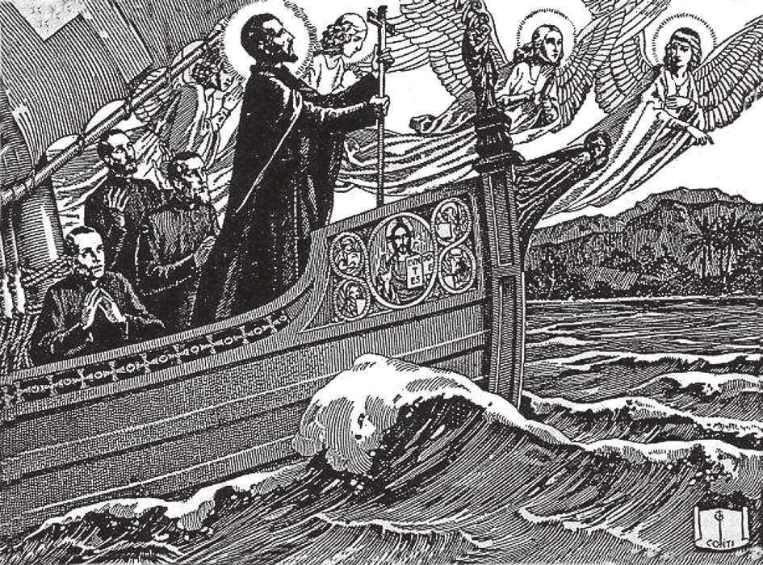

# 45. Meekness, Abstinence, Zeal, Brotherly Love

As an example of true zeal, we have the Apostle of the Indies, the Patron of Catholic Missions, St. Francis Xavier. Born of a noble family of Navarre, a descendant of kings, he was brought up for a career of earthly power and glory. But he met St. Ignatius, and decided to become a soldier for Christ. Inflamed with zeal, wishing only to reap rich harvests for God, he went through India, Malaya and Japan planting the seed of the Faith, converting innumerable heathen to Christ. In Japan, so fruitful was his apostolate that a generation after him the Christian population still totalled 400,000 souls. He is Protector of the Society for the Propagation of the Faith.

**What is meekness?**

— Meekness is that moral virtue which disposes us to control anger when offended, and resentment when rebuked.

> Meekness however must be distinguished from pusillanimity, which is weakness of spirit, and cowardliness.

1. Meekness is patience between man and man. It is related to the cardinal virtue of temperance, and is opposed to the sin of anger. The patient man keeps calm in the midst of the vicissitudes of life; he preserves his cheerfulness for the love of God.

> The motive is important. If we are calm and patient only because we hope to be admired or because we thereby wish to avoid temporal trouble, by indifference, then we do not practice virtue. Virtue is the result of love for God, doing things for His sake, because it is His law or desire. "By your patience you will win your souls" (Luke 21: 19).

2. We must endure with serenity all trials, not merely a part of them, in order to be truly patient.

> For instance, some are patient with sickness, but keep lamenting their being a burden to others on its account. Some are patient with others, but have no patience with themselves: for example, they feel irritated if they fall back into old sins. Such persons are not truly patient and meek; they show traces of pride, believing themselves too good to relapse into old sins. "Through many tribulations, we must enter into the kingdom of God" (Acts 16: 21).

3. The patient and meek man shows no anger when wrong is done him. He is a peacemaker at heart. However, although we should forgive and forget wrongs for the sake of peace, we must not give in to sin just to avoid opposing others; this would be sinful. Let us keep the peace with all when there is no good reason to break it; this should be our policy.

> Our Lord is the best example of meekness and patience. Did He use His almighty power to punish those who did Him evil? For hours He hung meekly on the cross, until He died. Every day, God is patient with sinners, giving them time to change their ways.

4. The meek man is master of his own self; he has self-control, and will find it easy to control others. He has peace of mind and will attain heaven, the home of the meek of heart. (See Chapter 26 on Anger, Gluttony, Envy, Sloth)

> Let us gaze at Jesus Crucified; He is the supreme example of meekness, the Lamb of God: "And I was as a meek lamb, that is carried to be a victim" (Jer. 11: 19). Indeed, "Blessed are the meek, for they shall possess the earth" (Matt. 5: 4); the land of the hearts of their fellowmen. As St. Francis de Sales practically said, "One catches more flies with an ounce of honey than with tons of vinegar."

**What is abstinence?**

— Abstinence is that moral virtue, related to the cardinal virtue of temperance, which keeps within bounds use of and pleasure in foods or drink.

> This general sense is to be understood as different from the particularized sense of "abstinence" during certain days, such as Fridays of Lent.

1. A temperate man eats only what he needs, does not fully satisfy his appetite, and is not dainty about the kind of food he eats. The virtue of abstinence is opposed to the sin of gluttony.

> One who is moderate in eating will be moderate also in many other things, and will escape numerous evils and sins. He always remembers the words of Our Lord: "Not in bread alone doth man live."

2. Temperance is a boon to both soul and body. It improves the health and strengthens the mind. It increases holiness, and aids towards the attainment of eternal life with God.

> A temperate man is like a person who travels light. He can move quickly and reach his destination, heaven, more easily. He is not like those who miss every train on account of the numerous bundles to be counted and carried and taken care of during a journey. (See Chapter 26 on Anger, Gluttony, Envy, Sloth)

**What virtues are opposed to sloth?**

— The virtues of diligence and zeal are opposed to sloth. 1. From the days of Adam work has been laid as an obligation on men. God said to Adam: "In the sweat of thy face thou shalt eat bread, until thou return to the earth out of which thou wast taken" (Gen. 3: 19)

> All men must work, whether mentally or bodily. The Apostle said: "If any man will not work, neither let him eat" (2 Thess. 3: 10). Our Lord worked all His life, and chose working people for His Mother and foster-father. Diligence in labour is a shield against temptation, for thieves do not break into a house full of busy people.

2. In opposition to spiritual sloth, we have zeal. It consists in fervour for our salvation and for that of others, out of love of God. It manifests itself in the propagation of the faith, the sanctification of souls, and making God better known. (See Chapter 26 on Anger, Gluttony, Envy, Sloth)

> The zealous man talks to God as often as he can in prayer; he does not forget his religious duties. He loses no opportunity in doing good works, and cheerfully makes sacrifices for the love of God. All his works and sufferings he offers to God, for his own salvation as well as for that of others. He works hard, remembering that "The kingdom of heaven has been enduring violent assault, and the violent have been seizing it by force" (Matt. 11: 12).

**What is brotherly love?**

—Brotherly love is charity towards our fellow men, our brothers in Christ. (See Chapter 26 on Anger, Gluttony, Envy, Sloth)

> Our Lord said: "This is my commandment, that you love one another, as I have loved you" (John 15: 12). And St. John exhorts: "Beloved, let us love one another, for love is from God. ... He who does not love does not know God; for God is love" (1 John 4: 7-8).

Love and envy cannot live in the same heart. Our Lord says: "By this shall all men know that you are my disciples, if you have love one for another" (John 13: 35); and He commands: "Love your enemies, do good to those who hate you, and pray for those who persecute you" (Mat. 5: 44)

> If God commands us to love even our enemies, how much more should we love those who have done us no harm, and avoid envying them! Let us remember that the mark of the Christian is love for his fellow-men; all that we do to others, whether for good or ill, we really do to Our Lord Jesus Christ. Therefore, when we feel the temptation to envy, let us banish it at once by praying for the person, and try our best to do all the good we can to him. In this way, we follow Christ our Master.
