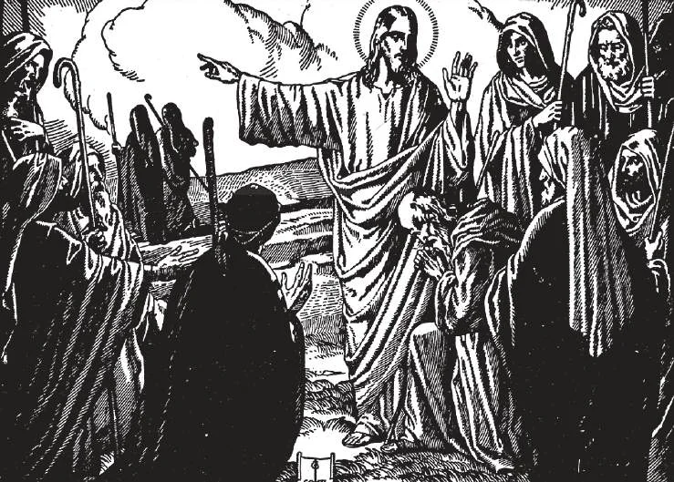

# 47. Foundation of the Church

*From among His disciples, Our Lord chose twelve Apostles, and gave them special training. He sent them forth to teach His doctrines, saying, "As the Father has sent me, I also send you." The Apostles were the foundation of the True Church. Christ gave them all power and authority, saying, "He who hears you hears me: he who rejects you rejects me."*

(NINTH ARTICLE OF THE APOSTLES' CREED)

**Did Jesus Christ found a Church?**

— Yes; all history, religious and non-religious, including the Bible, clearly proves that Jesus Christ founded a Church.

1. After teaching publicly what He required all to believe and practice, thereby announcing the main doctrines of His Church, Christ gathered a number of disciples. From them He chose twelve, to whom He gave special instruction and training.

> The term "a kingdom", by which Our Lord used to refer to His Church, implies organized authority. And He said to the special men He had chosen, "You have not chosen me, but I have chosen you" (John 15:16). He did not teach the disciples for themselves alone, but to be the foundation of His Church. God did not come to save only a few disciples, but all men.

2. Christ said to the men He had chosen: "As the Father has sent me, I also send you" (John 20:21), bidding them go and preach the doctrines He had taught. He sent them to all nations, promising salvation to those that should believe, and threatening condemnation to those refusing to believe.

> "He who believes and is baptised shall be saved, but he who does not believe shall be condemned" (Mark 16:16). God is just; He would not have threatened condemnation to unbelievers unless He had furnished the means whereby they could believe. His Church is this means; all men must join it.

3. Not only did the men chosen by Christ have authority; He gave them extraordinary powers, particularly the twelve special men, the Apostles.

> "Then having summoned his twelve disciples, he gave them power over unclean spirits, to cast them out, and to cure every kind of disease and infirmity" (Matt. 10:1).

a. They had power to sanctify, when Christ bade them:

> "Go therefore, and make disciples of all nations, baptising them in the name of the Father, and of the Son, and of the Holy Spirit" (Matt. 28:19).

b. They had power to forgive sin, when Christ said to them:

> "Whose sins you shall forgive, they are forgiven them" (John 20:23).

c. They had power to rule when Christ said:

> "He who hears you hears me; and he who rejects you rejects me; and he who rejects me rejects him who sent me" (Luke 10:16). And: "Whatever you bind on earth shall be bound also in heaven" (Matt. 18:18).

d. They had power to offer sacrifice, when at the Last Supper, Christ, after instituting the Eucharist, bade them:

> "Do this in remembrance of me" (1 Cor. 11:24 - 25).

4. After training the disciples and Apostles to form the organization of His Church, Christ chose Simon Peter and made him the Chief. Simon, whose name Christ changed to Peter, was the Head of the Church.

> On Simon, Christ promised to build His Church, saying: "Thou art Peter, and upon this rock I will build my Church" (Matt. 16:18). After the Resurrection, He confirmed Peter's authority over the Church, saying to him: "Feed my lambs; feed my sheep" (John 21:15 - 17).

5. Finally, He promised to remain for all time with the Church He established.

> If the death of Our Lord were to do good only to a few persons then living in Judea, its merits would have been very limited. But it could do good to future generations only if there were an organization with authority to carry on His teachings and preserve them from all change. This is His Church.

**Why did Jesus Christ found the Church?**

—Jesus Christ founded the Church to bring all men to eternal salvation. 1. Our Lord Jesus Christ established the Church in order to lead men to heaven by: a. Continuing His teaching and example; and b. Applying the fruits of His Sacrifice on the cross to all men until the end of the world.

> Our Lord gave to the Church a three-fold office: the office of teacher, the office of priest or sanctifier, and the office of pastor or ruler. By these offices, Christ intended His Church to accomplish the purpose for which He founded it.

2. After Pentecost Sunday, the Apostles began to carry out their mission of making disciples of all nations. Through them and their successors, this mission continues and will continue to the end of the world.

> On the first Pentecost, about three thousand were received into the Church after St. Peter's sermon. They were the first members converted and baptised since the Ascension of Our Lord.

**Was the Church founded by Christ a visible organization?**

— The Church founded by Christ was a visible organization, with certain distinguishing marks.

1. No one can deny that Jesus Christ gathered disciples, and out of them chose twelve Apostles, to whom He gave special instruction and orders. He formed them as the foundation of His organization; was this not visible?

> Speaking of a stubborn man, He said: "If he refuse to hear even the Church, let him be to thee as the heathen" (Matt. 18:17). And He promised his disciples: "Amen, I say to you, whatever you bind on earth shall be bound also in heaven; and whatever you loose on earth shall be loosed also in heaven" (Matt. 18:18). Surely something must be visible to bind and loose, to be heard and obeyed. And Christ referred to this visible organization as a city set on a mountain, that cannot be hidden (Matt. 5:14).

2. From the very beginning, the Apostles exercised their authority and powers; these were signs of a very visible organization. They did not advise; they directed, as superiors, and decided, as judges.

> Thus St. Paul excommunicated the sinful Corinthian; and he commanded the Hebrews: "Obey your superiors, and be subject to them" (Heb. 13:17).

3. The Apostles and Fathers condemned schism. This fact implies a visible organization; for how can there be schism against an invisible body?

> St. Paul urged the Corinthians: "By the name of Our Lord Jesus Christ ... that there be no dissensions among you" (1 Cor. 1:10). And St. Cyprian in the third century wrote: "Whoever is separated from the Church is separated from the promises of Christ ... One cannot have God as a Father who has not the Church as his mother."

## Apostolicity of Catholic Doctrines

(ADAPTED FROM CARDINAL GIBBONS, "FAITH OF OUR FATHERS")

### 1. Primacy of Peter

**Apostolic Church.** Our Saviour gave pre-eminence to Peter over the other Apostles: "I will give thee the keys of the kingdom of heaven" (Matt. 16:19). "Strengthen thy brethren" (Luke 22:32). "Feed my lambs; feed my sheep" (John 21:15-17).

**Catholic Church.** The Catholic Church gives the primacy of honour and jurisdiction to Peter and to his successors.

**Protestant Church.** Other Christian communions deny Peter's supremacy over the other Apostles.

### 2. Infallibility

**Apostolic Church.** The Apostolic Church claimed to be infallible in her teachings. "When you heard and received from us the word of God, you welcomed it not as the word of men, but, as it truly is, the word of God" (1 Thess. 2:13).

**Catholic Church.** The Catholic Church alone, of all the Christian communions, claims to exercise the prerogative of infallibility in her teaching. Her ministers always speak from the pulpit as having authority, and the faithful receive with implicit confidence what the Church teaches, without once questioning her veracity.

**Protestant Church.** Protestant churches repudiate the claim of infallibility, denying that such a gift is possessed by any teachers of religion. The ministers advance opinions as embodying their private interpretation of the Bible. Their hearers are expected to draw their own conclusions from the Bible.

### 3. Fasting

**Apostolic Church.** Our Saviour enjoined and prescribed rules for fasting: "When thou dost fast, anoint thy head and wash thy face, so that thou mayest not be seen by men to fast" (Matt. 6:17). The Apostles fasted before engaging in sacred functions: "They ministered to the Lord, and fasted." "When they had appointed presbyters for them in each church, with prayer and fasting, they commended them to the Lord" (Acts 14:22).

**Catholic Church.** The Church prescribes fasting to the faithful, particularly during Lent. A Catholic Priest is always fasting when he officiates at the altar. He breaks his fast only after he says Mass. When Bishops ordain Priests they are always fasting, as well as the candidates for ordination.

**Protestant Church.** Protestants have no law prescribing stated seasons of fasts, though some may fast from private devotion. They even try to ridicule fasting. Neither candidates for ordination, nor the ministers who ordain them are ever required to fast on such occasions.

### 4. Confirmation

**Apostolic Church.** St. Peter and St. John confirmed the newly baptised in Samaria. "They laid their hands on them and they received the Holy Spirit" (Acts 8:17).

**Catholic Church.** Every Catholic Bishop, as a successor of the Apostles, likewise imposes hands on baptised persons in the Sacrament of Confirmation, by which they receive the Holy Ghost.

**Protestant Church.** No denomination performs the ceremony of imposing hands except Episcopalians, and even they do not recognize Confirmation as a Sacrament.

### 5. The Eucharist

**Apostolic Church.** Our Saviour and His Apostles taught that the Eucharist is the Body and Blood of Christ: "Take and eat; this is my body... All of you drink of this, for this is my blood" (Matt. 26:28). "The cup of blessing that we bless, is it not the sharing of the blood of Christ? And the bread that we break is it not the partaking of the body of the Lord?" (1 Cor. 10:16).

**Catholic Church.** The Catholic Church teaches, with our Lord and His Apostles, that the Eucharist is truly and indeed the Body and Blood of Jesus Christ under the appearances of bread and wine.

**Protestant Church.** The Protestant churches condemn the doctrine of the Real Presence as idolatrous, and say that, in partaking of the communion, we receive only a memorial of Christ.

### 6. Forgiveness of Sins

**Apostolic Church.** The Apostles were empowered by our Saviour to forgive sins: "Whose sins you shall forgive, they are forgiven them" (John 20:23). "God," says St. Paul, "hath given to us the ministry of reconciliation" (2 Cor. 5:18).

**Catholic Church.** The Bishops and Priests of the Catholic Church, as the inheritors of Apostolic prerogatives, exercise the ministry of reconciliation and forgive sins in the name of Christ.

**Protestant Church.** Protestants affirm on the contrary, that God delegates to no man the power of pardoning sin.

### 7. Anointing of the Sick

**Apostolic Church.** Regarding the sick, St. James gave this instruction: "Is any one among you sick? Let him bring in the presbyters of the Church, and let them pray over him, anointing him with oil in the name of the Lord" (James 5:14).

**Catholic Church.** One of the most ordinary duties of a Catholic Priest is to anoint the sick in the Sacrament of Extreme Unction. If a man is sick among us he is careful to call in the Priest of the Church that he may anoint him with oil in the name of the Lord.

**Protestant Church.** No such sacrament as that of anointing the sick is practised by any Protestant denomination, notwithstanding the Apostle's injunction.

### 8. Indissolubility of Marriage

**Apostolic Church.** Of marriage our Saviour said: "Whoever puts away his wife and marries another, commits adultery against her; and if the wife puts away her husband, and marries another, she commits adultery" (Mark 10:11,12). And again St. Paul said: "To those who are married, not I, but the Lord commands that a wife is not to depart from her husband, and if she departs, that she is to remain unmarried... And let not a husband put away his wife" (1 Cor. 7:10,11).

**Catholic Church.** Literally following the Apostle's injunction, the Catholic Church forbids the husband and wife to separate from one another; or, if they separate, neither of them can marry again during the life of the other.

**Protestant Church.** The Protestant churches, as is well known, have so far relaxed this law of the Gospel as to allow divorced persons to remarry, during the lifetime of those they have divorced.

### 9. Perpetual Chastity

**Apostolic Church.** Our Lord recommended not only by word but by His example, to souls aiming at perfection, the state of perpetual chastity. St. Paul also exhorted the Corinthians by counsel and his own example to the same angelic virtue: "He who gives his virgin in marriage does well, and he who does not give her does better" (1 Cor. 7:38).

**Catholic Church.** Like the Apostle and his Master, the Catholic clergy bind themselves to a life of perpetual chastity. Members of our religious communities for men and women voluntarily consecrate their chastity to God.

**Protestant Church.** All the ministers of other denominations are permitted to marry. And far from inculcating the Apostolic counsel of celibacy to any of their flock, they more than insinuate that the virtue of perpetual chastity, though recommended by St. Paul, is impracticable.
