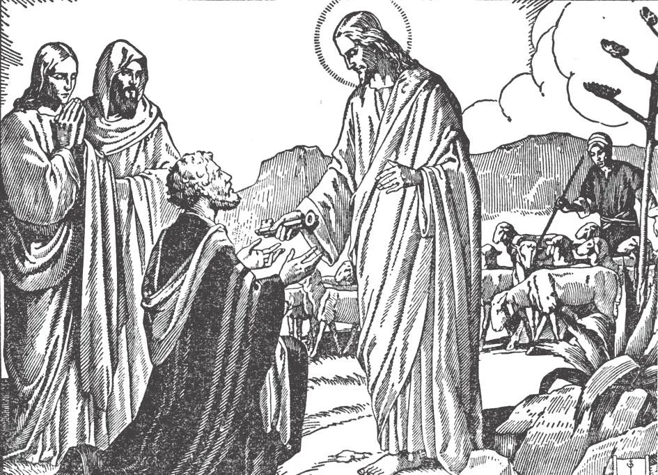

# 49. The Primacy of Peter

*When Our Lord said to Peter, "And I will give thee the keys of the kingdom of heaven," He clearly meant: "I will give you supreme authority over My Church. You shall be My representative." The true test of loyalty to Christ is not only to believe in Him and worship Him, but to honour and obey the representatives He has chosen. Our Lord chose St. Peter as His Vicar. It is rebellion against Christ to say to Him: "I will worship You, but I will not recognize Your representative." This is what Christians do, who deny the authority of the successor of Peter.*

**Did Christ give special power in His Church to any one of the Apostles?**

— Christ gave special power in His Church to Peter, by making him the head of the Apostles and the chief teacher and ruler of the entire Church.

1. When Simon, led by his brother Andrew, first met Christ, Our Lord said to him: "Thou art Simon, the son of John; thou shalt be called Cephas" (John 1:42).

> Christ spoke in Aramaic, and the original Cephas, or "Kepha" means stone or rock, which we interpret Peter. Our Lord must have some special purpose for having Simon's name changed, particularly as the word Kepha was never used as a proper name then.

2. When, at Caesarea Philippi, Peter made the memorable confession of faith in the name of the Apostles: "Thou art the Christ, the Son of the Living God," Christ promised to make Peter the head of His Church (Matt. 16:17 - 20).

> In reply Our Lord said: "Blessed art thou, Simon Bar-Jona, for flesh and blood has not revealed this to thee, but my Father in heaven. And I say to thee, thou art Peter, and upon this rock I will build my Church, and the gates of hell shall not prevail against it. And I will give thee the keys of the kingdom of heaven; and whatever thou shalt bind on earth shall be bound in heaven, and whatever thou shalt loose on earth shall be loosed in heaven."

a. Our Lord changed Simon's name to Peter, which means Rock.

> He said that He would make Peter the Rock on which His Church should be founded. As the foundation of a building holds up, supports, and preserves the building, so Peter was to hold the same office for Christ's Church.

b. Our Lord promised to Peter the keys of the kingdom of heaven. In ancient as well as modern times, keys are a symbol of authority. He who lawfully carries the key to a building has the right himself of entering and of admitting or excluding others.

> Our Lord said to all the Apostles, "Receive the Holy Spirit, whose sins you shall forgive, they are forgiven them; and whose sins you shall retain, they are retained" (John 20:23). But to Peter alone did Our Lord address these words: "I will give thee the keys of the kingdom of heaven."

3. Christ, after the Resurrection, fulfilled His promise, and appointed Peter head of the Church (John 21:15 - 17).

> On the Lake of Gennesareth, Jesus said to Simon Peter, "Simon, son of John, dost thou love me more than these do?" He said to him, "Yes, Lord, thou knowest that I love thee." He said to him, "Feed my lambs." He said to him a second time, "Simon, son of John, dost thou love me?" He said to him, "Yes, Lord, thou knowest that I love thee." He said to him, "Feed my sheep." A third time he said to him, "Simon, son of John, dost thou love me?" Peter was grieved because he said to him for the third time, "Dost thou love me?" And he said to him, "Lord, thou knowest all things, thou knowest that I love thee," He said to him, "Feed my sheep."

By this Christ entrusted to Peter the whole flock, thus making him the head shepherd. The "lambs" (the weak and tender portion of the flock) are the faithful, and the "sheep" (those that nourish the lambs) are the pastors, bishops and priests.

> The sheep of Christ are those who submit to Him, the Good Shepherd (John 10:14). Never did Christ say to any other Apostle: Feed My whole flock. As the shepherd is responsible for the flock, he is given authority comparable to his responsibility.

4. Christ also conferred on Peter special marks of distinction not conferred on the other Apostles. He gave him a new name. He chose him as a companion on the most solemn occasions. After the Resurrection, He appeared to Peter first, before showing Himself to the other Apostles.

> The Lord said: "Simon ... I have prayed for thee that thy faith may not fail; and do thou, when once thou hast turned again, strengthen thy brethren" (Luke 22:31-32).

As with every well-regulated society, the Church needed a visible head; Christ appointed St. Peter visible head of the Church. The city has its mayor, the state its governor, the nation its President. At the head of every government is a president or king. Even in the family, the father is the head. Every corporation has a head.

> The Church is a visible society; that is, it is composed of human beings. It needs a head as well as any other organization. Christ is always its invisible Head, but it needs a visible head to take His place among men.

**Did Peter actually exercise his primacy?**

— Yes, Peter actually exercised his primacy, and the other Apostles and the disciples recognized him as the head of the Church.

1. Peter's name always stands first in the lists of Apostles; Iscariot's is always last.

> St. Matthew even calls Peter the "first Apostle." But he was neither first in age nor in election, for Our Lord had called Andrew, his elder brother, before him. He must therefore have been first in honour and authority.

2. It was Peter who proposed the election of another to take the place of Judas.

> In obedience to Peter's advice, the Apostles put forward two among the disciples to choose from; and after praying, they chose Matthias (Acts 1:21 - 26).

3. It was Peter who preached the first sermon on the day of Pentecost.

> The Holy Ghost had descended on the Apostles; they spoke so that each person present (and there were many nationalities in the crowd) heard his own language being spoken. The people were amazed; and Peter spoke (Acts 2:14-36).

4. It was Peter who admitted the first converts from Judaism (Acts 2:38-41), as well as from paganism (Acts 10:5).

> "And he (Peter) ordered them (the Gentiles) baptised in the name of Jesus Christ" (Acts 10:48). This was a thing unheard of, that the Jews, "of the Faith", should consort with "heathen"; but Peter broke all bonds.

5. Peter worked the first miracle.

> He gave a man, lame from birth, the power to walk (Acts 3:6 - 8).

6. Peter meted out the first punishment.

> Ananias (and later his wife Sapphira) had lied and cheated; and having been rebuked by Peter, fell down dead (Acts 5:1 - 6).

7. Peter cast out the heretic Simon Magus.

> This heretic had wanted to purchase the power of the Apostles of bringing down the Holy Ghost on those on whom they laid hands (Acts 8:19 - 20).

8. Peter made the first visitation of the churches (Acts 9:31 - 32).

9. In the first Council at Jerusalem, there was much disputing, but when Peter spoke, all submitted (Acts 15:7 - 12).

> "After a long debate, Peter got up and said, ... 'But we believe that we are saved through the grace of the Lord Jesus' ... Then the whole meeting quieted down" (Acts 15:7, 11 - 12).

10. After his conversion, St. Paul presented himself to Peter (Gal. 1:18).

11. Of the early churches established by the Apostles, the Church of Rome was the highest in rank. It was the See of Peter.
