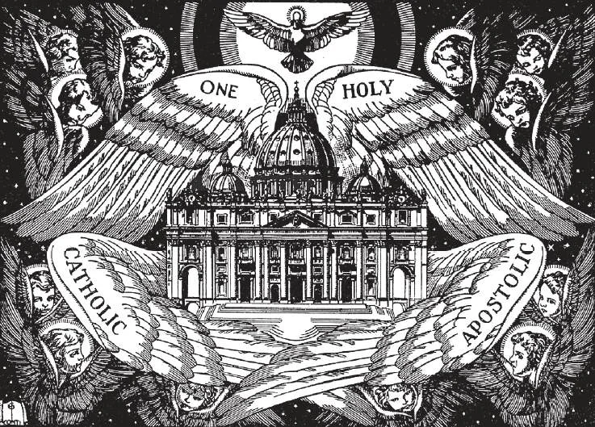

# 50. Marks of the True Church

The True Church is one, holy, catholic, and apostolic. The Church that possesses all the shining marks which Our Lord gave is the Church of God, the True Church. Any church that lacks even one of these marks is an imitation, a false church, and not the one founded by Our Lord. The True Church must possess all these marks. It is the Church which Christ commanded all to hear and obey.

**Did Christ establish many Churches?**

— Christ established only one Church, to continue till the end of time. 1. As God is one, He established one Church, which He commanded all men to obey and to follow in the way of salvation.

> God is essentially one. He is Truth itself. How can He say to one group of men that there are three Persons in one God, and to another that there is only one Person? How can He say to one body that the Holy Eucharist is Himself, and to another that it is mere bread? God cannot contradict Himself. "He who hears you hears me" (Luke 10: 16). "There shall be one fold and one shepherd" (John 10: 16).

2. Christ never referred to His Churches, but to His Church. Christ chose only one Head for His Church. Peter could not have been the Head of conflicting churches.

> Christ said: "And I say to thee, thou art Peter, and upon this rock I will build my Church, and the gates of hell shall not prevail against it" (Matt. 16: 18). Christ did not say: "Upon this rock I will build My Churches," it was clearly not His intention to establish various conflicting churches.

3. Christ, even in His prayers, spoke of unity among His followers. There would evidently be no unity if He had founded many churches.

> Immediately before His passion, He prayed: "Yet not for these only do I pray, but for those also who through their word are to believe in me, that all may be one, even as thou, Father, in me and I in thee; that they also may he one in us, that the world may believe that thou hast sent me" (John 17: 20-21).

**Is there any way by which we can distinguish the Church that Christ founded from all other churches?**

— We can distinguish the Church founded by Christ from all other churches by the marks or signs that Our Lord gave to it.

> A mark is a sign by which something may be distinguished from all others of the same kind. By its marks, we can recognize the True Church as the one founded by Jesus Christ, distinguishing it from all other churches, however similar.

1. It is important that we know which is the Church established by Christ, in order that we may obey it, as God commands. Then shall we also be certain what to believe and do in order to be saved; the Church, that True Church, will be our guide to heaven.

> We must distinguish the True Church from false churches, because today, there are many imitations of the Church founded by Christ.

2. The True Church must be that which Christ personally founded, and the Apostles propagated. It must have existed continuously since the time of Christ. It must teach in their entirety all the doctrines commanded by the Divine Founder while He was still on earth; and all its members must profess those fundamental doctrines. It must be a visible organization, discernible and discoverable, evidently existing, with clear marks or signs distinguishing it as the True Church.

> It was through a common bond of faith that the faithful throughout the world were to be united in one body, the Church, their heritage from the Son of God. Our Lord therefore before His Ascension made the necessary provision so that all men might from thenceforth recognize the Church which He established, and which He commanded all to join.

**What are the chief marks of the True Church?**

— The chief marks of the True Church are four: It is one, holy, catholic or universal, and apostolic. 1. Christ intended His Church to be One; therefore the True Church must be One. Its members must be united in doctrine, in worship, and in government. Christ said:

> "If a kingdom is divided against itself, that kingdom cannot stand" (Mark 3: 24). "There shall be one fold and one Shepherd" (John 10: 16).

2. Christ intended His Church to be Holy; therefore the True Church must be Holy. It must teach a holy doctrine in faith and morals, because its Founder is holy. It must provide the means for its members to lead a holy life. "Beware of false prophets, who come to you in sheep's clothing, but inwardly are ravenous wolves. By their fruits you will know them. Do men gather grapes from thorns, or figs from thistles? Even so, every good tree bears good fruit, but the bad tree bears bad fruit. ... Therefore, by their fruits you will know them" (Matt. 7: 15 - 17, 20).

> Christ promised His Church the gift of miracles, a sign of holiness: "Amen, amen, I say to you, he who believes in me, the works that I do he also shall do, and greater than these he shall do" (John 14: 12). He said: "You therefore are to be perfect, as your heavenly Father is Perfect" (Matt. 5: 48).

3. Christ intended His Church to be universal, that is, catholic; and therefore the True Church must be Universal, or Catholic. It must be for all peoples of every nation and for all times and teach the same faith everywhere. Christ commanded His disciples:

> "Go therefore and make disciples of all nations" (Matt. 28: 19). "Go into the whole world and preach the Gospel to every creature" (Mark 16: 15). "You shall be witnesses for me ... even to the very ends of the earth" (Acts 1: 8).

4. Christ intended His Church to be propagated by His Apostles; and therefore the True Church must be Apostolic. It must be the Church propagated by the Apostles. Its rulers must derive their office and authority by lawful succession from the Apostles. It must hold intact the doctrine and traditions of the Apostles, to whom Christ gave authority to teach.

> It was Christ Himself, and no one else, Who chose His Apostles and disciples, and commanded them to teach His doctrines to all the world. St. Paul says: "Even if we or an angel from heaven should preach a Gospel to you other than that which we have preached to you, let him be anathema" (Gal. 1: 8). St. Paul himself refers to the Church as "built upon the foundation of the Apostles" (Eph. 2: 20).

**Which Church possesses the marks of the Church established by Christ, and therefore must be the True Church?**

— The Catholic Church possesses the marks of the Church established by Christ; the Catholic Church is the True Church.

> The Catholic Church is One, Holy, Catholic, and Apostolic in the way Our Lord Jesus Christ wanted His Church to be One, Holy, Catholic, and Apostolic.
