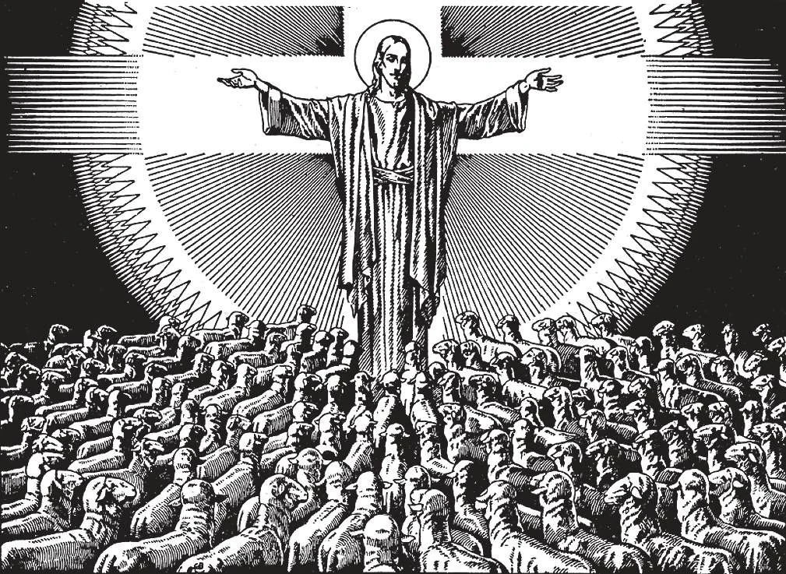

# 52. The Catholic Church: Unity and Holiness

*The Catholic Church is One, because it has one Divine Founder, God Himself, Who cannot be divided. All its members hear and obey the voice of their Shepherd. The Catholic Church is Holy, because it imitates its Holy Founder, the Incarnate Son of God. Its members strive for holiness, aided by divine sacraments instituted by Christ Himself.*

**Why is the Catholic Church one?**

— The Catholic Church is one because all its members, according to the will of Christ, profess the same faith, have the same sacrifice and sacraments, and are united under one and the same visible head, the Pope.

1. They have unity in doctrine, worship, and government. They have "One Lord, one Faith, one Baptism." There has never been any other society, religion, or government whose members are so closely united.

> "If a kingdom is divided against itself, that kingdom cannot stand" (Mark 3: 24). "Holy Father, keep in thy name those whom thou hast given me, that they may be one even as we are" (John 17: 11).

2. There are about 1.2 billion Catholics united in doctrine. This unity is evident and admitted by all. All Catholics everywhere believe each and every article of faith proclaimed by the Church. Wherever a Catholic goes throughout the world, he will find his home in the Catholic Church. There he will find his brethren in Christ all believing as he does. If he deliberately denies even one article of faith of the Church, he ceases to belong to it.

> International Eucharistic Congresses, held in different countries, in different parts of the world, every other year, are a good proof of the unity of the Church. In such Congresses, the faithful from all nations; African, American, Australian, Chinese, English, Filipino, French, German, Indian, Irish, Japanese, Russian, Spaniard, one and all bow down in adoration of Our Lord Jesus Christ in the most Holy Eucharist.

3. All Catholics today hold the same faith that Catholics in the past held.

> The same Gospel of peace that Jesus Christ preached in Judea, the same that St. Peter preached in Antioch and Rome, the same that St. Paul wrote to the Corinthians and the Ephesians, the same that apostles of all nations have been preaching for the last 1900 years, is preached today and taught in the Catholic Church throughout the world, from January to December; "Jesus Christ yesterday, and today, and the same forever" (Heb. 13: 8).

4. The Catholic Church is one in worship. All members make use of the same Holy Sacrifice of the Mass, and receive the same sacraments. Although rites vary, the essentials of worship laid down by Christ form the foundation of all. Certain ceremonies have been appointed by the Church, to show more clearly in outward form the spiritual significance of whatever act is being done, and to increase the devotion of those who are present or take part in the religious acts.

> The ritual varies in various places, certain ancient rituals from the early days of the Church being preserved. But in general the Roman ritual, the one followed by the diocese of Rome, is the one followed. The change of ritual does not change the substance of the religious act, which is preserved in its entirety.

5. All Catholics are united in government.

> Everywhere the faithful obey their pastors, the pastors obey the bishops, and the bishops obey the Pope. The Catholic Church is truly "one fold and one Shepherd", its unity standing out unequalled in all history.

**Why is the Catholic Church holy?**

— The Catholic Church is holy because it was founded by Jesus Christ, who is all-holy, and because it teaches, according to the will of Christ, holy doctrines, and provides the means of leading a holy life, thereby giving holy members to every age.

> St. Peter called the Christians of his time "a chosen race, a royal priesthood, a holy nation" (1 Pet. 2: 9).

1. The Founder of the Catholic Church, Jesus Christ, is holy. The Church exhorts its children to imitate its Divine Founder.

> No founder of any other church is as holy as Jesus Christ, Son of God. And among the children of the Church we may mention as examples of holiness the canonized Saints.

2. The Catholic Church teaches the highest and holiest doctrine ever presented to any people, a standard of perfection. The same precepts delivered to Moses on Mount Sinai, the same warnings uttered by the prophets in Judea, the same sublime lessons taught by Our Lord: these the Church teaches from year to year.

> The Church teaches its children to know, love, and serve God, and thus to become saints. It urges on them the truth: "What does it profit a man, if he gain the whole world, but suffer the loss of his own soul?" (Matt. 16: 26). It exhorts them to imitate Christ.

3. The Catholic Church provides powerful means for holiness, in prayer and the Sacraments. By the Sacraments, a Catholic receives abundant graces. One who is faithful in the reception of the Sacraments will never fail to live a righteous life and die a happy death.

> Every Catholic is obliged to say his morning and night prayers, and to resort to prayer in every necessity and temptation, as well as to prayer of thanksgiving. He is required under pain of sin to hear Mass on Sundays and holydays of obligation.

4. The Catholic Church produces holy members in its saints and martyrs. In every age and country the Church is the Mother of saints, martyrs, confessors, and holy men and women who live in Christ. We do not, however, maintain that all Catholics are holy. Unfortunately, some do not live up to the teachings of the Church; that will be their condemnation.

> We must remember that even among the Apostles there was one Judas. Our Lord Himself taught in the parable of the wheat and the cockle that the good and the bad will grow up side by side in His Church.

5. The Catholic Church still has the gift of miracles. Christ promised His Church the gift of miracles, a sign of holiness. "He who believes in me, the works that I do, he also shall do; and greater than these he shall do" (John 14: 12).

> Each holy soul proposed for canonization must have worked two miracles before beatification, and two more before canonization. We constantly read of miracles at Lourdes and other shrines. The cures at Lourdes are declared genuine by a board of physicians, many of whom are non-Catholic.

6. The Catholic Church carries on numberless works of holiness. It is the great Mother of Mercy and Charity to the helpless.

> It instructs children in school, cares for the poor, the sick, the lepers, the deaf, blind, dumb, the old, the orphaned and abandoned. It engages in all kinds of missionary and charitable activity.
