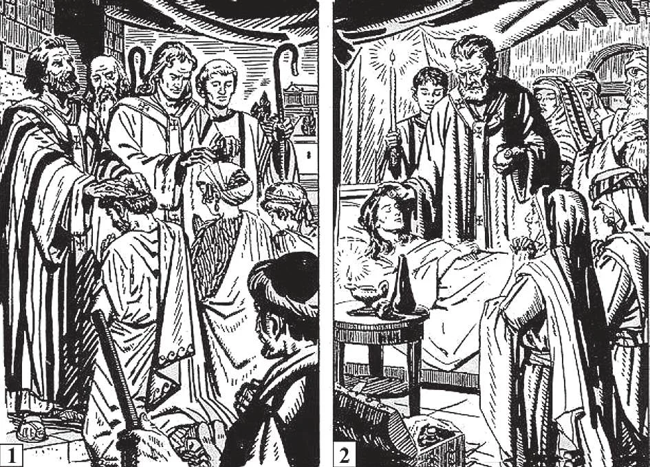

# 53. The Catholic Church: Catholicity and Apostolicity

The apostolicity of the Church receives additional proof from the fact that today it still administers the very same seven sacraments administered by the Apostles. Non-Catholic churches have abandoned most of the sacraments, but the Catholic Church preserves and administers them all. Among the sacraments thus preserved are (1) Confirmation, and (2) Extreme Unction. St. Peter and St. John administered the first (Acts 8: 14-17). St. James wrote about the second (Jas. 5: 14,15).

**Why is the Church catholic or universal?**

— The Catholic Church is catholic or universal because, destined to last for all time, it never fails to fulfil the divine commandment to teach all nations all the truths revealed by God.

> "You shall receive power when the Holy Spirit comes upon you, and you shall be witnesses for me in Jerusalem and in all Judea and Samaria and even to the very ends of the earth" (Acts 1: 8).

1. The very name of the Church is Catholic, that is, universal. Even its critics admit that it is catholic. It has existed in all ages since the time of Christ, and teaches all peoples of every nation the same faith.

> It was St. Ignatius (50-107 A.D.) appointed Bishop of Antioch by Saint Peter, who first used the Greek word Katholicos, meaning "universal," when referring to the Church founded by Christ; this he did in order to distinguish the True Church, already being preached throughout the world, from heretical churches that had arisen. In the fourth century, certain sectarians protested against the True Church, yet still called themselves Christians. And so Catholics began to call themselves "Catholic." In that same century, St. Augustine said: "All heretics wish to call themselves Catholics; yet if you ask any of them to direct you to a Catholic church, he will not direct you to his own!"

2. Wherever we go, whether in Europe, America, Africa, Asia, or Australia, we shall find the Catholic Church established. Everywhere it teaches the same doctrines; everywhere it is ruled by the same Head: the Pope.

> When we say the Church is Catholic or universal, we understand that wherever it exists it must have the mark of unity. Otherwise it would not be the same body, but many separate bodies. Some heretical churches have branches in different countries, but they are really different bodies, because they change doctrines under different conditions.

3. The Church everywhere teaches all the doctrines that Christ commanded His Apostles to teach.

> In the Catholic Church is fulfilled the prophecy of Malachy: "From the rising of the sun to the going down, my name is great among the Gentiles, and in every place there is sacrifice, and there is offered to my name a clean oblation; for my name is great among the Gentiles, saith the Lord of Hosts" (Mal. 1: 11).

4. The True Church must be so organized that it can admit all men into its communion. This the Catholic Church does. Christ founded the Church for all men, not only for a selected few, He died for all men, and wishes the fruits of His death to do good to all men. At present only the Catholic Church is to be found all over the world, ministering to all races and peoples, to all classes of the population, poor or rich, wise or ignorant, saint or sinner. The Catholic Church is the only Church for Everyman.

> Most denominations are national; all are localized. For example: in Germany the Kaiser used to be the head of the Lutheran Church; in Russia the Czar used to be head of the Russian Church. The Queen of England is head of the Anglican Church.

**Why is the Catholic Church apostolic?**

— The Catholic Church is apostolic because it was founded by Christ on the Apostles, and, according to His divine will, has always been governed by their lawful successors.

> Apostolicity is easily proved by the facts of history. If a church cannot trace back its history lawfully in an unbroken line step by step to the Apostles, it is not the True Church.

1. Our present Pope is the direct successor of St. Peter.

**CATHOLICS DO NOT BELIEVE**

That the Pope is God and can do no wrong; That anybody or anything may be worshipped or adored besides the True God; That the Blessed Virgin is equal to God; That images may be worshipped; That indulgences give permission to commit sin; That a Mass can be bought; That forgiveness of sin can be bought; That sin can be forgiven without true sorrow;

> He is the lawful successor of the Pope who preceded him; and thus each Pope lawfully succeeded the one before him, until we reach St. Peter, the first Pope, chosen by Christ Himself.

2. All the sees founded by the Apostles perished or were interrupted, except the See of Peter alone. Where Peter is, there is the True Church founded by Our Lord.

> Those denominations that broke away from the Church thus lost their connection with the Apostles. They were all begun by individuals who could never have had any authority from either Christ or the Apostles. Most of them came some 1500 years too late.

3. Non-Catholic denominations claim that they did not begin new churches, but merely "reformed" the old one. In answer we ask, Did the True Church exist at the time of the founding of these new churches, or not?

> If it did not, then Christ's promise to be with His Church always had failed; His Church had died, and no human reform could possibly have resurrected it. If it did exist, then those who invented new doctrines were not reforming it, but founding new churches.

4. In the same way, the Church derives all its holy orders, doctrines, and mission from the Apostles. It is "built upon the foundation of the Apostles," of which Christ is the cornerstone (Eph. 2: 20). It holds intact the doctrine and traditions of the Apostles, to whom Christ gave authority to teach.

> St. Paul says: "Even if we or an angel from heaven should preach a gospel to you other than that which we have preached to you, let him be anathema!" (Gal. 1: 8). A church which at any time denies an apostolic doctrine, discards the sacrament of Holy Orders, or breaks away from obedience to the Pope, ceases to be apostolic. It becomes a dead branch broken off from the parent vine which is Christ Himself: "I am the vine: you are the branches" (John 15: 5).

That scapulars, medals, crucifixes, and other sacramentals can give graces without proper dispositions on the part of the user; That non-Catholics will all be damned; That all Catholics will go to heaven; That the Bible is the only rule of faith; That anybody may interpret the Bible; That Our Lord Jesus Christ established many Churches; That outward piety is profitable without charity of the spirit; That all religions are the same.
