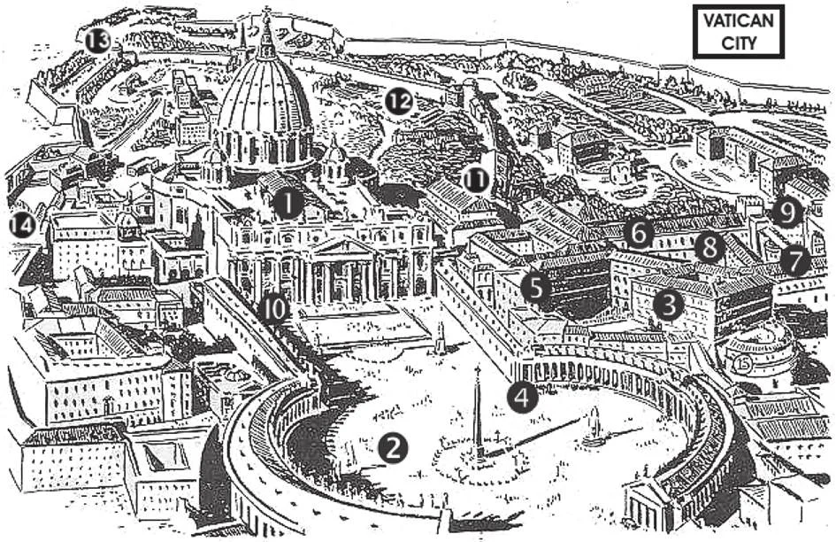

# 57. Powers of the Pope

1. Basilica of St. Peter; 2. Plaza of St. Peter; 3. The Vatican (10,246 rooms); 4. Bronze door; 5. Courtyard of Damascus; 6. Vatican Library; 7. Vatican Museum; 8. Courtyard of Belvedere; 9. Courtyard of Pines; 10. Door leading to Libraries; 11. Sistine Chapel; 12. Vatican Gardens; 13. Observatory; 14. Campo Santo; 15. Quarters of the Swiss Guards. In 1929 Pope Pius XI and King Victor Emmanuel III signed a formal agreement, by which the Pope regained temporal sovereignty over the City of the Vatican. That is the smallest independent state in all Christendom. But in it the Roman Pontiff is supreme, free from all human dictation. Catholics from all over the world at any time, in war or at peace, can have free access to their universal Father, because of this independence.

**What are the chief powers of the Pope?**

— The Pope has supreme and complete power and jurisdiction to decide questions of faith and morals and to arrange the discipline of the universal Church. 1. The power of the Pope extends over every single church, every single bishop and pastor, every one of the faithful.

> He may appoint and depose bishops, call councils, make and unmake laws, send missionaries, confer distinctions, privileges, and dispensations, and reserve sins to his own tribunal.

2. The Pope is the supreme judge; to him belongs the last appeal in all cases.

> The Pope is the "teacher of all Christians", the "chief shepherd of the shepherds and their flocks". "Peter, standing up with the Eleven, lifted up his voice and spoke out to them ..." (Acts 2:14). The word "Pope" is derived from the Latin term *papa*, which means "Father".

3. The Pope is independent of every temporal sovereign and of every spiritual power. He is responsible only to God.

**What is the temporal power of the Pope?**

— The temporal power of the Pope is his power to rule an independent state as sovereign, free and independent from other earthly sovereigns.

> The vastness of the Church and the greatness of its responsibilities towards its millions of members require that it should be able to communicate with them unhampered by any national government, free of foreign interference.

1. When Constantine the Great was converted at the beginning of the fourth century, he gave large grants of money and lands to the Church. Emperors who succeeded him added to the grants.

> In the year 327, Constantine moved the seat of his Empire to Constantinople. Rome was abandoned to itself, and became the prey of successive hordes of barbarians. The Roman people came to look up to the Popes as their only governors and protectors. In fact, it was Pope Leo the Great who saved Rome from Attila the "Scourge of God", and from Genseric the Vandal. Thus abandoned by the emperors, little by little the people of central Italy became bound more strongly to the Popes.

2. In 754, the Lombards invaded Italy and threatened Rome. The Pope appealed urgently to the Emperor in Constantinople, but he was indifferent, neglectful, and did nothing.

> In this emergency, the Pope crossed the Alps and appealed to Pepin, the Frankish king, to protect the people in Italy from the Lombards. Upon defeating the Lombards, King Pepin granted the conquered provinces to the Pope. In 774 Charlemagne, the successor of Pepin, confirmed the grant, and donated additional provinces to the Pope. These possessions, called the States of the Church, the Popes held till 1859.

3. In 1859, all the States of the Church, except Rome, were seized by the armies of Victor Emmanuel II, leader of the movement for the unification of Italy.

> In 1870, Rome itself was taken, and made capital of Italy, and the Pope became virtually a prisoner in his own palace.

4. In 1929, the Lateran Treaty signed between the Holy See and the crown of Italy recognized the Pope's temporal power and his sovereignty over the City of the Vatican, by a formal concordat between the Pope and the crown of Italy.

> The City of the Vatican is the smallest sovereign state in the world. At the time of the signing of the Lateran Treaty, it had a population of 532, only 250 of whom were resident. It is almost entirely enclosed by high walls, and comprises 110 acres.

**What exclusive privileges does the Bishop of Rome enjoy, to signify his supremacy as Head of the Church?**

— The Bishop of Rome enjoys the following exclusive privileges: 1. He has precedence of jurisdiction and honour over all other bishops.

> The Bishop of Rome's jurisdiction extends over all Christendom. He is first in both authority and honour.

2. He enjoys the exclusive titles of: Pope, Sovereign Pontiff, Roman Pontiff, Holy Father, His Holiness, Vicar of Christ, Father of Christendom. But he calls himself the "Servant of the Servants of God."

> Because of the words of Our Lord to Peter: "Blessed art thou," we address the Pope Beatissime Pater (Most Holy Father). The office is called the See of Peter, Holy See, or Apostolic See, or the Chair of Peter. The Pope is called from his see, the Pope of Rome, and the Catholic Church under him is often called the Roman Catholic Church.

3. He assumes a new name upon his election, as St. Peter was given a new name by Our Lord. From the tenth century, it has been the custom to choose the name from those of previous Popes, St. Peter's being excepted out of reverence.

> He wears the tiara, a triple crown, the symbol of his preeminence in the threefold office of Teacher, Priest, and Pastor. He wears a cassock of white silk, uses white silk shoes, and a crosier mounted by a cross. He issues medals, confers knighthood. He sends ambassadors. He has a gold-and-white standard.

## Consistories

The College of Cardinals is the Senate of the Pope. As principal advisers and helpers, the cardinals assist the Holy Father in the government of the Church. After the Supreme Pontiff, the cardinals have the highest dignity in our Holy Mother Church.

Consistories are assemblies of cardinals presided over by the Pope. There are three kinds: (1) secret, with only the Pope and cardinals present; (2) public, attended by other prelates and lay spectators; (3) semi-public, attended by bishops and patriarchs.

At the secret consistory, the Pope delivers an allocution on religious and moral conditions throughout the world; sometimes seeks the opinion of the cardinals on the creation of new cardinals, gives the cardinal's ring, appoints bishops, archbishops and patriarchs, makes ecclesiastical transfers, divides or unites dioceses, and asks for a vote on a proposed canonization. At the public consistory, the Pope bestows the red hat, hears the causes of beatifications and canonizations. At the semi-public consistory, the propriety of a proposed canonization is decided.
