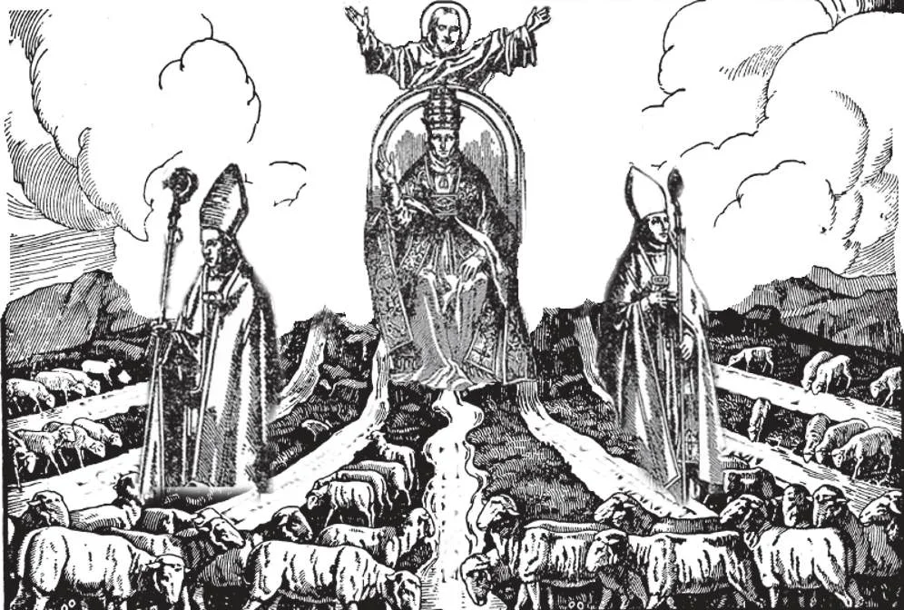

# 60. Bishops and Priests

As the Pope is the successor of St. Peter, so the other bishops are the direct successors of the other Apostles. Bishops are called "princes of the Church." To them Our Lord spoke: "He who hears you hears Me." They and their vicars general are termed ordinaries because they have ordinary, or immediate, jurisdiction over the diocese The priests, especially parish priests, assist the bishops in the care of souls.

**What jurisdiction has a bishop?**

— A bishop rules over that part of the Church, an organized territory called a bishopric, diocese, or see, assigned to him by the Pope.

> The word "bishop" is a translation from the Greek *episcopos*, which means "overseer," a term first applied during apostolic times. To Titus St. Paul wrote, "For this reason I left thee in Crete, that thou shouldst set right anything that is defective and shouldst appoint presbyters in every city" (Tit. 1: 5).

1. The bishops are the major-generals in the vast army of the Church. They command the different divisions of that army, subject to the authority of the commander-in-chief, the Bishop of Rome. Under their jurisdiction are the parish priests in charge of parishes.

> As the Pope is the successor of St. Peter, so the other bishops are the direct successors of the other Apostles.

> Bishops are called "princes of the Church." To them Our Lord spoke: "He who hears you hears Me." They and their vicars general are termed ordinaries because they have ordinary, or immediate, jurisdiction over the diocese

2. A bishop administers the temporal possessions of his diocese, and gives an account of their administration to the Pope. He provides for the education and training of candidates for the priesthood, and the religious education of his whole flock. He gives faculties to hear confessions, censors books on religious subjects, and has many other powers for the proper administration of his diocese. A bishop is supreme in his diocese, but he is subject in all things to the Pope, who appoints him.

> The Pope grants their jurisdiction to bishops; before a bishop can exercise his office, he has to be recognized and confirmed by the Pope. He is obliged to go to Rome at stated intervals, to report on the state of his diocese. A bishop has the right to be called to a General Council, which is an assembly of the bishops of the world, presided over by the Pope. But, "If anyone is eager for the office of bishop, he desires a good work" (1 Tim. 3:1)

3. A bishop is shepherd of his flock. He appoints and supervises parish priests to help him. In governing his diocese, he is assisted by a number of "canons", or by diocesan consultors. A coadjutor or auxiliary bishop is commissioned to assist the bishop of a diocese. Usually a coadjutor bishop is one with the right of succession.

> The Pope addresses a bishop; *Brother*, because as bishops, they have the same rank. Bishops wear a mitre, and carry a crosier as a sign of their office of pastor. They wear a pectoral cross. They have a ring, as a symbol of their union with their diocese. The faithful kiss this ring in token of obedience and respect.

4. A Vicar Apostolic is a bishop who rules over a territory that is not yet fully organized, called a Vicariate Apostolic.

> When the territory is first organized, it is usually placed under the care of a priest, and not a bishop. This priest is called a Prefect Apostolic and his territory is an Apostolic Prefecture.

5. A titular Bishop or Archbishop is one who bears the title of a diocese, but has no jurisdiction over it. Nuncios, apostolic delegates, coadjutor and auxiliary bishops, and vicars apostolic are generally titular.

> Titular bishops and archbishops have no actual sees; they are given the titles of certain sees that previously existed, but that have since disappeared in the reorganization of jurisdictions, or because of the inroads of Mohammedanism, heresy, or paganism. The names of the sees are kept intact, and awarded to those whom the Holy See wishes to raise to the rank of bishops, and given special work.

6. An Archbishop or Metropolitan is a bishop who has certain powers of jurisdiction granted by the Pope over neighbouring dioceses composing his province.

> Archbishops wear a pallium, a white strip of wool, on the shoulders, as a symbol of gentleness. They act as first judges of appeal from a decision of their suffragan bishops.

**Who assist the bishops in the care of souls?**

— The priests, especially parish priests, assist the bishops in the care of souls.

1. Parish priests are captains in the great army that is the Church. They command the soldiers of the Church, all baptised persons residing in the particular districts, called parishes, assigned to them by the bishops.

> The parish priest carries out the purpose of Christ in founding the Church. He teaches the people their religion, their duties towards God and each other. He governs the people, leading them in Catholic work. He sanctifies them by administering the sacraments.

2. Parish priests receive their orders and jurisdiction from the bishop. They are his spiritual children, and are bound to carry out his commands. In the parish, the parish priest represents the bishop, and no one may, without his consent or the bishop's, exercise spiritual functions there, such as marrying, baptising, preaching, burying, giving extreme unction, etc.

> A vicar for a ne (called also urban and rural dean) is a parish priest having supervisory power in the name of the bishop over neighbouring parishes. A vicar-general is the chief among the officers of a diocese. Parish priests of large districts have priests helping them, called curates or assistants.

3. The duties of parish priests are many, varied, and of great responsibility. Like all priests, they are pledged to lifelong celibacy. Daily, they must recite the Breviary, the priests' book, which cannot be read under less than an hour's time.

> On account of these heavy responsibilities, all Catholics have the obligation to pray for their priests, and to help them as much as possible, especially that they may continue in the love of God, and be enlightened by the Holy Ghost.

A parish priest and his curates have to visit the sick of the parish any time of the day or night, whenever there is a call. He has to give the last sacraments to the dying, however contagious or repellent the disease of such persons might be. He has to hear confessions hour after hour; he has to fast as long as the Masses he is scheduled to say have not been said. He must renounce the world with all its worldly amusements for the love of God. As shepherd of his flock, he is responsible to God for the souls of those committed to his charge; and on the day of judgement, he has to render a strict account of his stewardship over them.
