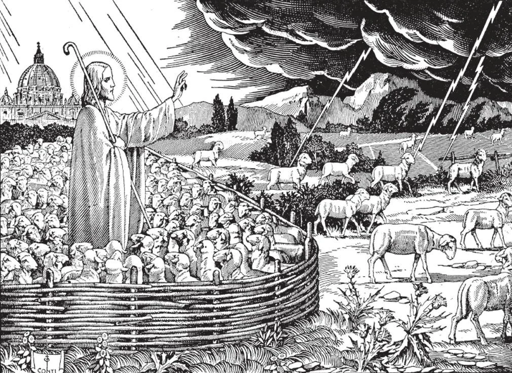

# 62. The Laity

*"I am the good shepherd, and I know mine and mine know me, even as the Father knows me and I know the Father; and I lay down my life for my sheep. And other sheep I have that are not of this fold. Them also I must bring, and they shall hear my voice, and there shall be one fold and one shepherd" (John 10:14-16). All those not baptised are sheep of Christ that have not yet heard His voice. They must also be brought into the Church. Protestants are sheep that have left the fold of Christ. They must return to the Church, if they would hear the voice of Christ, the Good Shepherd, Who lovingly calls them to His True Church.*

**Who are the laity of the Church?**

— The laity of the Church are all its members who do not belong to the clerical or to the religious state.

1. All members of the Church, whether clerical, religious, or lay, are termed "the faithful." After Baptism we join the ranks.

> The laity must remember that they are part of the Church. They must understand that when anyone speaks of the "Church" they are included, as we include the heart and mind of a man with his soul when we speak of him. The Church is you and I.

2. The clerical state includes all priests and aspirants to the priesthood who have received tonsure. Students of seminaries are aspirants to the priesthood.

> "Tonsure" is the rite by which a layman is initiated into the clerical state. The bishop, or any delegated prelate, cuts the candidate's hair in some prescribed form, and invests him with a surplice.

3. The religious state includes those who are members of religious orders or congregations, bound by either temporary or perpetual vows of poverty, chastity, obedience.

> Aspirants, postulants, and novices are preparing to embrace the religious state.

**Do Catholic Sinners continue to belong to the Church?**

— Yes.

1. Unless one cuts himself off by heresy, apostasy, or excommunication, a Catholic sinner continues to be a member of the Church. Those in mortal sin are called "dead members", for their souls are dead in sin.

> Indeed the Church is the Church of Saints; but the greatest part of its activities has to be for sinners. Perhaps we may say, without fear of contradiction, that most of the members of the Church are sinners. We all fall away from the ideal, at some time or other; then the Church calls, to bring us back.

2. Until we attain heavenly bliss, there will always be the darkness of sin, the pain of evil. Christ Himself spoke of bad fish with the good, of cockle among the wheat.

> Of the sheep in the fold, one wanders out. But Our Lord longs for the wanderer, let us help bring him back.

3. God gave Catholics the grace of their holy religion. But He also gave them their free will. And they are free to choose: whether to act in full accordance with His commands and counsels, or whether to practice only a part, or whether to violate those commands.

> There is a wide gap between belief and practice; it is that gap that divides Catholics into practical and nominal Catholics.

**Must the faithful think and act alike?**

— No.

1. The faithful must believe in all the doctrines entrusted by Christ to His Church, and act in accordance with those doctrines; but these pertain to the field of faith and morals, not to other matters. Therefore, there is no question about "thinking and acting alike," among the 1,200,000,000 Catholics in the world.

> Each Catholic is an individual. He must believe that Jesus Christ is God; but with one of his Catholic friends he may differ concerning the best political party to join. He must not deny his Church, but he may argue with the parish priest about who should be one's favourite Saints.

2. The Church is for no particular class, whether millionaires, or labourers, scientists or children; the Church is classless, and for all classes, for all men. These cannot all act and think in one uniform pattern.

> The different classes among Catholics arise from causes apart from the Church, such as racial, cultural, and social causes. But anywhere and everywhere one can be a good Catholic.

3. Good Catholics believe alike in this: that they are members of a divinely-established Church, the well-being of which it is their duty to promote, by striving to attain the perfection indicated by Christ.

> The Church presents us with the ideal, and provides the means to reach that ideal, inviting and urging us, feeding and shepherding the flock. But the Church does not guarantee salvation for all the faithful; because among its doctrines, the freedom of the will is as fundamental as the divine authority of the Church.

**How can the laity help the Church in the care of souls?**

—The laity can help the Church in the care of souls by leading lives that will reflect credit on the Church, and by cooperating with their bishops and priests, especially through Catholic Action.

> "Even so, let your light shine before men, in order that they may see your good works and give glory to your Father in heaven" (Matthew 5: 16).

1. A good Catholic makes serious efforts to save his soul. He keeps the commandments of God and the Church. He receives the sacraments. He does all things prescribed by Christ through the Church.

> Therefore, he must know his religion. He must not be ignorant of Christian doctrine, for by it he learns how to save his soul. By it he learns what to believe, and what to do.

2. A good Catholic obeys his ecclesiastical superiors in spiritual matters, and gives them due respect. He sees in his lawful superiors Christ's representatives on earth.

> He is loyal to the Church in word and deed. He does not criticise it, or make derogatory remark about it. Even if his priests may have faults, he tries his best not to bring them and the Church into contempt. If the faults are public and grievous, he may bring the matter to the attention of lawful authority, but always with great prudence.

3. According to his means, he contributes towards the support of the Church.

> This is a serious obligation which too many Catholics neglect. The Church needs support as much as the civil government. It cannot subsist on air. Religion makes no progress where Catholics are so indifferent as to begrudge their material support.

4. A good Catholic has before him a wide scope of activity if he wishes to participate in the work of the Church; there are no barriers between man and God.

> Should a Catholic be moved by a spirit of reform, he need not cut himself off from the Church by founding a new sect. He busies himself within the Fold of the Church, taking active steps to attain the reform he desires. For always there is need of reform in practices and current conditions, though never in fundamental doctrine.
