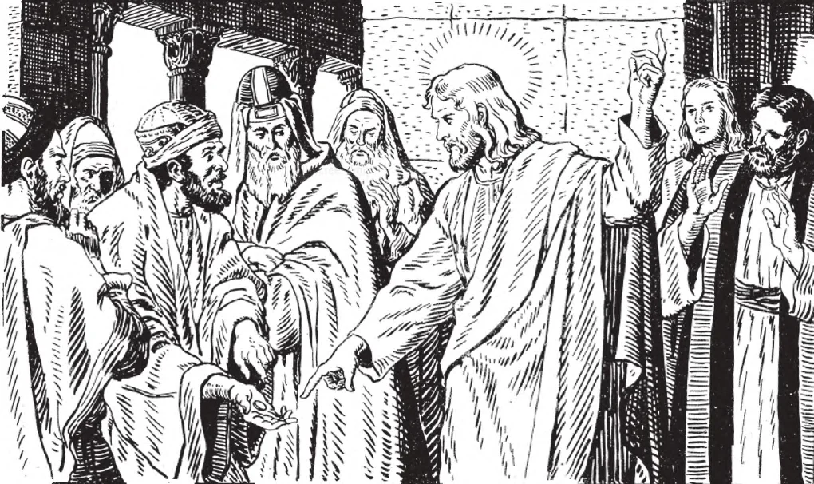

# 64. Church and State

Once the Pharisees asked Our Lord: "Is it lawful to give tribute to Caesar or not? Our Lord asked for a coin and then inquired, 'Whose image and inscription does it bear?'" They answered, "Caesar's." And Our Lord said. "Render, therefore, to Caesar the things that are Caesar's, and to God the things that are God's."Thus, we are taught to give both the State and the Church what is due to each, in accordance with the end that each pursues.

**How many Perfect Societies are there?**

— There are two perfect societies.. Catholic Doctrine recognizes that there are two perfect societies in this world – the Catholic Church and the State. Each possesses the means to attain the end that God has assigned to each of them. Thus, the Church promotes the salvation of souls while the State promotes the temporal common good. Imperfect societies, such as the family, cannot bring their members to perfection without the help of the Church and the State.

**What is the Relation between Church and State?**

— Although God has made each one of these Societies supreme in its own domain, they are naturally related. They have the same members and the temporal goal of the State is ordered to the spiritual goal of the Church – eternal salvation. In addition, there are many matters which concern both the Church and the State.

> “The Almighty therefore has given the charge of the human race to two powers, the ecclesiastical and the civil, the one being set over divine, and the other over human, things. Each in its kind is supreme, each has fixed limits within which it is contained…defined by the natural and special object of each…” (Leo XIII)

**What are the Obligations of the State towards the Church?**

— Since the State is a moral organization of men, it has the same duties as the men who compose it. Therefore, the first duty of the State is to recognize the True Church. From this flows its duties to public acts of the Catholic Religion, to protect the rights of the Church, to assist its work, to stand up against all moral errors and to prohibit, prudently, the propagation of false religions. Where the common good requires it, these latter may be tolerated. However, even if the State does not recognize the true Church, it must respect the rights of the Church because this is so beneficial for the temporal common good which the State must foster. “It is a public crime to act as if there were no God. So too it is a sin for the State not to have care for religion as something beyond its scope. … Now it cannot be difficult to find out which is the true religion, if only it be sought with an earnest and unbiased mind; for proofs are abundant and striking.” (Leo XIII)

**Is one subordinate to the other?**

— There is an independence but indirect sub or dina- tion. Both the Church and State are in de pen- dent of one another in their own domain, each retaining its competency in its own field. In a Christian state, whenever their interests overlap – “mixed matters” – there is an indirect subordination of the State to the Church. The Church alone has Divinely appointed power over spiritual things, while at the same time it respects the rights of the State.

> In a non-Christian State, this indirect subordination cannot be realized until the State recognizes the True Church. To this end the Church obeys its Divine mandate “to teach all nations”.

“The Church alike and the State both possess individual sovereignty (…) From God has the duty been assigned to the Church not only to interpose resistance, if at any time the State rule should run counter to religion, but, further, to make a strong endeavour that the power of the Gospel may pervade the law and institutions of the nations.” (Pope Leo XIII)

**Is there a Separation of Church and State?**

— Although they are independent, they are not and should not be separated. However, modern democratic systems are based on the false principle of the separation of Church and State. The Church has condemned this error because it violates the laws of God. Although this idea is promoted as beneficial to men, in fact, it leads to tyrannical governments, the corruption of morals and oppression.

> “As soon as the State refuses to give to God what belongs to God, by a necessary consequence it refuses to give to citizens that to which, as men, they have a right; as, whether agreeable or not to accept, it cannot be denied that man's rights spring from his duty toward God. Whence it follows that the State, by missing in this connection the principal object of its institution, finally becomes false to itself by denying that which is the reason of its own existence.” (Leo XIII) “Based, as it is, on the principle that the State must not recognise any religious cult, it is in the first place guilty of a great injustice to God; for the Creator of man is also the Founder of human societies and preserves their existence as He preserves our own. We owe Him, therefore, not only a private cult, but a public and social worship to honour Him." (St. Pius X).

**How is a Catholic patriotic?**

— Christian charity demands that we must want our nation to possess the greatest of all gifts – the truth. That is why a Christian, if he is worthy of the name, is always an Apostle. (Pius XII)

> "Wherefore, to love both countries, that of earth below and that of heaven above, yet in such mode that the love of our heavenly surpass the love of our earthly home, and that human laws be never set above the divine law, is the essential duty of Christians, and the fountainhead, so to say, from which all other duties spring." (Leo XIII)

**Do we have a moral duty to vote?**

— Yes, we do. All citizens, as members of both the Church and the State are obliged to promote the good of both these societies and to protect them from evil. Since modern democracies afford all the opportunity of political influence through voting, this means must not be neglected.

> “That in the present circumstances there is a strict obligation for those who have the right to vote, men and women, to take part in the elections. A person who abstains from voting, especially if he does so for reason of indolence, commits what in itself is a mortal sin.”(Pius XII)

“Grave therefore is the responsibility of every man or women who has the political right to vote, especially there where the religious interests are at stake. To abstain in such a case is, we know it well, a grave and fatal sin of omission.” (Pius XII)

**Is it ever lawful to disobey Civil authority?**

If the civil Government should command anything contrary to the natural law or the law of God, then “we ought to obey God rather than men.” (Acts 5:29) In fact, to disobey unjust laws is not disobedience because “the will of the rulers is opposed to the will of God.” (Leo XIII) Where a Catholic “disobeys” such an order, he bears witness to the Sovereignty of God. In so doing he serves the common good because God’s pre-eminence is the foundation of social justice. Without Him rulers become arbitrary tyrants.

> “If, therefore, it should happen to anyone to be compelled to disregard either the commands of God or those of rulers, he must obey Jesus Christ, who commands us to “give to Caesar the things that are Caesar’s, and to God the things that are God’s.” Mtt.22:21 (Leo XIII)
