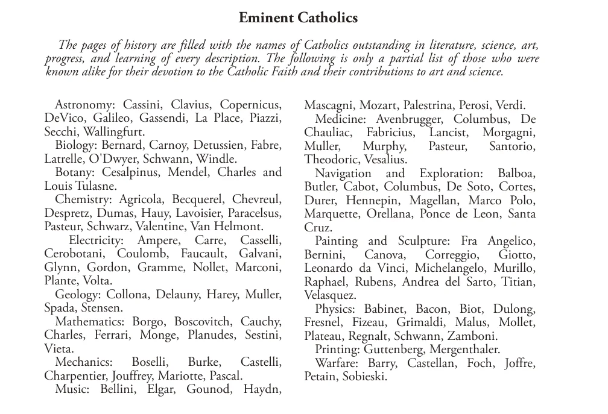

# 65. Services of the Church to the State

## Eminent Catholics

The pages of history are filled with the names of Catholics outstanding in literature, science, art, progress, and learning of every description. The following is only a partial list of those who were known alike for their devotion to the Catholic Faith and their contributions to art and science.

Astronomy: Cassini, Clavius, Copernicus, Mascagni, Mozart, Palestrina, Perosi, Verdi. DeVico, Galileo, Gassendi, La Place, Piazzi, Medicine: Avenbrugger, Columbus, De Secchi, Wallingfurt. Chauliac, Fabricius, Lancist, Morgagni, Biology: Bernard, Carnoy, Detussien, Fabre, Muller, Murphy, Pasteur, Santo rio, La tr elle, O'Dwyer, Schwann, Windle. Theodoric, Vesalius. Botany: Cesalpinus, Mendel, Charles and Navigation and Exploration: Balboa, Louis Tulasne. Butler, Cabot, Columbus, De So to, Cortes, Chemistry: Agricola, Becquerel, Chevreul, Durer, Hennepin, Magellan, Marco Polo, Despretz, Dumas, Hauy, Lavoisier, Paracelsus, Marquette, Orellana, Ponce de Leon, Santa Pasteur, Schwarz, Valentine, Van Helmont. Cruz. Electricity: Ampere, Carre, Casselli, Painting and Sculpture: Fra Angelico, Ce robot ani, Coulomb, Faucault, Galvani, Bernini, Canova, Correggio, Giotto, Glynn, Gordon, Gramme, Nollet, Marconi, Leonardo da Vinci, Michelangelo, Murillo, Plante, Volta. Raphael, Rubens, Andrea del Sarto, Titian, Geology: Coll on a, De lau ny, Harey, Muller, Velasquez. Spada, Stensen. Physics: Babinet, Bacon, Biot, Dulong, Mathematics: Borgo, Boscovitch, Cauchy, Fresnel, Fizeau, Grimaldi, Malus, Mollet, Charles, Ferrari, Monge, Pla nudes, Sestini, Plateau, Regnalt, Schwann, Zamboni. Viet a. Printing: Guttenberg, Mergenthaler. Mechanics: Boselli, Burke, Castelli, Warfare: Barry, Castellan, Foch, Joffre, Charpentier, Jouffrey, Mariotte, Pascal. Peta in, Sobieski. Music: Bellini, Elgar, Gounod, Haydn,

**Of what benefit is the Church to the State?**

— The Church is essential for the welfare of the State, for it upholds the government, directs its members to obey just laws, prevents crimes, incites to the practice of civic virtues, encourages to noble endeavour, and unites different nations in one brotherhood. 1. There is no better citizen than a good Catholic. He obeys the State because his religion teaches him that all lawful authority comes from God.

> Who can be a more law-abiding citizen than one who looks upon civil officials as superiors that God Himself bids him obey? Plutarch says that religion is a better protection for a city than its walls.

2. The Church teaches its children to make sacrifices for the common good. Thus it trains unselfish, thrifty, and industrious members of the State. A man with no religion seldom, makes, a good citizen. He is liable to try always to get as much as he can even at the expense of others. A man without religion generally ends without any morality whatever.

> The prisons are in general peopled, not by practising members of the Church, but by people who neglected religion. Only God knows the number of those who have been turned from the paths of sin and crime on account of their connection with the Church.

3. The Church not only prevents crimes, but incites to works of charity.

> It teaches the merit of works of mercy. From its teachings bud forth orphanages, schools, hospitals, social service, etc.

4. The greatest statesmen and patriots have recognized the necessity of religion in the State. Without religion among its citizens, the State would soon collapse. The Catholic Church teaches the best religion, the one taught by God Himself.

> Washington said: "Of all the dispositions and habits which lead to political prosperity, religion and morality are indispensable supports. In vain would that man claim the tribute of patriotism who should labour to subvert these great pillars of human happiness, these firmest props of the duties-of men and citizens." Machiavelli wrote: "The surest sign of ruin in a State is the neglect of religion." Napoleon himself confessed that no nation could endure without religion.

5. By a common profession of faith, a common membership in the same body, and by the commandment of charity, the Church binds different nations in one brotherhood, the brotherhood of men, children of one God. Such a feeling of brotherhood would help greatly towards eliminating sectional and racial prejudices and strife.

> Is it not a historical fact that national quarrels and wars have increased since the division of Christendom into sects? Today the term "brotherhood of men" seems to be a mere figure of speech in which most people have no faith.

**What has the Church actually accomplished for the State during the over two thousand years of its existence?**

—The history of all civilized nations gives ample testimony to the valuable services of the Church to civil government during a period of over two thousand years. 1. The greatest accomplishment of the Church was the Christianization of Europe. From thence we have derived whatever we today call "civilization". If we compare the truly Christian civilization with pagan life and culture, we can see the greatness of the service the Church has rendered the State.

> Ignorance and immorality are usually partners; for this reason the Church eagerly promotes culture. The Church looks upon the world as coming from the hand of God; therefore the Church is interested in science.

2. The Church has always striven to provide schools for the education of the young; it founded great universities.

> From the very beginning, the missions, parishes, monasteries, and cathedrals had schools. No less than 80 universities were built in the days when the Pope was supreme in Christendom; of these many still exist, though under different control. The encouragement given by the Popes advanced education, medicine, surgery, literature, chemistry, mathematics, and other sciences. Numerous religious orders and congregations have from earliest times devoted themselves to education.

3. The Church preserved the great works of ancient heathen philosophers and historians, saving them from destruction for future ages.

> In the Middle Ages, before the invention of printing, monks patiently and carefully copied and transcribed the ancient works. Their zeal for learning built up great libraries and museums. The most profound and prolific authors were Catholic.

4. So great a patron of art and architecture is the Church that a saying became current: "There is no art outside the Catholic Church." Practically all the world's classic painters have been members of the Church, and were supported in their work by the Popes. We need only mention Raphael da Vinci, and Michelangelo.

> To this day, thousands of tourists every year gaze in wonder at the great cathedrals of the Middle Ages, which stand unsurpassed. The Popes encouraged musicians like Palestrina. Plain chant, or Gregorian music, comes to us from St. Ambrose and St. Gregory the Great. The noblest musical works are products of the genius of sons of the Church, of whom we need mention only Gounod, Haydn, Mozart, Verdi.

5. Priests and monks, not to mention lay members of the Church, have contributed some of the greatest discoveries to human knowledge.

> In physical science, the deacon Gioja discovered the magnet and compass; the Jesuit Kircher experimented with the first burning glass; the canon Copernicus taught his famous system; the Jesuit Cavaliere worked out the components of white light; the Jesuit Secchi made fruitful studies concerning sunspots; the Franciscan Berthold Schwarz discovered gunpowder. Other scientific works by priests and monks: the Dominican Spina discovered the use of spectacles; the Benedictine Pontius invented a method of teaching deaf-mutes; the Dominican Calandoni invented a typesetter to take the place of the compositor; the monk Veit discovered the scale and rules of harmony in music. Pope Gregory XIII reformed the calendar.

6. The Church helped establish free and stable governments; it civilized the barbarians. Through the Benedictines, Cistercians, and Trappists, it reclaimed whole tracts of waste lands. The Church cared for the poor, the sick, the orphaned, the old and helpless. It opened hospitals, ransomed captives, and freed slaves. Pope Innocent III is known as "Father of Hospitals".

> Who but the Church insisted on the dignity of the soul of even the poorest slave in an age when class distinctions were rampant? Who but the Church rescued woman from degradation, and formed that beautiful institution, the Christian family? The Church stood for the liberties of the people against the encroachments of tyrants. It has ever stood for the poor against the oppressions of the rich. It has stood for the maintenance of authority against the violence of rebellious subjects. The whole history of Christian civilization has the mark of the Church.

## Popes of the Catholic Church

St. Peter 67 St. Boniface IV 615 Benedict VI St. De usd edit Benedict VII St. Linus, m. 76 (A de oda tus I) 618 John XIV St. A nac let us (Cletus), m. 88 Boniface V 625 John XV St Clement I, m. 97 Honorius I 638 Gregory V Severin us 640 Sylvester II St Evaristus, m. 105 John IV 642 John XVII St Alexander I, m. 115 St. Sixtus I, m. 125 Theodore I 649 John XVIII St. Martin I, m. 655 Sergius IV St. Telesphorus, m. 136 St. Eugene I 657 Benedict VIII St Hyginus, m. 140 St Pius I, m. 155 St. Vitalian 672 John XIX St. Anicetus, m. 166 A de oda tus II 676 Benedict IX Don us I 678 St Soter us, m 175 St. Aga tho 681 Sylvester III St. Eleutherius, m. 189 St. Victor I, m. 199 St. Leo II 683 Benedict IX St. Benedict II 685 St. Zephyr in us, m. 217 John V 686 Gregory VI St. Call is tus I, m. 222 St. Urban I, m. 230 Con on 687 Clement II St. Pontian, m. 235 St. Sergius I 701 Benedict IX John VI 705 St. Ante rus, m. 236 John VII 707 Damasus II St. Fabian, m. 250 St. Cornelius, m. 253 Sisinnius 708 St. Leo IX Constantine 715 Victor II St. Lucius I, m. 254 St. Gregory II 731 Stephen X St. Stephen I, m. 257 St. Sixtus II, m. 258 St. Gregory III 741 Nicholas II St. Dionysius 268 St. Zachary 752 Alexander II Stephen II 752 St. Gregory VII St. Felix I, m. 274 Stephen III 757 Bl. Victor III St. Eu ty chi an, m. 283 St. Caius, m 296 St. Paul I 767 Bl. Urban II Stephen IV 772 Paschal II St. Marcellinus, m. 304 Adrian I 795 Gel as ius II St. Marcellus I, m. 309 St. Eusebius, m. 309 St. Leo III 816 Call is tus II St. Mel chia des, m. 314 Stephen V 817 Honorius II St. Paschal I 824 Innocent II St. Sylvester I 335 Eugene II 827 Celestine II St. Mark 336 St. Julius I 352 Valentine 827 Lucius II Gregory IV 844 Bl. Eugene III Liberius 366 Sergius II 847 Anastasius IV St. Damasus I 384 St. Sir ici us 399 St. Leo IV 855 Adrian IV St. Anastasius I 401 Benedict III 858 Alexander III St. Nicholas I 867 Lucius III St. Innocent I 417 Adrian II 872 Urban III St. Zo zim us 418 St. Boniface I 422 John VIII 882 Gregory VIII Marinus I 884 Clement III St. Celestine I 432 St. Adrian III 885 Celestine III St. Sixtus III 440 St. Leo I (the Great) 461 Stephen VI 891 Innocent III St. Hilary 468 For mos us 896 Honorius III Boniface VI 896 Gregory IX St. Sim pl ici us 483 Stephen VII 897 Celestine IV St. Felix III (II) 492 St. Gel as ius I 496 Romanus 897 Innocent IV Theodore II 897 Alexander IV Anastasius II 498 John IX 900 Urban IV St. Symmachus 514 St. Hormisdas 523 Benedict IV 903 Clement IV St. John I, m 526 Leo V 903 Bl. Gregory X Sergius III 911 Bl. Innocent V St. Felix IV (III) 530 Anastasius III 913 Adrian V Boniface II 532 John II 535 Land us 914 John XXI John X 928 Nicholas III St. A gap it us I 536 Leo VI 928 Martin IV St. Silverius, m. 537 Vigilius 655 Stephen VIII 931 Honorius IV Pelagius I 561 John XI 935 Nicholas IV Leo VII 939 St. Celestine V John III 574 Stephen IX 942 Boniface VIII Benedict I 579 Pelagius II 590 Marinus II 946 Bl. Benedict XI A gap it us II 955 Clement V St. Gregory I John XII 964 John XXII (the Great) 604 Sab in i anus 606 Leo VIII 965 Benedict XII Boniface III 607 Benedict V 966 Clement VI John XIII 972 Innocent VI 974 Bl. Urban V 1370 983 Gregory XI 1378 984 Urban VI 1389 996 Boniface IX 1404 999 Innocent VII 1406 1003 Gregory XII 1415 1003 Martin V 1431 1009 Eugene IV 1447 1012 Nicholas V 1455 1024 Call is tus III 1458 1032 Pius II 1464 Paul II 1471 (1st reign) 1044 Sixtus IV 1484 1045 Innocent VIII 1492 Alexander VI 1503 (2nd reign) 1045 Pius III 1503 1046 Julius II 1513 1047 Leo X 1521 Adrian VI 1523 (3rd reign) 1048 Clement VII 1534 1048 Paul III 1549 1054 Julius III 1555 1057 Marcellus II 1555 1058 Paul IV 1559 1061 Pius IV 1565 1073 St. Pius V 1572 1085 Gregory XIII 1585 1087 Sixtus V 1590 1099 Urban VII 1590 1118 Gregory XIV 1591 1119 Innocent IX 1591 1124 Clement VIII 1605 1130 Leo XI 1605 1143 Paul V 1621 1144 Gregory XV 1623 1145 Urban VIII 1644 1153 Innocent X 1655 1154 Alexander VII 1667 1159 Clement IX 1669 1181 Clement X 1676 1185 Innocent XI 1689 1187 Alexander VIII 1691 1187 Innocent XII 1700 1191 Clement XI 1721 1198 Innocent XIII 1724 1216 Benedict XIII 1730 1227 Clement XII 1740 1241 Benedict XIV 1758 1241 Clement XIII 1769 1254 Clement XIV 1774 1261 Pius VI 1799 1264 Pius VII 1823 1268 Leo XII 1829 1276 Pius VIII 1830 1276 Gregory XVI 1846 1276 Pius IX 1878 1277 Leo XIII 1903 1280 St. Pius X 1914 1285 Benedict XV 1922 1287 Pius XI 1939 1292 Pius XII 1958 1294 John XXIII 1963 1303 Paul VI 1978 1304 John Paul I 1978 1314 John Paul II 2005 1334 Benedict XVI resigned 2013 1342 Francis 1352 1362
