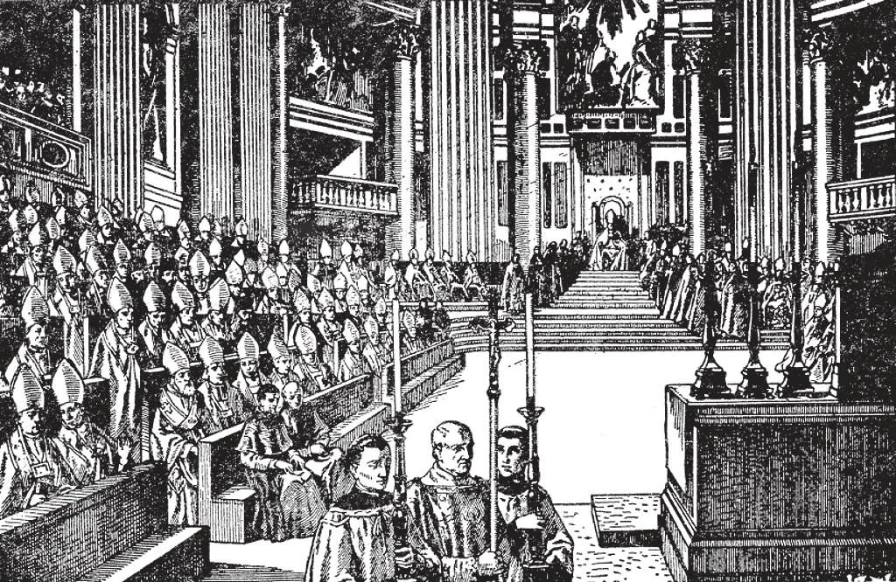

# 68. Sphere of Infallibility

Since the time of Christ, from the first council of the Apostles in Jerusalem in the year 50, to the last Vatican Council in 1870, there have been held in all twenty-one general or ecumenical councils. The Vatican Council, shown above, declared the dogma of the infallibility of the Pope.

**When does the Church teach infallibly?**

— The Church teaches infallibly when it defines, through the Pope alone, as the teacher of all Christians, or through the Pope and the bishops, a doctrine of faith or morals to be held by all the faithful.

> The Church, as the representative or substitute of Jesus Christ on earth, is infallible, and speaks with His own words: "This is why I was born, and why I have come into the world, to bear witness to the truth" (John 18:37).

1. When the Church makes an infallible pro-nouncement, we are not to suppose that a new doctrine is being introduced. For instance, when the Holy Father in 1854 defined the Blessed Virgin's Immaculate Conception as an article of faith, the infallible definition was not a proclamation of a new doctrine, but was merely an announcement of an article of faith, true from the very beginning, and publicly defined only in order to make the dogma clear to all and to be believed as part of the deposit of faith left to the Church.

> Another example is the definition of the Holy Father's infallibility, made in 1870 by the Vatican Council. The dogma was true from the very beginning, and had been universally held. But as in recent times, many objections were being made against it, the Bishops in the Vatican Council thought it best, in order to make clear the stand of the Church, to make an infallible definition.

2. The Church makes infallible pronouncements on doctrines of faith and morals, on their interpretation, on the Bible and Tradition, and the interpretation of any part or parts of these. The dogma of the Immaculate Conception of the Blessed Virgin was an interpretation of a longstanding Tradition in the Church.

> The Church also pronounces on the truth or falsity of opinions, teachings, customs, etc., with relation to fundamental doctrines. Another subject on which the Church makes infallible declarations is in the canonization of Saints. All whom the Church has raised to the glory of the altar by a solemn canonization are undoubtedly now in heaven, enjoying eternal bliss in the presence of God.

**When does the Church teach infallibly through the Pope alone?**

— The Church teaches infallibly through the Pope alone, when he speaks officially ( *ex cathedra* ) as the Supreme Head, for the entire universal Church.

> As the Pope has authority over the Church, he could not err in his official teaching without leading the Church into error. As Our Lord said to Peter, the first Pope: "I have prayed for thee, that thy faith may not fail; and do thou, when once thou hast turned again, strengthen thy brethren" (Luke 22: 31 - 32).

In order to speak infallibly, the Pope must speak *ex-cathedra*, or officially, under the following conditions:

1. He must pronounce himself on a subject of faith or morals. Infallibility is restricted to questions regarding faith and morals. The Church pronounces on natural sciences and on legislation only when the perversity of men makes of them instruments for opposing revealed truths.

> If the Pope should make judgements on mathematics or civil governments, he is as liable to error as any other man with the same experience. Letters to kings and other rulers are not infallible pronouncements. However, we should hold the Pope's opinions on any subject with great respect, on account of his position and experience.

2. He must speak as the Vicar of Christ, in his office as Pope, and to the whole Church, to all the faithful throughout the world. In his capacity as private teacher, for example, in his encyclical letters, he is as any other teacher of the Church.

> Should the Pope, like Benedict XIV, write a treatise on Canon Law, his book would be written in a private capacity, and liable to error, just as the books of other theologians. We accept, not on faith, but in obedience to his authority, out of respect for his experience and wisdom.

3. He must make clear by certain words his intention to speak *ex-cathedra*. These words are most often used: "We proclaim," "we define," etc.

> The Pope's infallible decrees are termed "doctrinal," since they involve doctrine. From the earliest days of the Church, the infallibility of the Pope has been acknowledged. In the year 417, the Holy See condemned the Pelagian errors; St. Augustine cried out the famous words, "Rome has spoken; the cause is ended!" The Council of Florence in 1439 called the Pope "the Father and Teacher of Christians."

**When does the Church teach infallibly through the Pope and the bishops?**

— The Church teaches infallibly through the Pope and through the bishops when convened in a general (or ecumenical) council under the Pope.

1. A General Council is an assembly convened by the Holy See, of all the bishops of the world, and others entitled to vote. It represents the teaching body of the Church, and must be infallible.

> In the year 50, the Apostles held the first General Council in Jerusalem. Its decisions were proclaimed as coming from God, the final decree beginning with these words: "For the Holy Spirit and we have decided to lay no further burden upon you" (Acts 15: 28).

2. Over a General Council, the Pope or his legate presides; a representative number of bishops and others entitled to vote, such as cardinals, abbots, and generals of certain religious orders, must be present. Upon confirmation by the Pope, a General Council's decrees are binding on all Christians.

> It must be understood that the decrees of a General Council have no binding authority until confirmed by the Pope. There is no appeal from the Pope to a General Council.

3. A unanimous vote is not necessary for an infallible decision of a general council; the Pope's decision is sufficient.

> The most notable of the General Councils so far held following the Council of Jerusalem have been: (1) the Council of Nicea in the year 325, which pronounced against the heresy of Arius; (2) the Council of Ephesus, in the year 425, which declared Mary the Mother of God; (3) the Council of Nicea, in 787, which declared the veneration of images as lawful and profitable; (4) the Council of Trent, 1545-1563, which declared against the heresies of Luther; (5) the Council of the Vatican, 1870, which defined as an article of faith the doctrine of the infallibility of the Pope.

4. Even when the bishops are not gathered together in one place, they form the teaching body of the Church, united with the Pope. Therefore, their voice must be infallible, otherwise the universal Church would be led into error. For the same reason as above, the daily ordinary uniform teaching of the Church in every place in the whole World is infallibly true.

> "Go into the whole world and preach the gospel to every creature" (Mark 16: 15).
