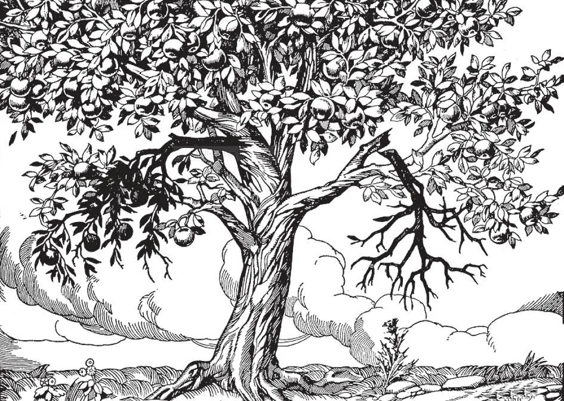

# 70. Salvation and the Catholic Church

Christ said: "As the branch cannot bear fruit of itself unless it remain on the vine, so neither can you unless you abide in me. I am the vine, you are the branches. He who abides in me, and I in him, he bears much fruit; for without me you can do nothing. If anyone does not abide in me, he shall be cast outside as the branch and wither; and they shall gather them up and cast them into the fire, and they shall burn" (John 15: 4-6). Time has continually proved the truth of what Christ predicted about schisms and their divisions. This is the reason for the fact that they change so often and finally disappear: they are branches broken from the tree, and must wither as He said.

**What do we mean when we say, "Outside the Church there is no salvation"?**

— When we say, "Outside the Church there is no salvation", we mean that those who through their own grave fault do not know that the Catholic Church is the true Church, or knowing it, refuse to join it, cannot be saved. 1. All are obliged to belong to the Catholic Church in order to be saved. Christ said: "Amen, amen, I say to thee, unless a man be born again of water and the Spirit, he cannot enter into the kingdom of God" (John 3: 5).

> The Catholic Church is founded on the Apostles, to whom Our Lord gave the commission to baptise; by Baptism, one is made a member of the Church. If then Baptism is indispensable, the Church must be indispensable.

2. Christ did not die for a part of, but for all mankind. He did not leave His legacy the Church for the benefit of a few, but for all. Our Lord said: "He who hears you hears me; and he who rejects you rejects me" (Luke 10: 16).

> Since God commanded all to be members of His Church, those who deliberately disobey His command will not be saved. Whoever, through his own fault, remains outside of the Catholic Church, will be lost eternally.

3. One who, knowing the Catholic Church to be the true one, leaves it or does not join it because he wants to make a good marriage, to advance his business, or for some other worldly motive, will not be saved. He is a wilful and malicious unbeliever.

> One who leaves the Church or does not enter it because of human respect, or because its doctrines require personal sacrifices, will not be saved. One who belongs to another church and has doubts about the truth or falsity of his own church, but takes no pains to find out the truth will not be saved. "If you believe not that I am he, you shall die in your sin."

4. It is not enough to belong to the Church. We must also live up to our beliefs, otherwise our membership will only work to our greater condemnation. Only those Catholics who live according to the teachings of the Church will be saved.

> The Church is a guarantee of salvation to those only who obey it. Unfortunately, there are bad Catholics. We must therefore study our religion and then practice it. God has given us the grace to be members of the true Church; we must not waste that grace.

5. Catholics who have committed grave sins such as murder, arson, adultery, etc., are still members of the Church. As long as a Catholic does not deny a doctrine of the Catholic faith, or is not excommunicated, he is a member of the Church.

> Catholics in grave sin are called dead members, for their soul is dead in mortal sin. Nevertheless they remain members, and have the privilege of receiving the sacraments to wash away their sins. Christ Himself predicted that in the Church there would be bad people with the good, cockle among the wheat. Mother Church is a good mother that patiently awaits the return of her sinful children, and does not exclude them from her gifts.

6. An excommunicate, is one who has been cut off from membership in the Church for some serious sin against faith. He is excluded from the sacraments, from Catholic burial, and from being prayed for in the public prayers of the Church. In order to become once more a member of good standing in the Church, an excommunicate has to obtain the absolution of the bishop.

> Catholics who join Masonry, or marry before a non Catholic minister, are automatically excommunicated, if they knew the serious nature of their action.

**Can they be saved who remain outside the Catholic Church because they do not know it is the true Church?**

— They who remain outside the Catholic Church through no grave fault of their own, and do not know it is the true Church, can be saved by making use of the graces which God gives them.

1. God condemns no man except for grave sin. Therefore He will not condemn those who through no fault of their own are unaware of His command to belong to the True Church, provided they serve Him faithfully according to their conscience, have a sincere desire to do His will in all things, and therefore implicitly wish to become members of His Church. They are members of the Church, in desire.

> A baptised Protestant, of Protestant parents, lives all his life a Protestant without ever having a doubt that he is in the wrong. Before death, he makes an act of perfect contrition for the sins he has committed. Such a man will be saved, for he dies in the state of grace. It is possible for one that has never even heard of Jesus Christ to be saved, for God "wishes all men to be saved and to come to the knowledge of the truth" (1 Tim. 2: 4) and "Christ died for all" (2 Cor. 5: 15). In order that such a one may be saved, it is required that he observe the natural law; with the help of God; everyone having the use of reason can do that. Whoever then obeys the natural law will be enlightened by God, at some time in his life, with the grace with which he can make an act of Divine faith. If he makes good use of this grace and firmly believes whatever God has revealed, he will receive the further graces with which he can make the acts of hope, repentance, and charity that must precede before God will bestow on his soul sanctifying grace, with which he can merit eternal life.

2. The fact that it is possible for those outside the Church to be saved should not make us lose sight of the great disadvantages they are under, as compared with Catholics who live in the full light of Divine revelation. Such persons have not the infallible Church to guide them in what they are to believe and do in order to serve God. They have to live without the Sacraments, Holy Mass, and Holy Communion, and the other countless sources of grace which the Church supplies for the sanctification of its children, those professed Catholics who are members of the body of the visible Church.

> These disadvantages should make us Catholics realize more fully the many reasons we have for humbly thanking God for the priceless blessings we have received without any claim or merit of our own. They should also spur us on to give Him a more worthy service, and help spread our Faith.
