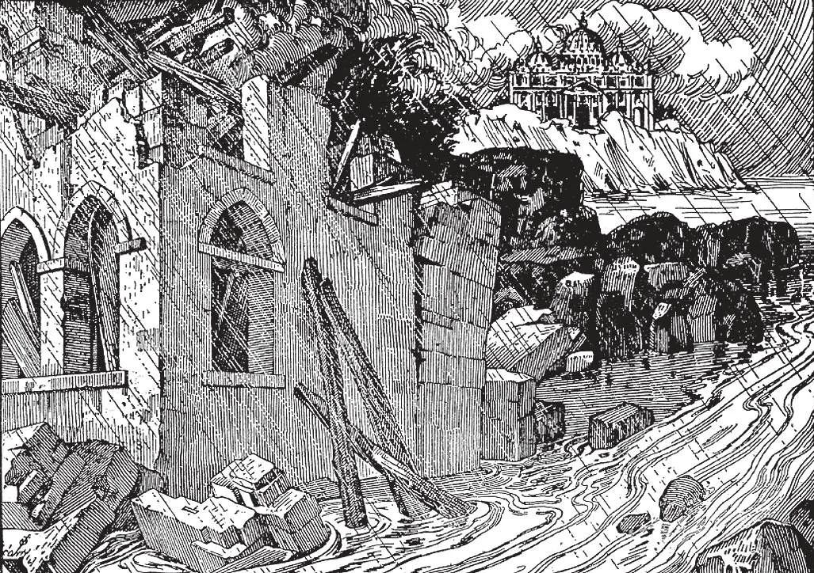

# 71. Schism and Heresy

Our Lord said; "Everyone therefore who hears these my words and acts upon them, shall be likened to a wise man who built his house on rock. And the rain fell, and the floods come, and the winds blew and beat against that house, but it did not fall, because it was founded on rock. And everyone who hears these my words and does not act upon them, shall be likened to a foolish man who built his house on sand. And the rain fell, and the floods came, and the winds blew and beat against that house, and it fell, and was utterly ruined" (Matt. 7: 24-27). Non-Catholic churches are the "house upon sand;" they rise up and fall. The Catholic Church is the "house upon rock;" it will last forever.

**What is schism; and what is heresy?**

— Schism is an act of refusing to submit to the authority of the Pope; heresy is the formal and deliberate denial or doubt of any revealed truth of the Catholic Faith.

> Apostasy is the total rejection of his Faith by a baptised Christian. With heresy and schism, and supported by persecution, it has caused divisions in the True Church, and the rise of other churches.

1. Christ predicted divisions in the Church, and the rise of other churches. From the time of the Apostles, new denominations have sprung up, and have divided and subdivided to form other denominations. With other churches that are non-Christian, the Christian denominations have opposed the Apostolic Church.

> "For false Christs and false prophets will arise, and will show great signs and wonders, so as to lead astray, if possible, even the elect" (Matt. 24:24)

2. The difference between a heretical and a schismatical church is this: while both may believe in the same doctrines, the schismatical church has valid orders and sacraments, but the heretical church has not.

**What were the most important schisms and heresies that have tried to destroy the Church?**

— Of the numerous schisms and heresies, the following may be mentioned: 1. Arius was a priest of Alexandria who taught that Jesus Christ was not God. The heresy of Arius spread rapidly, and was supported by the Roman emperors. He was condemned by the First General Council of the Church at Nicea, in the year 325; the Council declared the divinity of Christ.

> In a few centuries, the Arian sect was divided and swept away by other errors. Today we know Arius only by name: he has passed on, but the Church he fought still lives, upholding Christ's divinity. Another heretic of the early days was Macedonius, who denied the divinity of the Holy Ghost. His theories were condemned by the Council of Constantinople in the year 381. In the fifth century, Pelagius denied original sin, and declared grace not necessary for salvation. The doctrines were condemned by the synods of Milevi and Carthage, and the decision ratified by the Pope. Nestorius, Bishop of Constantinople, in the fifth century taught the doctrine that Jesus Christ was two persons: a man and God the Son; only the man Jesus was born of Mary and died on the cross. As a consequence, the Nestorians rejected the title "Mother of God" for the Blessed Virgin. The Third Council in Ephesus, 431, condemned the heresies. As a form of extreme reaction from Nestorianism, the Monophysites, held that Jesus Christ had only one nature, his divinity totally engulfing his humanity. Dioscoros, Patriarch of Alexandria, was the chief propagator of the heresy, which was condemned by the Council of Chalcedon in 451. In an effort to call back the Monophysites to the Church, the heresy of Monothelitism arose. The chief doctrine was that Christ had a single will; the heresy was condemned by the Council of Constantinople in 681. In the year 727, the Greek emperor Leo forbade all veneration to images on the ground that such veneration was idolatry. The heresy spread, and mobs entered churches to break images, to burn and destroy priceless works of art. Great harm was done to the people and their faith, before this heresy, called Iconoclasm (image-breaking), died out. The Council of Nicea in 787 defined the true doctrine of the Church.

2. The greatest schism suffered by the Christian Church was that of the East, resulting in the establishment of the Orthodox Eastern Church. The Eastern emperors, desiring more power in the Church, tried to make the patriarchs of Constantinople independent of Rome. Finally, Photius, with the support of the emperor, held a council of Eastern bishops in the year 867, and broke from Rome.

> The cause of the schism was not doctrinal, but rather political and material; jealousy between the East and the West. It has resulted in the separation from Rome of 145 million people with valid priesthood and sacraments. All over the world, there are a number of schismatical churches, among them the Greek Orthodox, and the Russian Church.

a. After minor schisms and misunderstandings between East and West in 1054, there was a final break by Cerularius, patriarch of Constantinople, continuing today.

> Today the Orthodox Eastern Church remains in schism, but does not spread. It is a withered branch, having cut itself off from the parent tree.

b. The Orthodox Eastern Church denies the Catholic dogma that the Holy Ghost proceeds from the Father and the Son. It also teaches that the souls of the just will not attain complete happiness till the end of the world, when they will be joined to their bodies; and that the souls of the wicked will not suffer complete torture in hell until that last day. These are heresies against the doctrines of the Church.

> Thus it can be seen that today, the Orthodox Eastern Church is not merely schismatical, but truly heretical; for it holds primary doctrines in a different light. But it has valid orders.

(See pages 110-111)

3. In the 12th century, Albigensianism arose in southern France. It upheld dualism: two opposing creative principles, the good creating the spiritual world, and the evil creating the material world.

> The Albigenses went to excesses, recommending suicide, forbidding marriage, asserting that Our Lord did not have a human body, denying the resurrection of the body. The heresy was condemned by the Fourth Lateran Council, 1215.

4. As an offshoot of Albigensianism, Waldensianism spread throughout Spain, Lombardy, Bohemia, and neighboring countries. The heresy continued until the outbreak of Protestantism, when it merged with this.

> The Walden ses denied the existence of Purgatory, combatted indulgences, asserted that laymen could preach and absolve, oaths were unlawful, sinful priests had no valid power of ministry, etc. But out of evil, God has often drawn good. Each schism and heresy has led to profound study in the Church, study of Scholars to discover the correct interpretation of doctrine under dispute. In this way, light came from darkness. As wise St. Augustine said: "Those who err in doctrine only serve to show forth more clearly the soundness of those who believe a right."

5. In the fourteenth century, Wycliff in England taught that the Bible was the sole rule of faith, that there was no freedom of the will, that confession was useless, that the Pope had no primacy.

> Adopting the theories of Wycliff, Huss in Bohemia spread the errors. Political considerations complicated the heresy; fighting broke out, lasting years.
