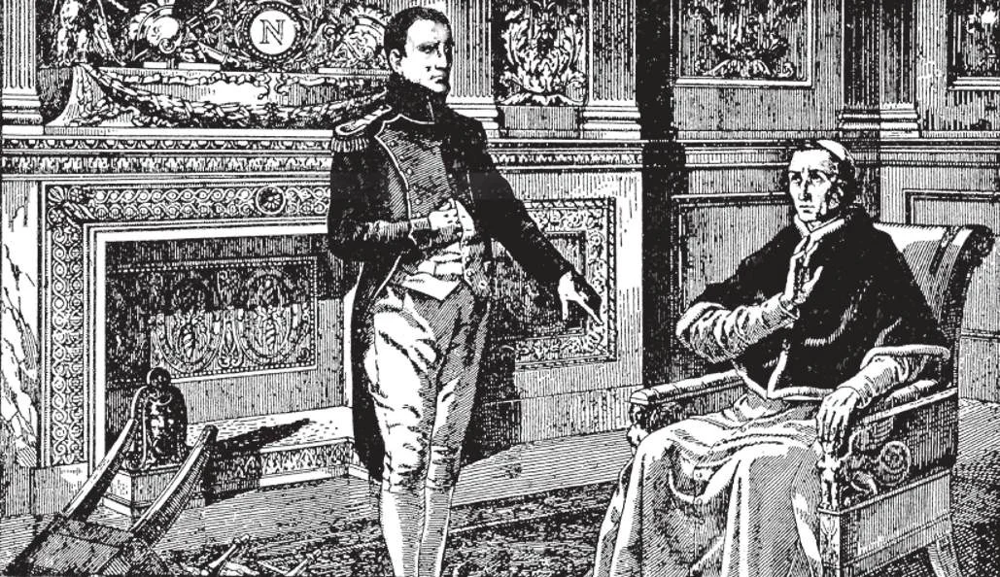

# 73. The Gates of Hell

*In the castle of Fontainebleu, Napoleon forced the Pope to give up the States of the Church, promising an annual income of two million francs. In the same castle, Napoleon was himself later forced to sign an abdication and was promised a yearly income of the same amount. When the Pope excommunicated Napoleon, he answered that the words of an old man would not make the arms drop from the hands of his soldiers. In the Russian campaign, because of the intense cold, this actually happened. He kept Pius VII prisoner for five years; he himself was later a prisoner for seven years. Four days after ordering the union of the States of the Church with France, he lost the battles of Aspern and Erlingen.*

**What was the end of the leaders of persecution, schism, and heresy?**

— Many of the leaders of persecution, schism, and heresy came to a bad end.

1. Of the first persecutors, several died violent deaths. The death of Judas is the type for his imitators. It is related that:

> Herod, the murderer of the Holy Innocents, died in unspeakable tortures. Herod, the murderer of James the Apostle, was devoured by worms.

2. Of the persecutors in Rome, Nero was deposed, and in despair stabbed himself.

> Domitian was assassinated. Hadrian became insane. Marcus Aurelius, despondent over the ingratitude of his only son, starved himself to death. Septimus Severus, whose life had been attempted by his only son, died in despair. Decius died miserably in a swamp, during a battle. Valerian was flayed alive by the Persians. Maxentius was drowned in the Tiber.

> Diocletian died from a loathsome disease. Julian the Apostate was struck down by a lance on the field of battle, and died crying: "Galilean, Thou hast conquered!"

3. The case of Napoleon is instructive.

> Drunk with power, Napoleon seized Rome in 1808, declaring himself the "successor of Charlemagne". He banished Cardinals and bishops, and carrying off Pope Pius VII, held him prisoner in Savona. Enemies of the Church exulted: "The Papacy is ended! The Emperor has devoured the Pope!" They forgot the divine promise to Peter: "The gates of hell shall not prevail!"; on that promise was based the ancient saying: "Who eats of the Pope dies like a beast." On the same day that Napoleon died in exile at St. Helena, Pope Pius VII was celebrating his own feast day in Rome.

4. Heretics and schismatics have shared the same fate. Arius burst asunder during a triumphal procession. Voltaire died in despair. The Greek Schismatics fell under the Turkish yoke in 1453, on Pentecost, the feast of that Holy Ghost about whom they had expressed doubts.

> Truly history has shown the truth of the words of Holy Scripture: "It is a fearful thing to fall into the hands of the living God" (Heb. 10:31).

**Why can no other church except the Catholic Church be the True Church of Christ?**

— No other church except the Catholic Church can be the True Church of Christ, because no other church possesses the marks of unity, holiness, catholicity, and apostolicity.

> Truth cannot change; hence the constantly changing doctrines of non-Catholic churches can not be true. They also differ in their government. Some recognize the temporal ruler as their spiritual head. Others have ministers whom they call bishops, deacons, elders. The majority reject such titles.

1. There are hundreds of churches and Christian denominations, each different from the others; they do not possess the mark of unity. They differ in even the essentials of faith. They cannot agree, and keep dividing and subdividing year by year. Their only similarity appears to be their opposition to the Catholic Church.

> Such churches are multiplying. In the United States, there are over two hundred religious bodies. They arise, then pass away, to give place to other denominations. Realizing the great handicap of disunity, efforts have been made by various groups of churches to organize. General councils and conferences of different bodies have been held; but there is no vital result for unity. This is of course because, though agreement may be general concerning matters such as social work, beneficent societies, and the like, no agreement can be found in the essentials of faith and doctrine. This is the result of free interpretation of the Bible, and the repudiation of Peter's successor, Vicar of Christ.

2. The denominations and their founders are not holy in the same sense or degree as the Catholic Church and its Founder are holy. Many non-Catholics are upright and good because they have retained many doctrines and practices of the Catholic Church.

> Many founders of non-Catholic churches were far from holy. Luther, the founder of Protestantism was an apostate friar, who married a nun who had left her convent and turned against her vows. During his life, he taught contradictory doctrines, some of them immoral. Henry VIII, the founder of Anglicanism, married five women successively after divorcing his lawful wife; he had two put to death.

3. No denomination is catholic or universal. These non-Catholic churches are everywhere, but are different everywhere.

> A regional or national Church cannot be the true Church, since it cannot teach all nations, as Christ commanded.

4. No heretical Christian denomination is apostolic. The Protestant churches are some 1500 years later than the Church founded on the Rock of Peter.

> Not even their teachings come down from the Apostles. Their ministers cannot trace their succession from the Apostles. Not one teaches all the doctrines of the Apostles. How then could they be the Church founded by Christ?

**What should be the attitude of Catholics towards those who do not belong to the True Church?**

— Catholics should observe an attitude of understanding towards them, because the majority of those who do not belong to the True Church are in good faith.

1. Catholic teachings are not easy to understand at first sight; many Catholic practices require sacrifice. Towards such a religion there is bound to be prejudice.

> To be obliged to go to Mass every Sunday under pain of mortal sin; to have to confess to a priest, who is another human being like ourselves; to condemn divorce and birth control; to observe fasts and abstinence; these are not easy doctrines.

No wonder in looking for relief, man often, however unconsciously, seeks motives for not accepting the Church that commands its members to obey such precepts, to accept such doctrines.

> When Our Lord first announced the institution of the Holy Eucharist, many of the disciples said, "This is a hard saying. Who can listen to it?" (John 6:61) And they no longer went with Jesus.

2. Catholics should above all try to give good example; nothing is more effective in the eyes of non-Catholics than the exemplary lives led by good Catholics.

> "Behave yourselves honourably among the pagans; that, whereas they slander you as evildoers, they may through observing you by reason of your good works glorify God in the day of visitation" (1 Peter 2:12). Catholics should often pray for the conversion of those outside the Church, praying with the Good Shepherd for only one Fold.

3. While avoiding useless discussions that generally end in bitter quarrels, Catholics should try to show the beauty, the truth of the Catholic Church.

> In our friendly discussions with non-Catholics, we should not be always on the defensive, but should try to see whether they can trace the origin of the authority of their ministers to the Apostles, whether their church can be proved the True Church by the possession of the four marks. Often our non-Catholic friends criticise the Catholic Church on account of some devotional practices like holy water, candles, etc., as if such practices belonged to the essentials of faith.
