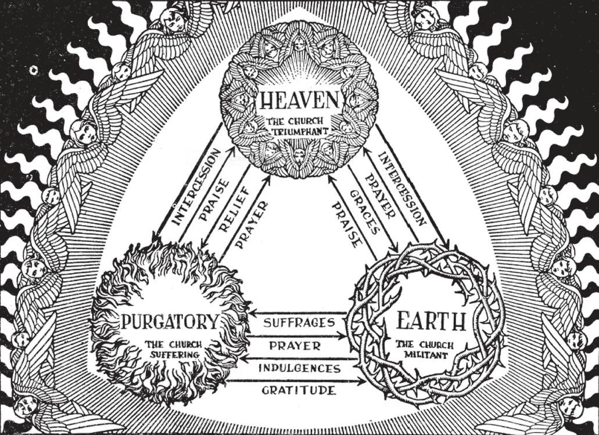

# 74. One Body in Christ: Communion of Saints

The illustration shows the continuous communication in the three portions of the Church spiritually united in Jesus Christ. The members on earth send up prayers to the angels and saints for themselves and for the poor souls in purgatory. They in turn are helped by the intercession of the saints and angels, and by the graces obtained thereby. The poor souls pray for the members on earth.

**Why is the Catholic Church called the Mystical Body of Christ?**

— The Catholic Church is called the Mystical Body of Christ, because its members are united by supernatural bonds with one another and with Christ, their Head, thus resembling the members and head of the living human body. 1. The term "Mystical Body of Christ" is derived from St. Paul's metaphor: "He is the head of his body, the Church" (Col. 1: 18) . Again: "You are the body of Christ, member for member" (1 Cor. 12: 27). "We, the many, are one body in Christ" (Rom. 12: 5).

> Jesus Himself used a similar symbol: "I am the vine, you are the branches. He who abides in me, and I in him, he bears much fruit; for without me you can do nothing. If anyone does not abide in me, he shall be cast outside as the branch and wither" (John 15: 5-6).

2. In the Mystical Body, Christ as Head wills to be helped by His Body. Thus He rules the Church, but does so indirectly, through the hierarchy, human authority.

> In a similar manner, the human head, to live, has need of the rest of the body. The hierarchy is the material on which is formed the Image of Christ, God. The acts, ceremonies, ritual, liturgy of the Church; all these are outward signs of the inward reality of the union of the members with one another and with their Head, Christ; they are visible manifestations of a common supernatural life in the Godhead.

3. Among the members of the Mystical Body of Christ, there exists an interdependence; so that although each one has his own individual function, yet he does not live for himself alone, but for the entire Body. Every good he does perfects the Body, of which he is a part.

> Similarly, the eye, or the foot, or the arm of a man is useless existing alone and apart from the rest of his body. Here is an example of the interdependence among members of the Church: Suppose a Catholic prays to recover from a grievous illness, and he does not recover; there is no evident answer to his prayers. Yet, do they go to waste? God lets no good work "go to waste"; the merits of the prayers are not lost for the Mystical Body.

4. Because of the interdependence among the members, and between members and Head, of the Mystical Body, there follows a continuous contribution and distribution of merits and graces, profiting all towards eternal life. This supernatural fellowship, this mystical union and interdependence, is presented to us in the Apostles' Creed in the doctrine of the Communion of Saints.

**What is meant by "the Communion of Saints" in the Apostles' Creed?**

— By "the Communion of Saints" is meant the union of the faithful on earth, the blessed in heaven, and the souls in purgatory, with Christ as their Head.

> There is only one Mystical Body, only one Church. But this Church has three aspects: the Church Triumphant, the Church Suffering, and the Church Militant.

1. The saints and angels in heaven compose the Church triumphant, because they have gained the crown of victory. The souls in purgatory compose the Church suffering, because they still have to expiate for their sins before they can enter heaven. The faithful on earth compose the Church militant, because they have to struggle ceaselessly against the enemies of their souls.

> The Church triumphant, the Church suffering and the Church militant compose one Church united in Christ, members of a body whose head is Christ: "So we, the many, are one body in Christ, but severally members one of another' (Rom. 12:5).

2. All the members of the Church are of one family, and share in the spiritual treasures of the Church. However, not all members of the Church Militant fully enjoy the benefits of the communion of saints, but only those in a state of grace.

> "Dead members" do not lose all the benefits of the communion of saints, for the Church prays publicly for them, and particular members in the state of grace often send up petitions for them. Thus they may receive the grace to repent and recover sanctifying grace. Hence a Catholic who still belongs to the Church, although a great sinner, may have more hope of being converted than one who cuts himself off from the Church.

**How do the members of the Communion of Saints help one another?**

— The members of the Communion of Saints help one another by prayer and intercession, and by the merits of their good works. 1. The faithful on earth can help one another by practising supernatural charity and, especially, by performing the spiritual and corporal works of mercy.

> St. Peter was freed from prison by the prayers of the faithful. St. Stephen's prayer obtained the conversion of St. Paul. The prayers of St. Monica led to the conversion of her son, St. Augustine. This is why today, on all occasions, Catholics ask for each other's prayers, and pray for those in need. They give the spiritual alms of prayers continually, even when they cannot perform the corporal works.

2. The faithful on earth, through the communion of saints, can relieve the sufferings of the souls in purgatory by prayer, fasting, and other good works, by indulgences, and by Masses offered for them.

> St. Augustine says: "Prayer is the key by which we open the gates of heaven to the suffering souls." In the Memento after the consecration at every Mass, a special petition is made for the souls of the faithful departed. The poor souls cannot merit anything; they depend upon their brothers in Christ on earth and in heaven to help them attain their eternal home as soon as possible.

3. The souls in purgatory pray to the angels and saints, and pray for the living.

> They cannot merit anything, either for themselves or for the living, but they intercede for us.

4. Through the communion of saints, the blessed in heaven can help those in purgatory and on earth by praying for them. The faithful on earth should honour the blessed in heaven and pray to them, because they are worthy of honour and as friends of God will help the faithful on earth.

> This is why we pray to the saints and angels that they may intercede for us before God, Whom they see face to face. "Rendering thanks to God the Father, who has made us worthy to share the lot of the saints in light" (Col. 1:12).

5. The doctrine of the communion of saints is one of the most consoling dogmas of the Church. When our loved ones die, they are not separated from us forever. Whether in heaven or purgatory, they still love us and pray for us.

> We should be happy to call saints and angels our brothers. We should implore their intercession, not only for ourselves, but also for our other brothers, the poor souls in purgatory.
