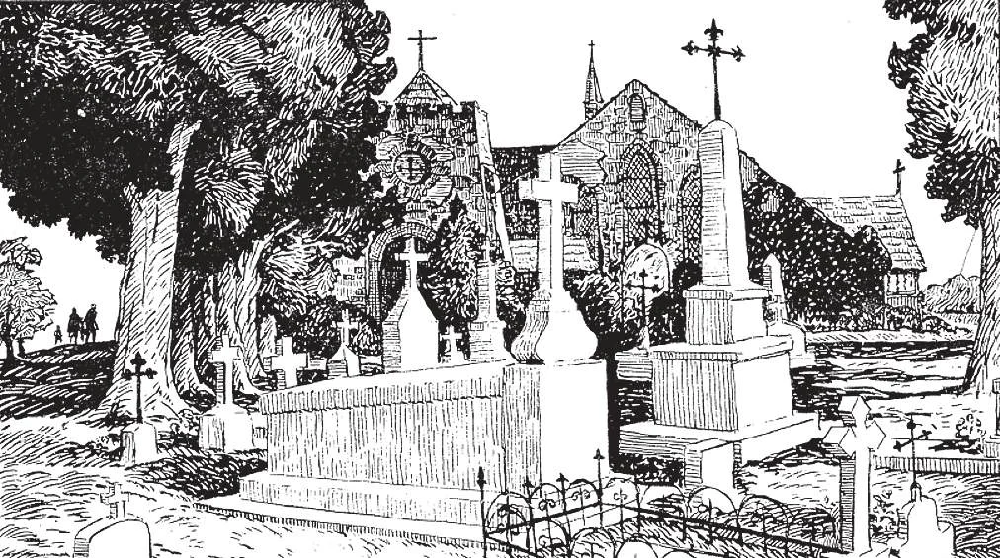

# 76. Death

Respect for the dead requires that cemeteries be properly kept. We should remember that the bodies of the buried will one day rise again to join immortal souls and live forever with God. Respect for the dead would also advise us to give up the recent fad of dolling up corpses, painting their faces to make them seem alive, as if they were prepared for some flighty show.

## Eleventh Article of the Apostles' Creed

**What happens at death?**

— At death the soul is separated from the body. 1. The soul is judged by God, and rewarded with heaven, punished with hell, or sent for a time to be cleansed in purgatory. The body begins to corrupt and returns to the dust from which it came.

> St. Peter spoke of the body as a tabernacle for the soul: "the putting out of my tabernacle is at hand" (2 Pet. 1:14). At death, "the dust returns to its earth, from whence it came, and the spirit returns to God, Who gave it" (Eccles. 12: 7). The only exceptions have been the bodies of Our Lord and the Blessed Virgin, which rose to join their soul, and are now in heaven.

2. All men must die, because death is a consequence of original sin. "Therefore as through one man sin entered into this world and through sin death, and thus death has passed into all men" (Rom. 5:12).

> By their sin our first parents lost the immortality of the body, for God condemned them to die. "Dust thou art, and into dust thou shalt return" (Gen. 3: 19). Even Jesus Christ and His Mother submitted to death.

3. No one knows when, where, or how he will die. All we know is that we shall die, and that when our hour strikes, nobody can take our place.

> God has mercifully hidden from us the hour of our death. If we knew when we should die, we might be overcome by fear when the moment approached. Some, besides, might lead sinful lives in the hope of repenting just before their death.

4. We must therefore always be ready to die. Death comes "as a thief in the night" when we least expect it. We must live as if every moment were the last of life, always ready to appear before our Divine Judge.

> "Therefore you must also be ready, because at an hour that you do not expect, the Son of Man will come" (Matt. 24: 44).

**How should we prepare for death?**

— We should prepare for death by leading a good life, avoiding sin, and doing good. 1. We must keep in God's grace and love, so that when the Angel of Death comes, we may welcome him as one who takes us home to see the face of our loving Father. The good do not fear death.

> Let us die with joy, saying to God, as Holy Simeon did: "Now thou dost dismiss thy servant, O Lord, according to thy word, in peace" (Luke 2: 29). Let us imitate St. Paul, who says, "I have fought the good fight. I have finished the course, I have kept the faith. For the rest, there is laid upon me a crown of justice, which the Lord, the just Judge, will give to me in that day" (2 Tim. 4: 7-8). St. Augustine exclaims: "O how sweet it is to die, if one's life has been a good one!" For such as he, "to die is gain". To the just man death is only a passing into a better life. It is a journey to his everlasting home, where his heavenly Father dwells. Death is to be feared only by the sinner, for it is the end of his earthly pleasures, and the beginning of his eternal punishment.

2. As a man lives, so he dies. Holy Scripture says: "As the tree falls so shall it lie" (Eccl. 11: 3). We should often recall the thought of death and eternity so that we may avoid sin. "In all thy works remember thy last end, and thou shalt never sin" (Ecclus. 7: 40). Those who put off reforming their lives in the hope of a deathbed repentance are like a traveller who starts packing when the train whistles for departure.

> Let us picture the death of a just man, one who all his life has done good and avoided evil. He has often seen people taken away suddenly, when they least expected it, and made up his mind to be always ready to die and face his Judge. He had hoped he would, at the end of his life, die with the Last Sacraments, a priest, and his family by his side. But his obligations have taken him into the wilderness; there he is dying, with only the guide at his side. But he is at peace, and a smile is on his lips, for he is ready to die: being always in the state of grace, he is ready to meet his Judge anywhere, any time. He knows the Judge will smile, too, and welcome him as a good son, a friend.

3. We should also have our temporal affairs in order when we die. This is why adults should make a will in order that no confusion may arise as to the disposition of their property after their death. A sudden death is not to be desired, for then we may not be able to put in order our spiritual and temporal affairs.

> This is why in the Litanies we pray: "From a sudden and unprovided death, deliver us, O Lord!"

**What are cemeteries?**

— Cemeteries are the burial grounds for the dead. 1. The word "cemetery" comes from the Greek, and means sleeping-place; there the bodies of the dead sleep till Judgement Day.

> It is the custom to engrave the letters R.I.P. (Requiescat in pace. May he rest in peace) on headstones.

2. Cemeteries are solemnly consecrated. Catholics should be buried in a Catholic cemetery, if there is one; at least the grave should be blessed.

> Some day the bodies of the just will rise in glory, and unite with their souls in heaven; is it befitting their high destiny to bury them like animals in unconsecrated ground? The bodies are buried facing the east, as a symbol of the hope the deceased placed in Christ, Light of the soul.

3. Cemeteries should be properly kept. They should be such as to invite everyone to go there and pray for those who have fallen asleep in Christ. The Church strictly forbids the desecration of graves and corpses.

> We should go regularly to the cemetery to see to it that the graves of our beloved dead are clean and well kept, and to pray for them. If when they were alive we liked to visit them, why shouldn't we continue to visit them even now that they are dead? Such visits would attest to our living faith in the immortality of the soul, and the resurrection of the body. It is true the souls of the dead are not in their graves, but the bodies there will some day be inhabited again by the souls. Our prayers in the presence of the bodies are the proof of our love for our dear dead.

4. Apostates, heretics, schismatics, the excommunicated, suicides, duellists, Masons, and public sinners, are not permitted to be buried in a consecrated Catholic cemetery.

> The refusal of the Church to give Christian burial to her bad children does not mean that she sentences them to damnation: judgement of the dead is in the hands of God. It is merely a public expression of her condemnation of sin, and a disciplinary measure so that her other children may avoid falling into such sins. Non-Catholics are not permitted burial in a Catholic cemetery, because since they did not belong to the Church during life, there is no reason for including them in the burial grounds for members of the Church, at death. The Catholic cemetery is the family plot of the Church, and only members of the family are buried therein. For the same reason, the Church permits non-Catholic relatives, as a special concession, and if no scandal would thereby follow, to be buried in family mausoleums, vaults, or plots, in consecrated ground.

5. The Church forbids cremation of the bodies of the departed, except in cases of epidemics. It is a pagan custom that has become favoured by modern materialists and atheists, as a sign of denial of immortality.

> If Catholics ask for cremation, they may not be buried in consecrated ground.
