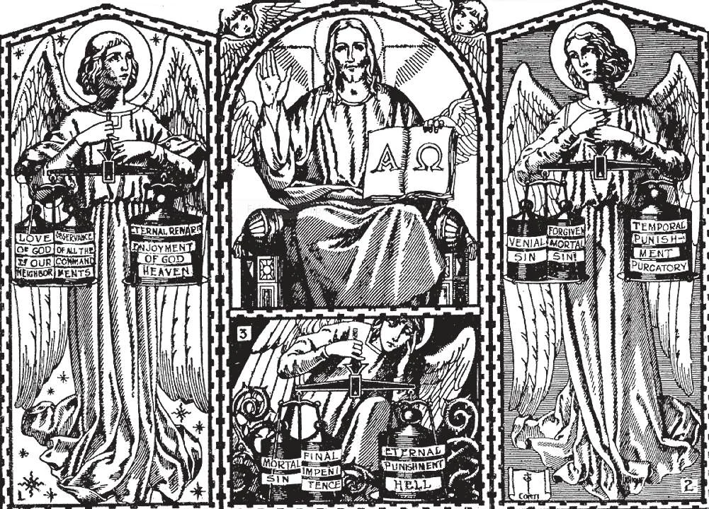

# 77. Particular Judgment

*Complete justice will not be done in this life, but in the next. Then everything will be weighed in the balance of God's justice, and punished or rewarded. If on earth we have obeyed the commandments of God and of the Church we shall be given an eternal reward in Heaven (1). If we have obeyed all the commandments, but die with unforgiven venial sin, or without having satisfied for forgiven mortal sin, we shall be sent to Purgatory (2). Alas for us if we die with even one mortal sin! For then we shall be banished from the sight of God and suffer torments in hell forever.*

**What is the judgement called which will be passed on each one of us immediately after death?**

— The judgement which will be passed on each one of us immediately after death is called the particular judgement.

> The existence of the particular judgement can be deduced from the parable of Dives and Lazarus; a soul is shown rewarded immediately after death.

1. As soon as each soul leaves the body at death, it undergoes the Particular Judgement, at which its eternal destiny is decided. "We must all be manifested at the judgement seat of Christ." "It is appointed unto men to die once, but after this comes the Judgement" (Heb. 9:27). "Every one of us will render an account for himself to God" (Rom. 14:12).

> Let us remember that even while the relatives gather around the bed of the departed one, even while his body is still warm, the particular judgement is gone through and finished; the judgement is passed, and the soul gone to his reward or punishment. If we remember this, we shall be more fervent in praying for the dead, in helping others die a happy death, so that they may meet God at the judgement without fear.

2. Jesus Christ is the Judge at the Particular Judgement. Before Him each soul must stand. The soul will stand in the awful presence of God the Son, to give an account of its whole life: of every thought, word, act, and omission.

> "Neither does the Father judge any man, but all judgement he has given to the Son" (John 5:22).

3. A man's whole life will be spread before him like a great picture. He will remember everything, although he might have forgotten much at the moment of death. How he will wish then that he had done only good! We are not to suppose that the soul will go to heaven before Christ to be judged. God enlightens each soul in such a manner that it fully knows Christ has passed a true judgement on it.

> "Of every idle word men speak, they shall give account on the day of judgement" (Matt. 12:36). The judgment will embrace even the good which has been neglected: a strict account will have to be rendered of the use we made of the talents and graces given to us. Even good actions badly performed will come under scrutiny: careless communions, hasty confessions, etc. Only then shall we know the exactness with which God sees and measures every act, word, and even intention in our deepest thought.

4. The good and the evil that the soul has done will be weighed in the balance of God's justice. Then the sentence will be passed by Jesus Christ alone, without the intervention of witnesses. This sentence is final and will never be reversed. The soul will learn the sentence, the reasons for it, and its absolute justice.

> "But of every one to whom much has been given, much will be required; and of him to whom they have entrusted much, they will demand the more" (Luke 12:48).

**What are the rewards or punishments appointed for men after the particular judgment?**

- The rewards or punishments appointed for men after the particular judgment are heaven, purgatory, or hell.

> "With what measure you measure, it shall be measured to you" (Matt. 7:2). As we have loved God and our fellow-men during life, so we shall be given the proper reward or punishment.

1. He who dies in his baptismal innocence, or after having fully satisfied for all the sins he committed, will be sent at once to heaven.

> The just will enter into everlasting life (Matt. 25:46). Only those souls enter heaven who are free from all sin, and from the penalty due to sins which have been forgiven. "Nothing defiled can enter heaven" (Apoc. 21:27).

2. He who dies in the state of grace, but is in venial sin, or has not fully atoned for the temporal punishment due his forgiven sins, will be sent for a time to purgatory.

> The souls in purgatory are saints, because they are sure of going to heaven. In purgatory they cannot commit any more sin, not even the slightest. They only long for God.

3. He who dies in mortal sin, even if only with one single mortal sin, will be sent at once to hell.

> "For the hope of the wicked is as dust, which is blown away with the wind, and as a thin froth which is dispersed by the storm: and a smoke that is scattered abroad by the wind: and as the remembrance of a guest of one day that passeth by" (Wis. 5:15). By mortal sin a man cuts himself off from God. It is really he himself that sends himself to hell. God's desire would be to see all His creatures with Him in heaven.

**How should we prepare for the judgment?**

— We should prepare for the judgment by being most careful to lead a good life and die a happy death.

1. We should do all the good we can, so that God may forgive the evil we may do. We should not only obey carefully all the Commandments of God and the Church, but do good works in prayer and alms-deeds, practising charity for the love of God.

> How can we be careless about a matter of such importance, when we are absolutely certain of being judged by God! "For what shall I do, when God shall rise to judge?" (Job 31:14).

2. We should do voluntary works of penance, for love of God, in expiation of any sins we may have the misfortune to commit.

> The "Imitation of Christ" says on this topic: "In all things look to the end, and how thou wilt stand before the strict Judge, from Whom there is nothing hid; Who takes no bribes, and receives no excuses, but will judge that which is just....Be, therefore, now solicitous for thy sins, that in the day of judgment thou mayest be in security with the blessed.... Then shall the poor and humble have great confidence, and the proud fear on every side. Then it will appear that he was wise in this world, who for Christ's sake learned to be a fool and despised.... Then shall the flesh that was afflicted exult more than if it had always fared in delights — a pure and good conscience shall bring more joy than learned philosophy. Then shall the contempt of riches far outweigh all treasures of the children of earth.... Learn to suffer now in little things, that thou mayest be delivered from more grievous sufferings....All is vanity except to love and serve God alone" (Bk. I, chap. 24),

3. We should never go to sleep without being prepared never to awake on earth again, but in the presence of our Judge.

> Let us examine our conscience every day, make acts of contrition for our sins, confess them, and resolve to avoid them in the future.
