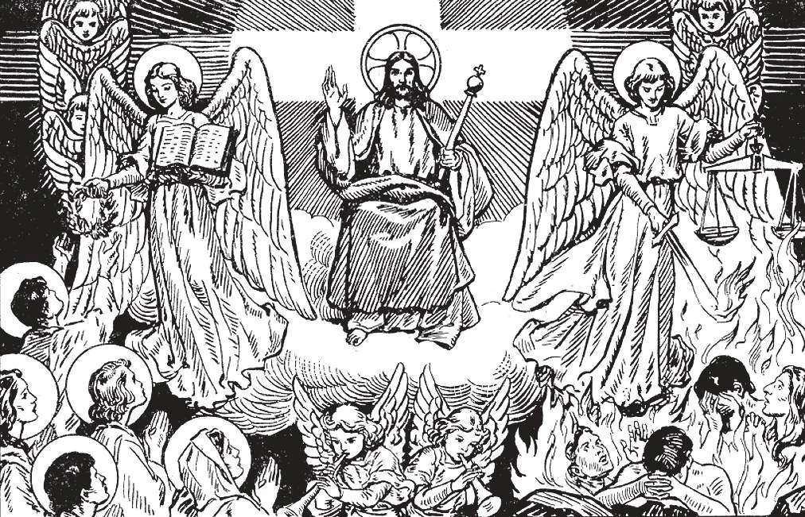

# 81. General Judgment

*The General Judgement will take place at the end of the world. It is a public repetition of the particular judgement. Then all that each has thought, said, done, or omitted will be known to everybody. The just will receive their reward, and the wicked will be punished. At the General Judgement Jesus Christ will be the Judge. Then complete justice will be meted out to all, to the souls united with the bodies.*

SEVENTH AND TWELFTH ARTICLES OF THE APOSTLES' CREED

**What is the judgement called which will be passed on all men immediately after the general resurrection?**

— The judgement which will be passed on all men immediately after the general resurrection is called the general judgement.

1. The Last or General Judgement will take place at the end of the world, but when that will be, no man knows.

> "But of that day and hour no one knows, not even the angels of heaven, but the Father only" (Matt. 24:36). After the Ascension angels told the Apostles that Christ will come again as Judge; "This Jesus who has been taken up from you into heaven will come in the same way, as you have seen him going up to heaven" (Acts 1:11).

2. Our Lord predicted that signs will precede the Last Judgement, which He Himself described; He will be the Judge. (a) The Gospel will be preached in the whole world.

> "And this gospel of the kingdom shall be preached in the whole world, for a witness to all nations; and then will come the end" (Matt. 24:14).

(b) There will be a great apostasy from faith; people will lose themselves in evil.

> "Yet when the Son of Man comes, will he find, do you think, faith on the earth?" (Luke 18:8). "And as it came to pass in the days of Noe, even so will it be in the days of the Son of Man. They were eating and drinking, they were marrying' and giving in marriage, until the day when Noe entered the ark, and the flood came and destroyed them all. In the same wise will it be on the day that the Son of Man is revealed" (Luke 17:26-27, 30).

(c) Antichrist will appear and work false miracles.

> St. Paul speaks of "the man of sin . . .the son of perdition, who opposes and is exalted above all that is called God, or that is worshipped, so that he sits in the temple of God, and gives himself out as if he were God" (2 Thes. 2:4).

**What will take place on the last day?**

— On the last day these events will take place:

1. The earth and the heavens will show signs; the stars will fall. In the heavens the sign of the Son of Man will appear. It is believed that this sign is the Cross.

> "But immediately after the tribulation of those days, the sun will be darkened, and the moon will not give her light, and the stars will fall from heaven. ... And then will appear the sign of the Son of Man in heaven" (Matt. 24:29).

2. Jesus Christ, in great power and majesty, accompanied by the angels, will come in the clouds of heaven.

> "For as the lightning comes forth from the east and shines even to the west, so also will the coming of the Son of Man be. ... And they will see the Son of Man coming upon the clouds of heaven with great power and majesty" (Matt. 24:27, 30).

3. The trumpet will sound, and all the dead will spring to life in a moment; they will be instantly reunited to their souls, and come to judgement.

> "Behold, I come quickly ... to render to each one according to his works" (Apoc. 22:12). "And he will send forth his angels with a trumpet and a great sound, and they will gather his elect from the four winds" (Matt. 24:31).

4. From these statements we are not to conclude that everybody will perceive the divine essence at the day of judgement. This cannot happen without completeness of joy; and the wicked can never see God.

> The lost souls will "see God" behind some kind of veil so that they do not delight in His divinity; they will have some kind of perception of His Majesty, and recognize His justice.

**If every one is judged immediately after death, why will there be a general judgement?**

— Although every one is judged immediately after death, it is fitting that there be a general judgement, in order that the justice, wisdom, and mercy of God may be glorified in the presence of all.

1. The last or General Judgement will be a public repetition of the particular judgement. The Judge and the matters taken up will be identical. Then Jesus will bring to light "the hidden things of darkness."

> "And I saw the dead, the great and the small, standing before the throne, and scrolls were opened. And another scroll was opened, which is the book of life; and the dead were judged out of those things that were written in the scrolls" (Apoc. 20:12).

2. All men and all angels, good and bad, will be present to hear the judgement of each one. "For there is nothing hidden that will not be made manifest, nor anything concealed that will not be known" (Luke 8:17).

> Then wilt the unjust say these words, as I have consider the just: "These are they whom we had some time in derision, and for a parable of reproach. We fools esteemed their life madness, and their end without honour. Behold how they are numbered among the children of God, and their lot is among the saints. ... What hath pride profited us? or what advantage hath the boasting of riches brought us? All those things are passed away" (Wis. 5:3-9).

3. Our Lord will place the good on His right hand, and the wicked on His left. To the just Christ will say: "Come, blessed of my Father, take possession of the kingdom prepared for you from the foundation of the world" (Matt. 25:41). To the wicked He will say: "Depart from me, accursed ones, into the everlasting fire" (Matt. 25:41).

> A great fear and instant realization of their sentence will fall upon the wicked. And they will say to the mountains and the rocks: "Fall upon us and hide us from the face of him who sits upon the throne, and from the wrath of the Lamb" (Apoc. 6:16). Immediately the good will go body and soul to heaven, and the wicked will fall body and soul into hell. "And these will go into everlasting punishment, but the just into everlasting life" (Matt. 25:46).

4. The General Judgement is necessary in order: (a) To vindicate God's providence in the government of the world, and to disclose both the good and the evil that men have done, in order to reveal God's justice, wisdom, and mercy. Man is a social, as well as an individual being; hence the necessity for a general, as well as a particular judgement.

> On that day will men see how often God has granted them graces, and they have rejected them, how often God has turned even their evil acts to their advantage, that they might repent! Then will men see how much that took up time and thought on earth was folly in the eyes of God, and how what the world called nonsense and mocked was really heavenly wisdom. As St. Paul says: "We, for our part, preach a crucified Christ — to the Jews indeed a stumbling-block and to the Gentiles foolishness" (1 Cor. 1:23).

(b) To give the just the public honour due them, and the wicked the public shame they deserve, and to make the body share in the reward or punishment of the soul with which it shared good or evil on earth.

> At the Last Judgement all our thoughts, words, and deeds, public and secret, will be made known to all creation. This fact should urge us to avoid everything of which we should then be ashamed made public. When we are tempted let us remember that the "hidden things of darkness" will be revealed on the last day.
