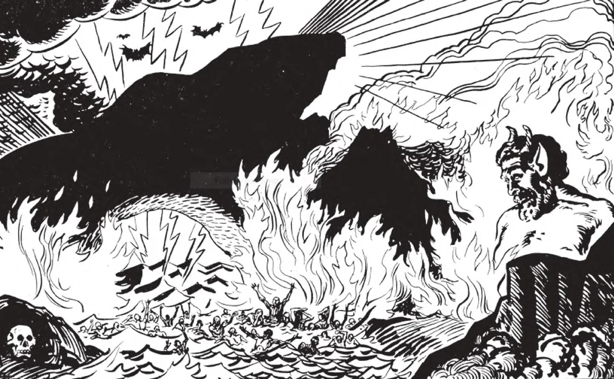

# 82. The Torments of Hell

The wicked in hell suffer dreadful torments. They feel despair, remorse, envy, and hopelessness, because they know that they can never obtain the one thing necessary for happiness. They can never see and enjoy Cod. They are tortured with envy of the blessed in heaven. They are tormented with shame because their sins will be known to all entirely and completely. After the general judgement their bodies will share the pains of their souls. They will be in torments for all eternity.

**Who are punished in hell?**

— Those are punished in hell who die in mortal sin; they are deprived of the vision of God and suffer dreadful torments, especially that of fire, for all eternity. 1. Christ Himself in fifteen places in Holy Scripture, refers to the punishment of hell, the horrible abode of the wicked.

> Scripture calls hell "a place of torments," "an unquenchable fire," "everlasting fire," "the bottomless pit," "everlasting punishment," "outer darkness."

2. All who die in mortal sin, even with only a single unrepented and unforgiven mortal sin are sent to hell.

> God is continually calling sinners to repentance by numberless graces. He instituted a Church to teach them the way to heaven, to show them what to avoid. He instituted the sacrament of penance to cleanse from all sin, to assure the sinner that without any doubt, God forgives him. He stands as the loving Father, awaiting with anxiety the return of the prodigal. If after all these graces the sinner persists in sin, he has only himself to blame when he is sent to hell.

3. God does not wish to send anyone to hell. His only desire would be to have all His children with Him in the bliss of heaven. The sinner forces God to punish him in hell, by defying Him and refusing to recognize His authority. When a vile creature defies his infinite Creator, no punishment is too great.

> Not one single sinner is sent to hell except by his own fault. No one is sent to hell unless he has wilfully, deliberately, and knowingly refused to obey the commands of God. We can truly say that the fetters of hell are of man's own fashioning. If a man is given a bright light, and he purposely blows it out, can he blame anyone else for the dark?

**What pains will the condemned suffer in hell?**

— The condemned in hell will suffer the pain of loss and the pain of sense.

> But no one can ever describe or understand adequately the torments of hell, just as no one can realize the bliss of heaven.

1. The pain of loss. The wicked in hell know what they rejected and lost: God. This pain will be the greatest torment of hell, for the human soul is made for God. (a) They feel despair, remorse, envy, and hopelessness, because they know that they can never obtain the one think needed for happiness: they can never see God.

> The greater the value of what is lost, the greater is the pain of loss. But the sinners in hell have lost God of infinite worth. Their pain of loss must be in proportion.

(b) Instead of God and the angels and saints, the sinners in hell have devils and loathsome criminals for eternal companions. Hell contains nothing good. St. Paul truly says: "It is a fearful thing to fall into the hands of the living God" (Heb. 10: 31).

> There is no love in hell. The damned hate God, hate each other, and hate themselves. St. Chrysostom says: "Insupportable is the fire of hell—who doth not know it?—and its torments are awful; but if one were to heap a thousand hell-fires one on the other it would be as nothing compared with the punishment of being excluded from the blessed glory of heaven, of being hated by Christ, and of being compelled to hear Him say, "I know you not!"

2. The pain of sense. The wicked will suffer from fire and the torments inflicted on all the senses, the sight, the hearing, the smell, the taste, the touch. After the resurrection, the bodies of the damned will suffer with their souls. In this life sinners sin by their senses. In the same way they will be punished in hell. "By what things a man sinneth, by the same he also is tormented."

> Christ calls hell an "unquenchable fire". The sensation of burning is the greatest pain man can conceive of. If one cannot stand for a brief instant putting his finger in the flame of a candle, how can he endure the fire of hell? Christ calls hell "the outer darkness"; it is fire that gives no light, because in hell the damned never see God, the source of eternal light. Hell is the place where there is "weeping and gnashing of teeth", where the "worm never dies".

3. The punishment in hell is not the same for all. Each sinner will be punished according to the measure of his offences.

> Just as in heaven the bliss and glory of the saints differ, so in hell the torments and pains of the wicked differ. God is just; He will not punish a man who has committed only one mortal sin in the same measure that He punishes one who has lived a long life of wickedness.

4. The pains of hell will last for all eternity.

If the punishment of hell were temporary, many sinners might prefer to gratify their passions on earth, no matter at what cost and penalty in hell, if it were to have an end. The fear of hell should urge us to lead a good life. Nothing on earth is worth one moment in hell; and do we choose to suffer it for all eternity.

> Just as the bliss of heaven will last for all eternity, so will the pains of hell;, and on and on and on, without end, forever. "And the smoke of their torments goes up for ever and ever; and they rest neither day nor night" (Apoc. 14: 11). Christ Himself said: "And if thy hand or thy foot is an occasion of sin to thee, cut it off and cast it from thee! It is better for thee to enter life maimed or lame, than, having two hands or two feet, to be cast into the everlasting fire" (Matt. 18: 8).

**Why did a good God create such a fearful place as hell?**

— A good God created such a fearful place as hell, because He is just, and must punish the sinner. 1. The sinner is a traitor to God Who created him.

> God created this world and ail creatures. He owns them. They must therefore be absolutely obedient to His will. If a creature revolts and defies God, then he must be treated as an enemy.

2. It is the opinion of Doctors of the Church that no one in hell is punished as much as he deserves. God sent us His own beloved Son, to suffer incredible agonies and death, so that we may be saved from eternal damnation. Can such a God be anything but merciful?

> We know the mercy of God. We know how glad He is to receive back the repentant sinner. We therefore know that He will not punish too severely, that whatever punishment He metes out will be just.

3. We should have no fear of hell if we do our duty. God will not send us to hell, unless we force Him.

> Let us remember that our Judge will be Jesus Christ, Who so loved us that He died on the cross for us. He is more eager to pass a favourable sentence on us than we are to receive it. We should have confidence in Him, as little children. "The Son of Man did not come to destroy men's lives, but to save them" (Luke 9: 56). The Lord "is long-suffering, not wishing that any should perish, but that all should turn to repentance" (2 Peter 3: 9).

Let us remember always to plead with God for our souls. We can refuse God, but God can never refuse us: on this account salvation is in our hands.
