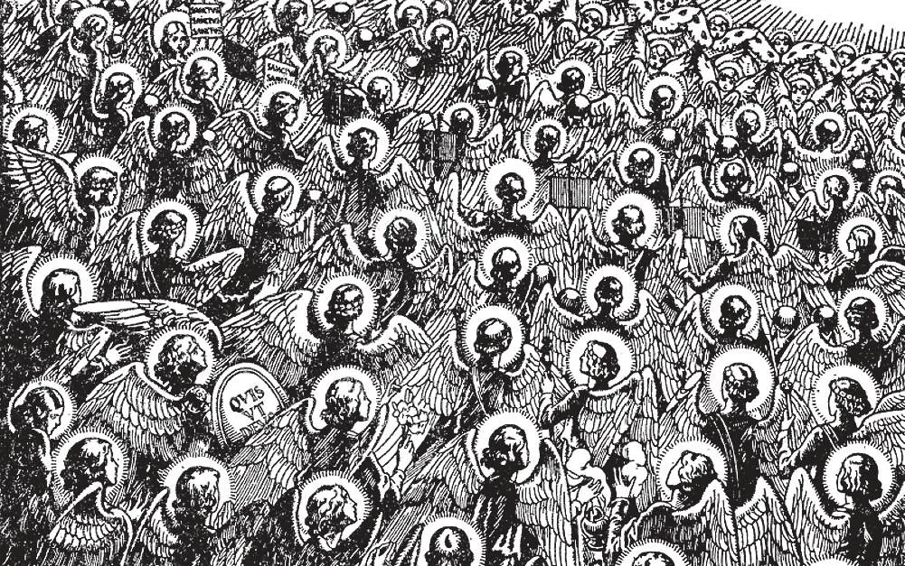

# 83. Life Everlasting: Heaven

*Words can never give any idea of the bliss of heaven, where the good will continually enjoy God, and be in the company of the saints and angels, of heaven David speaks: 'They shall be inebriated with the plenty of thy house, and thou shalt make them drink of the torrent of thy pleasure" (Ps. 35:9). St. John says of the blessed: "And God will wipe away every tear from their eyes. And death shall be no more; neither shall there be mourning, nor crying, nor pain any more" (Apoc. 21:4).*

**What do we mean by "life everlasting?"**

— By "life everlasting" we mean that there will be another existence after this present life, and in it the just will be happy for all eternity.

> In that life, the just will dwell in heaven with God, in perfect and everlasting happiness. Heaven is both a place and a state: Our Lord Jesus Christ came down from heaven, and ascended into it. Heaven is a state: even when the Blessed Virgin Mary, for example, appears to men, she does not leave heaven, which she carries with her, in the state of her soul. This is why the good and holy have a foretaste of heaven even here on earth, in the peace and joy they possess in their hearts. "And I saw the holy city. New Jerusalem, coming down out of heaven from God, made ready as a bride adorned for her husband. And I heard a loud voice from the throne saying, — 'Behold the dwelling of God with men, and he will dwell with them. And they will be his people, and God himself will be with them as their God' " (Apoc. 21:2 - 3)

**Who are rewarded in heaven?**

— Those are rewarded in heaven who die in the state of grace and have been purified in purgatory, if necessary, from all venial sin and all debt of temporal punishment; they see God face to face, and share forever in His glory and happiness.

> We do not obtain heaven without working for it. He that for God's sake has suffered most and given up most will get the greatest reward in heaven. ''He who loves his life, loses it; and he who hates his life in this world, keeps it unto life everlasting" (John 12:25). As St. Paul says: "Through many tribulations we must enter the kingdom of God" (Acts 14:21).

1. The greatest joy of heaven is the Beatific Vision. This is the sight of God face to face. This vision is called beatific because it completely fills with joy those who possess it. They know and love God to their utmost capacity, and are known and loved by God in return. The Beatific Vision will satisfy completely and supremely all our desires. Having God, we shall never wish for anything else, "One day with the Lord is as a thousand years, and a thousand years as one day" (2 Peter 3:8).

> On earth, even when we obtain the dearest desires of our heart, we can never be completely happy. "We see now through a mirror in an obscure manner; but then face to face. Now I know in part; but then I shall know even as I have been known" (1 Cor. 13:12). In heaven, "They shall be inebriated with the plenty of thy house; and thou shalt make them drink of the torrent of thy pleasure" (Ps. 35:9).

2. The other joys and perfections of heaven will be numberless and of infinite variety. There will be neither sin, nor death, nor sorrow, nothing to cause trouble or affliction, nothing to mar the eternal bliss.

> "They shall neither hunger nor thirst any more, neither shall the sun strike them nor any heat ... and God will wipe away every tear from their eyes" (Apoc. 7:16 - 17).

3. Our companions will be the most Holy Virgin Mary, the Angels and the Saints. We shall be reunited with those we have loved on earth, and we shall love them there more intensely. There will be no more separation. Whatever we have desired to know here on earth, we shall learn in heaven. All the mysteries of faith and science will be revealed. After the resurrection, we shall have our bodily senses in heaven, and by them relish joys unending.

> Holy Scripture says of heaven: "Eye has not seen, nor ear heard, nor has it entered into the heart of man, what things God has prepared for those who love him" (1 Cor. 2:9). "The sufferings of the present time are not worthy to be compared with the glory to come that will be revealed in us" (Rom. 8:18).

4. This bliss will last for all eternity. The joys of heaven will always delight. And we shall have no fear of their ending, for heaven will be everlasting. Eternity has no measure. It is like a circle: We can spend our whole life going around a circle, but we shall never find an end. Each part is only the beginning.

> Eternity has no end. We can never have a proper conception of its duration, because we have nothing similar to eternity. Millions of ages are as nothing compared to eternity. If a bird were to carry away from the ocean one drop of water every thousand years, a time will come when it will have carried away the whole ocean. But that time is less than the shortest moment, if compared to eternity.

5. The reward and bliss of heaven will not be the same for all. (a) The heavenly reward is given according to the goodness of the life each led on earth. In the same measure as we have loved God, He will reward us. However, each will be completely and supremely happy, because each will receive according to the fullness of his capacity. "There is one glory of the sun, and another glory of the moon, and another of the stars" (1 Cor. 15:41).

> In a similar way, if we fill a small glass and a great glass full to overflowing with water, one contains more than the other, yet neither can receive one more drop. Martyrs, Virgins, Doctors, that is, teachers of truth and religion, are promised a special joy and glory in heaven.

(b) In the same way bodies, after joining the souls at the resurrection, will differ in brilliancy and beauty as star differs from star in glory. But all will be perfect, without defect or blemish.

> Yet among the blessed there will be no envy. As St. Francis of Sales said: two children receive from their father each a piece of cloth to make a garment. The smaller child will not envy his brother the bigger garment, but will be quite satisfied with the one that fits him.

(c) The degree of glory of the blessed in heaven can neither be added to nor diminished for all eternity. And yet there are what we might term incidental glories: as for example, on the feast days of the Saints, when special Masses and commemorations are held in their honour, or when more people pay veneration, etc.

> "And night shall be no more, and they shall have no need of light of lamp, or light of sun, for the Lord God will shed light upon them; and they shall reign forever and ever" (Apoc. 22:5).

**What is meant by the word "Amen" with which we end the Apostles' Creed?**

— By the word "Amen", with which we end the Apostles' Creed, is meant "So it is", or "So be it;" the word expresses our firm belief in all the doctrines that the Creed contains.

> Our Lord often used the word "Amen", usually as a solemnly positive affirmation: "Amen, amen, I say to thee, unless a man be born again, he cannot see the kingdom of God" (John 3:3). "Amen, amen, I say to you, you shall see heaven opened, and the angels of God ascending and descending upon the Son of Man" (John 1:51).

## Part Two

## What to Do:

## The Commandments of God of the Church
