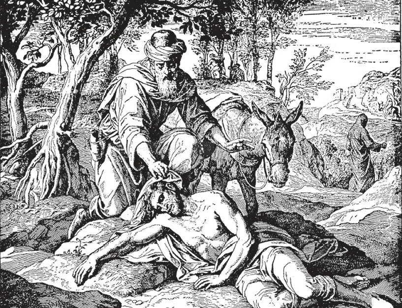

# 87. Love of Our Neighbour

All human beings without distinctions of race, nationality, religion, riches, sex, age, or occupation are our "neighbour''. Even enemies are our "neighbour"; only devils and souls in hell are not. Christ Himself taught us the love of our neighbour in the parable of the Good Samaritan, who took care of a stranger that had been robbed and left half dead by the wayside (Luke 10: 29). "There is neither Jew nor Greek. For you are all one in Christ Jesus" (Gal. 3: 28).

**Why must we love our neighbour?**

— We must love our neighbour because: 1. God commands it. "Thou shalt love thy neighbour as thyself" (Matt. 22: 39). The love of our neighbour for the love of God, is strictly enjoined upon us. This is why Holy Scripture speaks of only one commandment of charity.

> God looks upon acts of mercy towards others as acts of love towards Himself. "For I was hungry, and you gave me to eat; I was thirsty, and you gave me to drink; I was a stranger, and you took me in. "Amen I say to you, as long as you did it for one of these, the least of my brethren, you did it for me" (Matt. 25: 35, 40); "If anyone says, I love God, and hates his brother, he is a liar" (1 John 4: 20).

2. Our neighbour is a child of God, made after God's image. God loves him so much that He died to redeem him.

> God loves our neighbour as He loves us. God is preparing for him a place in heaven. If we love God, we shall love those whom He loves. "Have we not all one father? Hath not one God created us? Why then doth every one of us despise his brother?" (Mal. 2:10).

3. Our neighbour is our brother. All human beings are descended from Adam and Eve. Our neighbour is our own brother, belonging to the same human family destined for the same place of eternal happiness, heaven. Only devils and those in hell are excluded from our love.

> We should be more especially united to Christians, because they are, like us, members of Christ's body, the Church. Our Lord said: "By this will all men know that you are my disciples, if you have love for one another" (John 13:35).

**How should we love our neighbour?**

— We should love our neighbour as ourselves, for God's sake. 1. To love our neighbour as ourselves means to have for him the same kind, although not the same degree of love that we have for ourselves. Jesus gave us the Golden Rule: "Even as you wish men to do to you, so also do you to them" (Luke 6: 31).

> The best way of knowing how to treat our neighbour is to put ourselves in his place. However, we are not bound to deprive ourselves of what is necessary in order to help our neighbour. In this case, the assistance we extend to him is not of obligation, but of counsel; this is the charity of the saints, the charity of Jesus Christ Himself, Who gave up His life that men may live: "Greater love than this no one has, that one lay down his life for his friends" (John 15: 13).

2. It is not enough, in order to practice love of neighbour, to feel kind and affectionate towards him; our love must be practical, aimed at doing our neighbour good spiritually as well as materially.

> "Let us not love in word, neither with the tongue, but in deed and in truth" (1 John 3:18). And St. James said, "If a brother or a sister be naked, and in want of daily food, and one of you say to them, 'Go in peace, be ye warmed and filled', yet you do not give them what is necessary for the body, what shall it profit?" (Jas. 2: 15 - 16).

3. To love our neighbour for God's sake means to love him in order to please God. This supernatural love is called charity. If we love a person because we expect from him some favour or advantage in return, we love him for our own sake. Our love is interested; it is not real love.

> Our Lord says: "If you love those who love you, what merit have you? For even sinners love those who love them" (Luke 6:32). "But when thou givest alms, do not let thy left hand know what thy right hand is doing, so that thy alms may be given in secret: and thy Father, who sees in secret, will reward thee" (Matt. 6: 3 - 4). If we love a person because he is attractive or kind, without any reference to God, we love him only for his own sake, and not for God's. This is natural affection.

4. True love of God makes us love even disagreeable people, without reference to their love for us. It makes us love the poor, the sick, the unfortunate, the suffering, the repulsive, and even our enemies, just because God loves them, and wishes us to love them. Thus Christians of all ages have sacrificed themselves for charity.

> St. Peter Claver, the "Apostle of the Negroes", in Colombia, South America, became a slave of slaves for Christ's sake. In the Philippines, Priests and Sisters are labouring in the Culion leper colony, in constant danger of exposure to the disease. Others take care of other charitable institutions, with no hope of earthly reward, all for God's love.

**Should we give the same degree of love to all men?**

— No, we may, and should, love some more than others. 1. We should love our parents, brothers, sisters, relatives, friends, and benefactors best.

> Husbands and wives must be devoted to each other. Parents must sacrifice themselves for their children. We must love our country and countrymen in a special manner, because God gave them to us, but we must never hate or dislike people of other nationalities.

2. We must exercise great care in choosing our companions. We should not be intimate with more than a trusted few.

> We should be kind to all, but not intimate with all. One rotten apple in a basket will rot all the rest in a short time; so an evil companion easily corrupts his associates.

**What is the reward of those who unfailingly practice the precept of love of neighbour?**

— Those who unfailingly practice the precept of love of neighbour bring down blessings upon earth, and will obtain heaven as their eternal reward. 1. Our Lord called the precept of charity towards our neighbour a new commandment: "A new commandment I give you, that you love one another: that as I have loved you, you also love one another" (John 13: 34).

> This is because before Christ's coming, people did not understand the precept of charity in the same sense that Our Lord gives it. If today men would closely fulfil that precept, what blessings would ensue! No one would wrong his fellow men; there would be no need of prisons; there would be no extreme poverty; and peace would reign.

2. Love is the fulfilling of the law; and so one who loves his neighbour for the love of God is rewarded with heaven.

> One who is good to his fellow men cannot be a wicked sinner. He who practises charity has other virtues. Love cannot exist alone in the human heart, as the heart cannot exist without other organs.
