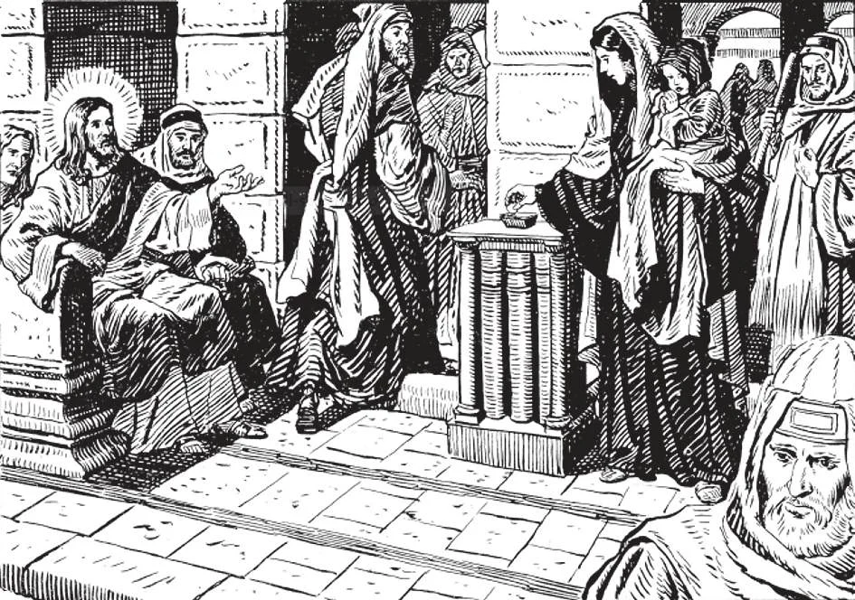

# 90. Obligation of Good Works

"Take heed not to practise your good before men, in order to be seen by them; otherwise you shall have no reward with your Father in heaven" (Matt. 6: 1). The widow's mite had more value in the eyes of God than the gold that the rich poured ostentatiously into the Temple's coffers. Everything done for the service of our neighbour may be considered almsgiving. Everything spent in good works is lent to God, Who will return it with interest: "Come, blessed of my Father . . . Amen, I say to you, as long as you did it for one of these, the least of my brethren, you did it for me...As long as you did not do it for one of these least ones, you did not do it for me" (Matt. 25: 34, 40, 45).

**Is every one obliged to perform the works of mercy?**

— Every one is obliged to perform the works of mercy, according to his own ability and the need of his neighbour.

> By the works of mercy we put into practice the commandments of God completely, not merely avoiding sin, but doing good to others. Our obligation of good works varies with our condition in life and our vocation, as with the degree of need of our neighbour. The obligation of a millionaire for the poor of his city is not the same as that of a wage-earner; neither is the duty of a bishop for good works the same as that of a layman.

1. It is a most serious obligation to give alms to the needy according to one's means. If material or corporal alms or works of mercy are not within our means, we can always give spiritual alms: prayers, etc. "Every tree therefore that is not bringing forth good fruit is to be cut down and thrown into the fire" (Matt. 3: 10) "Faith without works is useless" (Jas 2: 20).

> One who does no works of mercy fails to comply with the precept of love of neighbour. As St. Ambrose said to the stingy rich of his time: "The walls of your dwellings are hung with magnificent tapestry, while you strip the clothes off the poor man's back. A beggar is at your door pleading for a small alms; you do not even glance at him as you debate within yourself what kind of marble to use for the pavements of your palaces. The diamond you wear on your finger is sufficient to feed a multitude!"

2. He who performs the works of mercy in order to obtain the praise of others does not practice virtue, for his intention is not of God. Even poor people can do works of mercy, because what counts before God is not the amount we give, but the good will with which we give what we can afford.

> "If I distribute all my goods to feed the poor, and if I deliver my body to be burned, yet do not have charity, it profits me nothing" (1 Cor. 13: 3). This "charity" St. Paul speaks of is nothing but the pure love of God and neighbour; it excludes all vanity.

3. In doing the works of mercy, we should not be moved by the hope that we shall receive an earthly reward. Hence we should do good preferably to those who cannot repay us: "When thou give st a feast, invite the poor, the crippled, the lame, the blind; and blessed shall thou be, because they have nothing to repay thee with; for thou shalt be repaid at the resurrection" (Luke 14: 13).

> "When thou give st alms, do not let thy left hand know what thy right hand is doing, so that thy alms may be given in secret, and thy Father, who sees in secret, will reward thee" (Matt. 6: 3-4). This does not mean, however, that we should always keep our good works in secret, for Our Lord Himself advised, "So let your light shine before men in order that they may see your good works, and give glory to your Father in heaven" (Matt. 5: 16). If what we do will give good example, we should let it be known, but always with true modesty.

4. We ought to give material alms only to those really poor or unable to get work. It would be wrong to support people in idleness or vice; this would be to encourage them in sin. But if we have no means of finding out about the poor who beg our aid, it is much better to err on the side of charity than miserliness.

> Quite a number of people give as an excuse for not giving alms the fact that many beggars are "fakes" who amass wealth by begging. It is, however, true, that such fakes cannot be of a considerable number, and that the people who most often excuse themselves do not give to anybody at all. Is not God generous to us? Let us imitate His example.

**What are some practical ways of almsgiving?**

— Some practical ways of almsgiving are: to give help to our poor relatives, those in want, the Church, and charitable institutions. 1. In works of charity, we should give preference to our relatives, to our fellow Catholics, to our friends.

> "Charity begins at home." It is not edifying to see well-known figures in public charities turn away a poor cousin who begs for some help to send his little child to school. This would very likely mean that the public charities done by such people are so done only for show, not from kindness of heart. As for fellow Catholics, St. Paul said: "Let us do good to all men, but especially to those who are of the household of faith" (Gal. 6: 10).

2. The Church may be helped by giving alms to its missions, schools, orphan asylums, and homes-for the poor.

> Even children should be trained early to give alms by setting aside every week a small sum from their pocket-money. "By this will all men know that you are my disciples, if you have love for one another" (John 13: 35).

3. In these times, there are many organizations conducted by the government or by laymen to aid particular groups of the poor.

> In contributing to such organizations, we should exercise prudent care. It has become the fashion to give alms to "institutions" instead of directly to the poor, to let these "institutions" distribute our charity for us; in other words, it is fashionable to give charity "by proxy". We should remember that personal charity is more kind than impersonal charity through institutions, that signing and mailing a check does not seem to be as Christian as visiting the poor in their dwellings, finding out what they really need, giving them comfort and aid directly. We should also, if we are too busy to do anything but "institutional charity", find out which are worthy of help. Some such institutions are top-heavy; that is, too much goes for officials' salaries.

**Are all the ordinary deeds done every day to relieve the corporal or spiritual needs of others true works of mercy?**

— All the ordinary deeds done every day to relieve the corporal or spiritual needs of others are true works of mercy, if done in the name of Christ.

> "And before him will be gathered all the nations, and he will separate them one from another, as the shepherd separates the sheep from the goats; and he will set the sheep on his right hand, but the goats on the left. Then the king will say to those on his right hand, 'Come, blessed of my Father, take possession of the kingdom prepared for you from the foundation of the world; for I was hungry and you gave me to eat; I was thirsty and you gave me to drink; I was a stranger and you took me in; naked and you covered me; sick and you visited me; I was in prison and you came to me.' Then the just will answer him, saying, 'Lord, when did we see thee hungry and feed thee; or thirsty, and give thee drink? And when did we see thee a stranger, and take thee in; or naked, and clothe thee? Or when did we see thee sick, or in prison, and come to thee?' And answering, the king will say to them, 'Amen I say to you. as long as you did it for one of these, the least of my brethren, you did it for me' " (Matt. 25; 32-40).

If in all our works we remember and love God, we have the supernatural motive.
