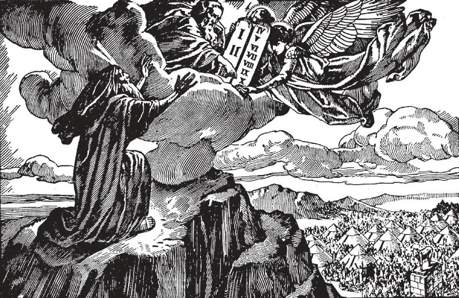

# 91. Commandments of God

*Moses spent forty days on Mount Sinai speaking with God. To him God gave two stone tablets on which were engraved the Ten Commandments. We see why we must obey the Commandments, for God Himself gave them to us; they are God's laws, thus requiring strict obedience.*

**Which are the commandments of God?**

— The commandments of God are these ten:

1. I am the Lord thy God; thou shalt not have strange gods before Me.
2. Thou shalt not take the name of the Lord thy God in vain.
3. Remember thou keep holy the Lord's day.
4. Honour thy father and thy mother.
5. Thou shalt not kill.
6. Thou shalt not commit adultery.
7. Thou shalt not steal.
8. Thou shalt not bear false witness against thy neighbour.
9. Thou shalt not covet thy neighbour's wife.
10. Thou shalt not covet thy neighbour's goods.

**By whom were the ten commandments given?**

— The ten commandments were given by Almighty God, Who first gave them to Moses on Mount Sinai.

1. In the third month after the Israelites had left Egypt, they arrived near Mount Sinai. God called Moses and told him He would appear to the people. On the third day, there was thunder and lightning, and a trumpet sounded.

> Moses took the Israelites to the foot of the mountain, which shook violently and smoked like a furnace. The trumpet blew louder. Then God spoke from the clouds. But the Israelites were afraid, and begged Moses to pray God not to speak to them.

2. Moses went up Mount Sinai to talk with God. God gave him two tablets of stone, on which were carved the ten commandments. On coming down from the mountain, Moses found the Israelites adoring a golden calf, made out of the gold from their jewellery. In his anger, Moses threw down the tablets of stone and broke them. Later, Moses again went up Mount Sinai. God told him to make two new tablets; on these Moses wrote the commandments.

> The two tablets, which are called the Tables of Law, were later placed in the Ark of the Covenant, and the Ark was kept in the Tabernacle. When Solomon built the Temple, the Ark was placed in the innermost part, called the "Holy of Holies." Both Ark and Tables disappeared with the destruction of the Temple and fall of Jerusalem; 587 B.C.

**In the enumeration of the commandments of God to be found in the Books of Moses, are the commandments definitely divided into ten?**

— In the enumeration of the commandments of God to be found in the Books of Moses, although the injunctions are distinctly tenfold, there is no definite numerical division.

1. The Catholic enumeration of the ten commandments differs from the English (and Calvinist) Protestant enumeration. The Catholic division was in use in England till the Protestant revolt; it is still used by most Lutheran churches.

> The Catholic system is based on the Hebrew text, and principally on the enumeration made by St. Augustine; it was adopted by the Council of Trent. By it, the first commandment contains everything relating to false worship and false gods. The tenfold division is safeguarded by dividing the last precept regarding desire into one relating to sins of the flesh, and another referring to sins against property, just as acts against purity are forbidden separately from acts against property. The English Protestant enumeration is based on Origen and others. By it the worship of graven images is numbered as the Second Commandment, and all the succeeding commandments thereby are advanced one over the Catholic enumeration. To safeguard the tenfold division, the last two commandments are grouped together as the Tenth.

2. The ten commandments are arranged in logical order to embrace all laws necessary for the enforcement of the two precepts of charity, the two great commandments of love of God and love of neighbour. The first three commandments comprise our duty towards God. The first commandment requires adoration and loyalty; the second requires reverence; the third requires formal service, the sanctification of a day for the exclusive honour of God.

> The last seven commandments comprise our duty to ourselves and our fellowmen. The fourth commandment contains our duties towards our parents and superiors, as representatives of God. Conversely, the commandment also contains the duties of superiors towards their subordinates. The fifth commandment assures the protection of life; the sixth, of purity; the seventh, of property; the eighth, of reputation and honour; and the ninth and tenth of domestic life.

**Are we obliged to obey the commandments of God?**

— We are strictly obliged to obey the commandments of God.

1. God has imprinted the substance of the ten commandments in the human heart and mind, and they have therefore binding force. Even if they had never been revealed, we should still be obliged to keep them, for they are dictated by reason, and taught by natural law. The revealed law merely repeats and amplifies natural law.

> While it is true that reason does not tell us to sanctify Saturday or Sunday, it certainly requires us to keep some day or days holy, to give exclusive honour to our Creator.

2. Our Lord Jesus Christ confirmed the ten commandments and laid them upon us in more complete form.

> Christ reiterated the ten commandments when speaking to the rich young man (Matt. 19: 18), and in the sermon on the mount. On various occasions, He explained several of them separately. "I say to you, till heaven and earth pass away, not one jot or one tittle shall be lost from the Law, till all things have been accomplished" (Matt. 5: 18-19).

3. We should gladly keep the Commandments, because God wishes and orders us to do so. It is the way to serve Him. If we keep the Commandments, we show by our acts that we love God, and so serve Him.

> Violation of the commandments results in temporal punishments like discontent, dishonour, bad health, and other miseries. Those obedient to God's commandments always enjoy peace of conscience in this life, and in the next their heavenly reward will be great, without limit and without end.

**Should we be satisfied merely to keep the commandments of God?**

— We should not be satisfied merely to keep the commandments of God, but should always be ready to do good deeds, even when they are not commanded.

> If we truly love our parents and friends, we do not wait to be commanded to do what will please them. God is our best Friend; if we really love Him, we would do what we know He likes, without being ordered to do so by His commandments. We would do little extra things, good works, sacrifices, all as an offering of love for Him.
