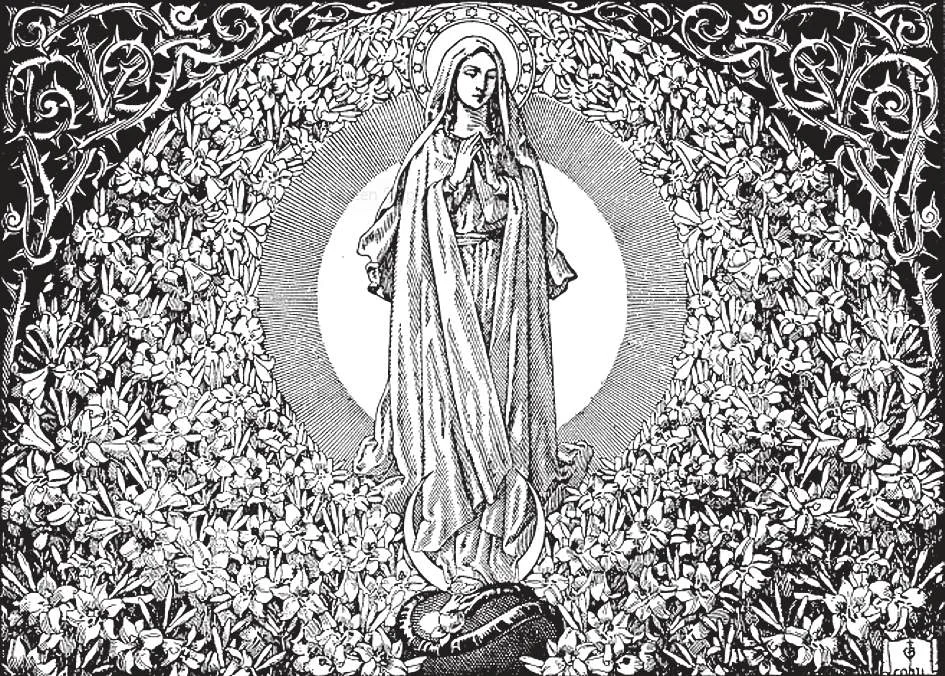

# 93. Veneration of Saints

*We pay special honour to the Blessed Virgin because she is the Mother of God and our Mother. God has exalted her above all other creatures. Her intercession is more powerful with God than that of any other saint. No man refuses his mother a favour; so God does not refuse any request of Mary. Christ even worked his first miracle in advance of His time, because Mary asked Him. Let us all love and honour the Blessed Virgin, for she is our Mother, whom Christ Himself gave us from the cross.*

**Does the first commandment forbid us to honour the saints in heaven?**

— The first commandment does not forbid us to honour the saints in heaven, provided we do not give them the honour that belongs to God alone.

> Devotion to the Blessed Virgin Mary, and veneration of the saints, are not opposed to the commandment to adore God alone. We do not worship the saints; we only honour them as the special friends and servants of God. We adore God alone.

1. By venerating the saints, we honour God Himself, Who is the cause of their holiness. Without the help of God, they would not have done anything holy. We do not adore saints. Should we not reverence those who reflect God's perfections? So we venerate the saints. Similarly we honour outstanding persons on earth; but we do not adore them.

> We give to God the supreme honour and adoration, called latria. We render the saints our veneration, called dulia. To the Blessed Virgin we give special veneration, called hyperdulia, because She is above all angels and saints as the Mother of God. But even the Blessed Virgin we do not and cannot adore or worship. However saintly, not all the saints and angels together can approach the infinite holiness of God. We show honour to God when we venerate those to whom was granted grace to resemble Him.

2. Those who died in the grace of God, and who are already in heaven, and especially those whom the Church has canonized, are called Saints. Before beatification, a very careful inquiry is made into the holiness of the person concerned.

> The preliminary inquiry usually does not take place until at least fifty years after the person's death. Before beatification, two certain and unquestionable miracles must be worked at the intercession of the one whose cause is being considered. These miracles prove his being in heaven. One who is beatified is called Blessed. A limited public devotion to him is permitted.

3. Canonization is the solemn declaration that a person led a heroic life, is in heaven, and therefore may be publicly venerated by the whole Church. After canonization, a person is called Saint.

> After beatification, two additional miracles must be worked at the intercession of the Blessed, before he can be canonized. Canonization is certainly not a demand for entrance into heaven. The Church merely declares that a person is already there. The holiness of the person's life is proved in the strict examination before beatification. The fact of his being in heaven is proved by the miracles worked at his intercession.

**Why do we honour the saints in heaven?**

— We honor the saints in heaven because they practised great virtue when they were on earth, and because in honouring those who are the chosen friends of God, we honour God Himself.

1. While still living on earth, the saints were of outstanding holiness in themselves, and did good to others for the love of God.

> The cause for the beatification of someone does not take place unless such holiness is outstanding and ascertained by competent authority, or unless the miracles worked by the person proposed for beatification are of a most extraordinary character.

2. We venerate the saints because they are the chosen friends of God, in heaven.

> If we are eager to show honour to earthly royalty, how much more should we honour the saints of God, princes of heaven! If we ask for prayers of our fellow men on earth, how much more eager should we be to ask the saints, our friends in heaven!

**How can we honour the saints?**

— We can honor the saints:

1. By imitating their holy lives. The highest honor we can pay them is to imitate their virtues.

> The saints are models presented by the Church before our eyes so that we may know how to live according to the desires of God.

2. By praying to them. We honor them by praising them in word and song, and asking for their intercession.

> We may pray in private to anyone who we believe is either in heaven or purgatory. But we are forbidden to give public veneration to anyone who is not beatified or canonized.

3. By showing respect to their relics and images.

> We also give the saints honor when we celebrate their feasts, or take them as our patrons and models.

**When we pray to the saints, what do we ask them to do?**

— When we pray to the saints we ask them to offer their prayers to God for us.

1. This is what we call the "intercession" of the saints. If we are grateful for the intercession of a friend before an earthly superior, how much more so should we be for the intercession of saints before God!

> How many times have the saints obtained favours from God for men? And God likes this intercession: as He said, He would have spared Sodom for the sake of ten just men (Gen. 18: 32).

2. Experience has proved that much is gained by invoking certain saints in times of special need. It appears that God has given to individual saints powers to help us in special needs.

> Thus we invoke St. Joseph as the patron of a happy death; St. Anthony when we have lost anything; St. Blaise for diseases of the throat, etc. Many wonderful answers to prayer lead to the belief that the saints take particular interest in persons whose circumstances are the same as theirs were on earth.

**How do we know that the saints pray for us?**

— We know that the saints will pray for us, because they are with God and have great love for us.

1. The saints in heaven are, with us, members of the Church, of one body belonging to Christ. "So we the many, are one body in Christ but severally members one of another" (Rom. 12: 5).

> Members of the same body give mutual help to each other; the saints help us by their prayers before God. On our part, we honor and imitate them.

2. The Church omits no opportunity to urge us to the veneration of saints. At Baptism we receive the name of a saint. Each day of the year one or more saints are commemorated. Images and pictures of the saints are placed in the churches. Saints are invoked in the Mass, the litanies, and other public prayers.

> The Church worships God, and honours the saints as friends and servants of God. So churches and altars are dedicated and consecrated to God alone although named after saints and placed under their protection. The Holy Sacrifice of the Mass is offered to God alone, although it may be celebrated in memory of the saints. In praying, we say to God, "Have mercy on us", but to the saints, "Pray for us", just as we would say it to a dear friend.
