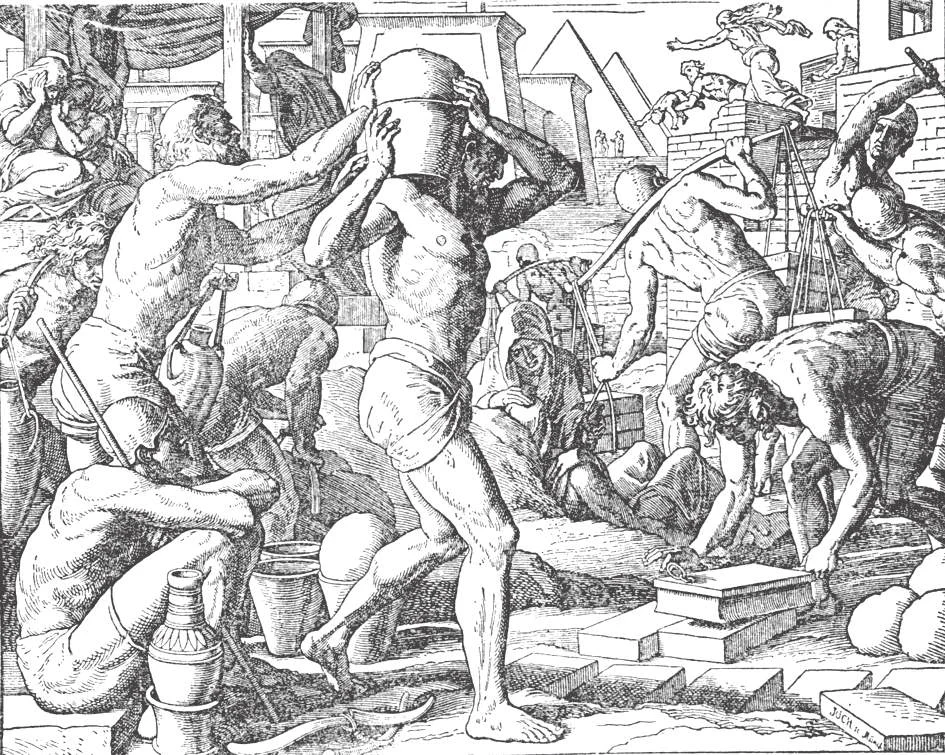

# 97. Sins Against Hope and Charity

*"There arose a new king over Egypt ... and he said to his people: Behold, the people of the children of Israel are numerous and stronger than we. Come, let us wisely oppress them, lest they multiply. ... .Therefore he set over them masters of the works to afflict them with burdens, and they built for Pharaoh cities.... And the Egyptians hated the children of Israel, and afflicted them, and mocked them. And they made their life bitter with hard works in clay, and brick, and with all manner of service, where with they were overcharged in the works of the earth. .. And the Lord said to Moses: I have seen the affliction of my people in Egypt, and I have heard their cry, because of the rigour of them that are over the works" (Ex. 1:8-14; 3:7). God still hears the cry of the oppressed poor.*

**What are the sins against hope?**

— The sins against hope are presumption and despair.

**When does a person sin by presumption?**

— A person sins by presumption when he trusts that he can be saved by his own efforts without God's help, or by God's help without his own efforts.

1. One who relies on his own powers, on his friends, or on earthly things more than on God commits presumption. He thus puts his hope on "strange gods" in competition with Almighty God. Such hope is purely human, not supernatural, heavenly, or Christian.

> Such hope is built on sand, as how many have found out to their distress! Peter thought he was strong, and denied his Lord. "It is good to confide in the Lord, rather than to have confidence in man" (Ps. 117:8). It is this human kind of hope, this presumption, that causes one to expose oneself to occasions of sin, in the belief that one has the strength to resist. "Follow not in thy strength the desires of thy heart: and say not: How mighty am I!" (Ecclus. 5:2-3).

2. It is presumption to commit sin boldly, pleading that God easily pardons sinners. Our confidence in God's mercy must always go hand in hand with our knowledge of His justice. In this way, even while we trust in our merciful Father, we have a salutary fear of His judgements. God wishes us to work out our salvation in fear and trembling.

> Nobody can be absolutely sure that he is safe from hell, that he will persevere in justice till death. What happened to Solomon with all his wisdom, and the blessings God rained on him! "Let him who thinks he stands, take heed lest he fall" (1 Cor. 10:12). "Unless you repent, you will all perish in the same manner" (Luke 13:3).

We must not tempt God by exposing ourselves to sin and its occasions in the hope that God will protect and save us; this is presuming on God's mercy. We can be sure of God's help only if we try our best to do His will. "He that loveth danger shall perish in it" (Ecclus. 3:27). The greatest saints took as their watchword regarding sin, "Safety in flight," — flight from all occasions that might tempt them to sin. However, those who by their profession or necessity are compelled to expose themselves to even proximate occasions of sin must humbly put their trust in God: He will surely protect them.

> It is presumption to expect to be saved by faith alone, without attempting to accomplish good works; to hope to obtain forgiveness of our sins without penance; or while hoping in God's mercy, to remain in the state of sin, and put off conversion.

Our Lord said clearly, "Seek first the kingdom of God and his justice, and all these things shall be given you besides" (Matt. 6:33).

**When does a person sin by despair?**

— A person sins by despair when he deliberately refuses to trust that God will give him the necessary help to save his soul.

1. Despair is an abandonment of all hope for obtaining eternal salvation and the means of attaining it. Despair is wicked, because it is a denial of the goodness of God, and His willingness to forgive.

> Cain was guilty of this sin when he cried out after murdering his brother Abel, "My sin is too great to be forgiven" (Gen. 4:13). He is guilty of despair who believes he cannot resist certain temptations, overcome certain sins, or amend his life. Despair results in temporal as well as spiritual evil, because often those in despair commit suicide, as Judas did.

2. When tempted to despair, let us remember that God is infinitely merciful, that He is nearest when our need for Him is greatest, and that there is no sin that He will not forgive if we go to Him with a repentant heart.

> To avoid sin, we may ponder on God's justice and the fear of God; but once we have fallen into sin, let us meditate on His infinite mercy. Let us remember that God is the Good Shepherd Who goes out to seek His sheep that have fallen among the thorns of life. St. John Chrysostom says, "As a spark is to the ocean, so is 'the wickedness of man compared to the mercy of God."

**What are the chief sins against charity?**

— The chief sins against charity are hatred of God and of our neighbour, sloth, envy, and scandal.

> Without charity, faith and hope will profit us nothing, for God will not open the gates of His Kingdom except to those that love Him. "If he should speak with the tongues of men and of angels, but do not have charity, I have become as sounding brass, or a tinkling cymbal" (1 Cor. 13:1).

1. Every grave sin is a violation of charity, because it destroys the love of God. "If you love Me, keep My commandments" (John 11:15) Hatred of God, or of one's neighbour, is a special offence against charity: by it one desires evil or harm to befall, or rejoices at the misfortune of others.

> To desire death from a yearning for heaven in order to be reunited with God is not wrong. The Apostle Paul himself sighed, "Who shall deliver me from the body of this death?" (Rom. 9:24). "I am ... desiring to depart and to be with Christ" (Phl. 1:23). But to desire death out of impatience or despair, or to wish death or misfortune to another out of selfishness or hatred, is sinful.

2. Sloth is a sin against charity, because it paralyses the faculties of the soul. One who is ruled by sloth is too lazy to love God or his neighbour, because such love or zeal takes trouble.

> Sloth begets tepidity and indifference. Someone has said with truth that a great sinner may become a great saint, but a slothful person, never.

3. One is guilty of envy if one is bitter about another's good fortune, considering such as a detraction from one's own wellbeing. An envious man is sour against the good and holy, wishing he had their attainments, but taking no steps to improve himself.

> Envy is the sin of the devil, the sin above all that implies malice, the sin that leads to calumny, gossip, hatred, and other sins. The best means of overcoming envy is to do every good possible to our neighbour, especially to the one that we are tempted to envy. There is no reason for envy; it will not make us any richer, more popular, more satisfied. Satan envied Adam and Eve, so happy in Paradise. The Pharisees envied Jesus Christ the wonderful miracles He worked, and His consequent great following.

4. Scandal is given when we injure our neighbour's soul by causing or tempting him to sin. As charity helps him towards heaven, so scandal pushes him towards hell.

> Our Lord said that at the end of the world the angels "will gather out of his kingdom all scandals ... and cast them into the furnace of fire, where there will be the weeping, and the gnashing of teeth" (Matt. 13:41-42). (See pages 218-219).
