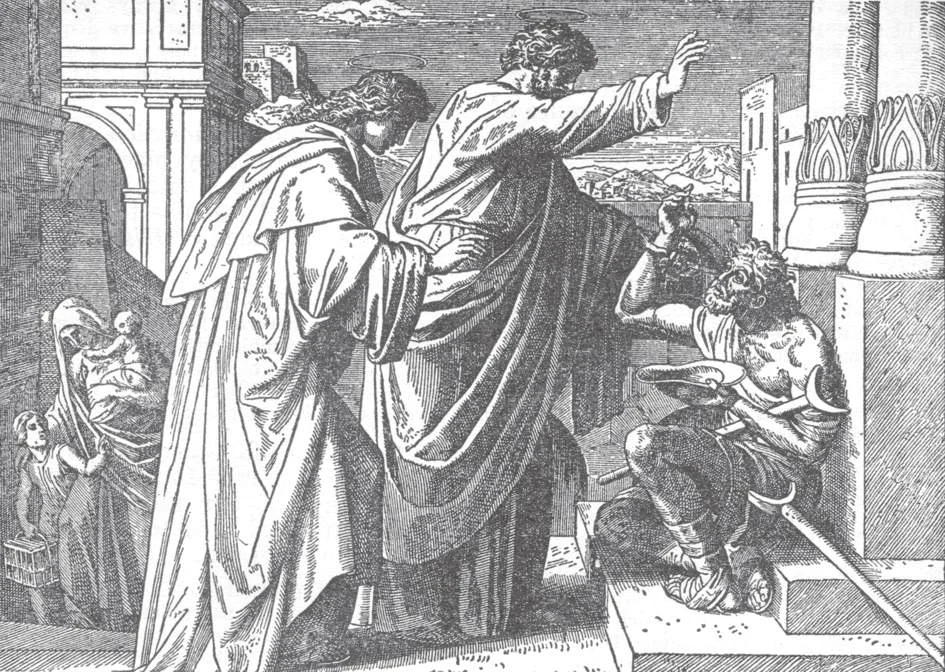

# 98. The Second Commandment

By the most holy Name of Jesus, the Apostles worked innumerable miracles. Among the first examples was that of the lame man that sat and begged at the gate of the Temple. Upon seeing Peter and John about to enter the Temple, he asked for an alms. Peter said, "Silver and gold I have none; but what I have that I give thee. In the name of Jesus Christ of Nazareth, arise and walk" (Acts 3: 6). And the man lame from birth leapedup and walked into the Temple, praising God.

"THOU SHALL NOT TAKE THE NAME OF THE LORD THY GOD IN VAIN."

**What are we commanded by the second commandment?**

— By the second commandment we are commanded always to speak with reverence of God, of the saints, and of holy things, and to be truthful in taking oaths, and faithful to them and to our vows.

> "Blessed be the name of the Lord, from henceforth now and for ever. From the rising of the sun unto the going down of the same, the name of the Lord is worthy of praise" (Ps. 112: 2-3). "I say to you not to swear at all . . . But let your speech be. "Yes. yes"; "No. no" (Matt. 5: 54-37). "The tongue no man can tame ...Out of the same mouth proceed blessing and cursing" (Jas. 3: 8,10).

1. We should never speak God's name without holy respect. We should frequently call upon the name of God with true and heartfelt devotion, especially at the commencement and end of all our important actions, and in time of trouble.

> "Call upon me in the day of trouble; I will deliver thee and thou shalt glorify me" (Ps. 49: 15). We should often praise God for His perfections and infinite goodness, and particularly when we receive favours from Him. It is strange how often good gifts come to us from Almighty God, and we simply take without a word of thanks. Let us say that old saying of truly Christian hearts, *Deo gratias*! Thanks be to God! "Bless the Lord, O my soul, and never forget all he hath done for thee" (Ps. 102: 1).

2. The name of Jesus is the most powerful of all names; through it we can obtain all that we need. "If you ask the Father anything in my name. He will give it to you'' (John 16: 23). Should pay reverence to the name of Jesus by bowing every time we speak it. We should especially pronounce the name of Jesus at the hour of death.

> "At the name of Jesus every knee should bend, of those in heaven, on earth, and under the earth" (Phil. 2:10). St. Stephen's last words were: "Lord Jesus, receive my spirit" (Acts 7: 59). By the name of Jesus the apostles and saints worked innumerable miracles, as St. Peter did when he said to the lame man, "In the name of Jesus Christ, arise and walk" (Acts 3:6). Holy Scripture truly says, "There is no other name under heaven given to men, by which we must be saved" (Acts 4:12).

**What is meant by taking God's name in vain?**

— By taking God's name in vain is meant that the name of God or the holy name of Jesus Christ is used without reverence: for example, to express surprise or anger.

> "And let not the naming of God be usual in thy mouth, and meddle not with the names of saints, for thou shalt not escape free from them" (Eccles. 25: 10).

1. Profanity is the use of irreverent language. We should not use sacred names in impatience, jest, mere surprise, or habit, with no idea of paying God honour. The habit shows a lack of proper reverence.

> Many have the habit of exclaiming at every trifling circumstance: "Good Lord!" "My God!" "Jesus, Mary, Joseph!" It is a thoughtless habit that should be corrected. It is wrong likewise to quote Holy Scripture in a light or irreverent manner.

2. We should distinguish between profanity and vulgarity. Profanity is a sin of irreverence; vulgarity is not necessarily sinful.

> Vulgarity is the use of coarse expressions like "devil," "holy," etc., through thoughtlessness or habit. It is a breach of good manners, and if indulged in will lead to profanity. If used with malice, vulgarity is certainly a sin. By all means we should avoid both vulgarity and profanity.

3. Let us use God's holy Name only in prayer and adoration. Irreverence to that Name is sacrilege, since by the sin we profane a holy thing. "The Lord will not hold him guiltless that shall take the name of the Lord his God in vain" (Exod. 20: 7).

> Among the ancient Jews the word for God was so sacred that even the high priest could speak it only once a year, at the feast of the Atonement, when he entered the most sacred part of the Temple.

4. It is a sin to take God's name in vain; ordinarily, it is a venial sin.

> The Holy Name Society aims to promote love and reverence for the Holy Name of God and Jesus Christ; to suppress and make reparations for blasphemy, perjury, forbidden oaths, profanity, and any improper language. Every man should be a member of this Society, which is only for men. In 1950, the membership was already 3,500,000: most Catholic policemen of New York City were faithful members.

**What is cursing?**

— Cursing is the calling down of some evil on a person, place, or thing. 1. To call down some punishment on ourselves or other creatures of God in a moment of anger, is cursing. If the name of God is used, the sin is worse.

> When angry, parents sometimes curse their children, and workmen their animals and tools. Often the one who curses does not mean what he says. If he does, it is indeed a most grievous sin to ask God to damn a person or send him' to hell.

2. A Christian should never curse. "For such as bless him shall inherit the land; but such as curse him shall perish" (Ps. 36: 22).

> The habit of cursing is an indication of lack of refinement and of self-control. Gentlemen do not curse. Generally we know the origin of a person by the words that come forth from his mouth; one who curses advertises his origin as the gutter.

**What is blasphemy?**

— Blasphemy is insulting language which expresses contempt for God, either directly or through His saints and holy things. 1. Contemptuous or abusive language against God, scoffing at the true religion, or ridiculing sacred ceremonies, — all these are blasphemous. Sacrilege is a form of blasphemy; irreverent actions and thoughts against God, the saints and angels, or holy persons and things, are also blasphemous.

> In the Old Law, the blasphemer was condemned to death. "And he that blasphemeth the name of the Lord, dying let him die: all the multitude shall stone him" (Lev. 24: 16). It is blasphemy to speak scornfully of God or of His actions; or to attribute to a creature a prerogative of God. Thus the people blasphemed when they said, after King Herod had spoken to them: "It is the voice of a god and not of a man" (Acts 12: 22) .

2. Blasphemy is a sin of the devil. By insulting language against God, one offends the Almighty directly, not only His image. Blasphemy is essentially malicious, not as other sins that arise from human weakness or ignorance.

> "Whom hast thou blasphemed, against whom hast thou exalted thy voice? Against the holy One of Israel" (4 Kings 19: 22). The soldiers blasphemed Christ; so did the impenitent thief.

3. Deliberate blasphemy is one of the gravest sins. God punishes it even on earth with severe chastisements, and in hell after death. "God is not mocked" (Gal. 6: 7).

> King Baltassar used the sacred vessels for his feasting. A strange hand wrote his fate on the wall; that same night the enemy entered his city, killed him, and made his kingdom part of the empire of the Medes and Persians. King Sennacherib blasphemed God, and died by the hand of his own sons. But the worst punishment will be after death; one cannot blaspheme God and escape unpunished. "They shall be cursed that shall despise thee" (Tob. 13: 16).
