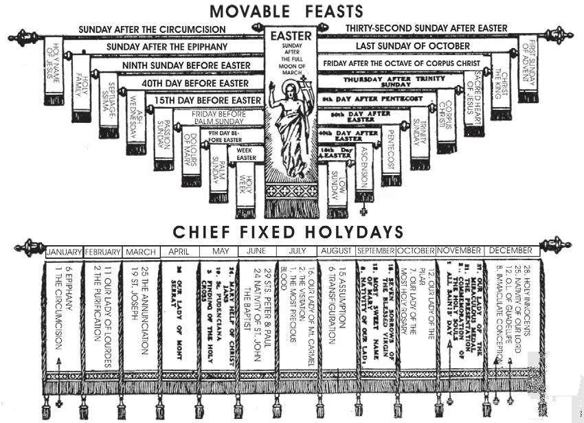

# 100. The Third Commandment

*In these tables, the holydays of obligation which do not necessarily fall on a Sunday are marked by crosses. They are to be observed exactly as the Sunday by hearing Mass, abstaining from unnecessary servile work, and doing other pious exercises. The other feasts which do not fall on a Sunday are not of obligation. They are, however, important feasts, and all who can should at least hear Mass on those days. If we can visit human friends on days important to them, why not God?*

"REMEMBER THOU KEEP HOLY THE LORD'S DAY."

**What are we commanded by the third commandment?**

— By the third commandment, we are commanded to worship in a special manner on Sunday, the Lord's day.

> "Keep you my sabbath: for it is holy unto you: he that shall profane it, shall be put to death: he that shall do any work in it, his soul shall perish out of the midst of his people. Six days shall you do work: in the seventh day is the sabbath, the rest holy to the Lord" (Exodus 31:14-15).

1. God commanded the observance of a definite day, in order that man may devote one day a week to the special worship of his Creator. Natural law obliges man to adore and thank God for His continuous blessings.

> If God gives us six days to work for ourselves, we ought to be glad to devote one day to Him exclusively.

> The day enables us to join in public worship and receive religious instruction. The rest benefits both body and soul. If we had to work always, seven days a week, year in and year out, our health would break under the strain.

2. In the Old Law, the celebration of a definite day, the sabbath, had been ordered only specially for the Jews, just as circumcision and bloody sacrifices had been. The Old Law was abrogated upon institution of the New (Acts 10: 15; 2: 16; Gal. 4: 10-11).

> In the Old Law, the Jews kept holy the seventh day of the week, Saturday. It was their day of rest. The vital principle of the Third Commandment was not the specific day, but that one day out of seven should be devoted to the worship of God the Creator.

**Why does the Church command us to keep Sunday as the Lord's day?**

— The Church commands us to keep Sunday as the Lord's day, because on Sunday, Christ rose from the dead, and on Sunday the Holy Ghost descended upon the Apostles.

1. In the New Law, Christ delegated His authority to the Church, His Living Voice. It remained then for the Church to indicate the ceremonial day to be kept holy.

> The Church of the time of the Apostles observed the first day of the week, Sunday, in honour of the Resurrection and Pentecost, which both took place on a Sunday. In the same way, the early Church caused circumcision and bloody sacrifices to make way for Baptism and the Sacrifice of the Mass.

2. In the New Law, Catholics keep holy the first day of the week, Sunday. It is called "The Lord's Day" St. Paul refers twice to its observance. (Acts 20: 7; 1 Cor. 16: 2).

**How does the Church command us to worship God on Sunday?**

— The Church commands us to worship God on Sunday by assisting at the Holy Sacrifice of the Mass.

1. The obligation of Mass is binding on all persons who have attained the use of reason; that is, including children seven years old. Those who find it impossible, or very difficult, to hear Mass, are excused.

> The sick, the very aged and infirm, and those engaged in works of necessity at the hour of Mass, are excused from attending it. Those who live too far to walk and have no conveyance are also excused. Very bad weather may be sufficient excuse.

2. Not to hear Sunday Mass, or to miss a notable part of Sunday Mass, is a mortal sin. To come a little late and not make up for it in another Mass, is a venial sin.

> The precept is to hear an entire Mass from beginning to end; that is, from the Priest's entrance into the sanctuary until his departure into the sacristy. One is considered to have missed Mass if one arrives too late to be present at the Offertory (when the Priest uncovers the chalice), or leaves before the Communion is finished. The principal parts — that is, the Offertory, the Consecration, and the Communion — must be heard in one and the same Mass.

3. Those who on every slight pretext excuse themselves from their obligation of hearing Sunday Mass will gradually slip into religious carelessness and indifference. We should be sturdy Christians, and not let anything but impossibility or serious illness interfere with our hearing Mass on Sunday.

> Not to have a new or clean dress is not sufficient reason for staying away from Sunday Mass. Neither is an excursion that leaves early a reason. One should go to Mass before going on the excursion.

4. Mass is not our only obligation on Sunday, for God commands us to sanctify the whole day, and not only a part of it. We should perform other good works.

> We may hear sermons or instruction, receive the sacraments, attend vespers or benediction, read the Bible or other spiritual books, say the rosary, attend a sodality or confraternity meeting, visit the Blessed Sacrament, the poor, the sick, and perform other works of mercy. It is not an obligation to spend the entire Sunday in such works, but we should try to give as much time to them as we can, for the love of God. If we do things not required for the love of our friends on earth, how much more eager we should be to do them for our best Friend of all, God!

**How should we hear Mass?**

— We should hear Mass with attention and devotion.

1. We should be in church a few minutes before the beginning of Mass, to prepare for it, and not leave before the priest leaves.

> If we arrive after the beginning of Mass, but before the uncovering of the chalice for the Offertory, we should make up for our lateness by attending the next Mass at least up to the uncovering of the chalice. If we arrive when the chalice is already uncovered, we must hear another entire Mass.

2. Not only must we be bodily present at the Mass; we must also have at least an implicit intention of participating, avoiding deliberate distractions, and not look around, laugh, or carry on conversations.

> It is a serious lack of reverence for the word of God to leave the church during the sermon.

3. Most persons find it easiest to follow the Mass by reading a prayer book. Others use a missal, following the actions of the priest. This last is the best way of participating in the Holy Sacrifice of the Mass, for then we can best share in Christ's sacrifice, uniting our intentions to His, offering ourselves with Him to the Heavenly Father.

> It is an honour to be permitted to assist in some way at Holy Mass. Today, laymen are allowed to perform services that were previously reserved to those in orders, such as serving at Mass, etc. In many parishes, there are Altar-boy Societies. All boys should try to become members.

4. We should be generous with our offerings for the collection-box. Even children should be trained to put in a few cents out of their pocket-money. We must remember our obligation to help support our pastors.
