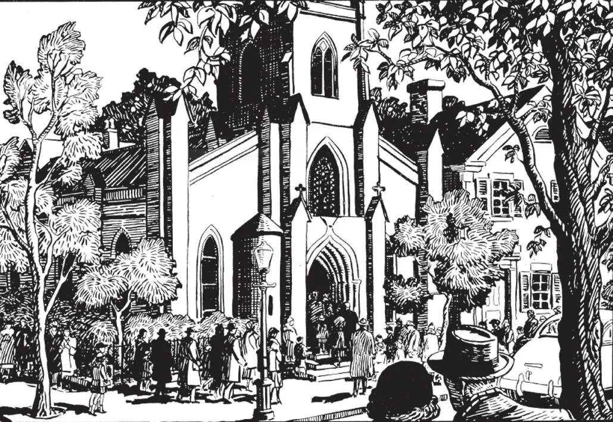

# 101. Unnecessary Servile Work

*The illustration shows a parish church on a Sunday morning. The people are hastening to church, to obey the precept of hearing Mass. It is a mortal sin to fail to sanctify Sundays and holydays through our own fault. To keep these days holy, we must hear Mass, abstain from servile work, and devote the day to pious works. Wholesome recreation and innocent amusements which do not interfere with our religious obligations are allowed; too often, however, "fun" appears to be the main feature.*

**What is forbidden by the third commandment of God?**

— By the third commandment of God all unnecessary servile work on Sunday is forbidden.

**What is servile work?**

— Servile work is that which requires labour of body rather than of mind.

1. Servile work is that ordinarily performed by labourers. Work in which the mind has the greater share, such as reading, writing, teaching, drawing, studying, and music practice is not servile, and is not forbidden.

> Servile work performed on Sunday is not considered a grievous sin unless it is continued beyond two hours, or becomes the cause of scandal or bad example.

2. Employers who force their employees to do unnecessary servile work on Sunday are responsible for the violation of the Third Commandment. Employers should make it possible for the employees to comply with their religious duties.

> The trial of lawsuits and public buying and selling, are also forbidden. Catholics should make provision on Saturday for their food and other necessities of Sunday, so that no store may be forced to keep open.

3. The non-observance of Sunday is often attended with material evils, such as poverty and sickness. God is the God of nature as well as of the Law.

> Those who do not observe Sunday and keep working often lose their health and thereby sink deeper and deeper into poverty. Those who desecrate Sunday and do not hear Mass fall into all kinds of vices. In Holy Scripture, we find the Jews losing their Holy City and being taken into captivity, because they violated the Sabbath.

**When is servile work allowed on Sunday?**

— Servile work is allowed on Sunday when the honour of God, our own need, or that of our neighbour requires it.

1. Preparing a place for Holy Mass is a work for the honour of God, and may be done even on a Sunday.

> In a parish where the women are all occupied during the week, and can meet for their altar society meetings only on Sundays, it would be allowed for them to sew or repair vestments for the church.

2. Work of daily necessity such as cooking, cleaning, and sweeping, and buying and selling of necessary food may be performed even on Sunday. Sewing is not permitted, as it is not of necessity. Servile work when necessary for one's support, for the common good, or to prevent serious financial loss, is permitted on Sunday.

> Farmers are allowed to care for their cattle and domestic animals, and even to harvest crops that otherwise might spoil. Our Lord does not desire man to suffer on account of Sunday, for He says: "The Sabbath was made for man, and not man for the Sabbath" (Mark 2: 27).

3. Servile work needed by our neighbour may be performed on Sunday.

> For example, a farmer who has attended all week to his own farm may help a sick neighbour attend to his on Sunday.

4. Those in charge of persons who are necessarily on duty on Sunday, such as policemen, foremen, soldiers, etc., are obliged to give them an opportunity to hear Mass, if not every Sunday, at least as often as possible.

> Domestic help can easily be permitted to go to Mass, if their duties are properly arranged.

**Are amusements forbidden on Sunday?**

— Amusements are not forbidden on Sunday. Only those that interfere with the Sunday obligations are forbidden.

1. Sunday is a day of rest. On Sunday, therefore, we are permitted to relax from our daily work in wholesome recreation.

> Not too much emphasis should be given in competitive games as to which side wins or loses. A good loser is better than a poor winner who is proud of himself. "God blessed the seventh day and sanctified it because in it, He had rested from all His work" (Gen. 2:3) If God, Who needed no "rest", chose to stop His work of creation, we should imitate His divine example and rest after six days of labour. The experience of all peoples has borne out the wisdom of this practice of resting one day out of the week. As an example, we may cite the case of the French Revolution. The French atheists in control wished to change the old order completely, and went so far as to change the number of days in the week to ten. They could not, however, retain the new week, for even the work animals, unable to endure work without rest, died of exhaustion.

2. To attend entertainments such as dances up to a late hour on Saturday night, even when in themselves they are not wrong, is a poor way of preparing for the Lord's day. Those who stay up late Saturday night are inclined to oversleep on Sunday morning. As a result, if they do not omit Mass altogether, they will not hear it devoutly.

> An outstanding example of such entertainments is the New Year's eve all-night dancing so fashionable in these days. People go to dances and carousals in different varieties of dress and undress, with paint, powder, and all kinds of worldly decorations on their persons. Then those that feel a twinge of conscience run out for an intermission of Mass, to return perhaps to the dance, or to go home to sleep all the day of New Year, the feast of the Circumcision, a holyday of obligation! Let any reasonable man say whether this kind of amusement is in consonance with the commandment to sanctify the Lord's day.

3. Some people seem to take advantage of Sunday to indulge more freely in useless or sinful pastimes. It is a scandal to see people engaged in excessive eating, drinking, dancing, and vanity on Sunday, of all days. It is an abuse of a sacred institution: the Lord's Day. "The kingdom of God does not consist in food and drink" (Rom. 14: 17).

> To many, the Lord's day and holydays are nothing more than days of enjoyment. What was intended as an accompaniment becomes the main theme. Not infrequently, Sunday is taken as a favourite day for gambling, drinking, and other vices. Then indeed is God's day desecrated, and God robbed of the honour due Him.

4. When Sunday is desecrated by vice and unrestrained pleasure, we can expect by this loosening of morals the gradual dissolution of family ties and the final disintegration of society.

> Neglecting common worship, members of the family become indifferent to each other. Children turn stubborn and disobedient. The father hardly stays home, and knows strangers better than his own children. Since the children lose respect for their parents, it is an easy step to loss of respect for all authority, including the secular power. Thus by forgetting God's day, men live like heathen and will die outside God's grace.
