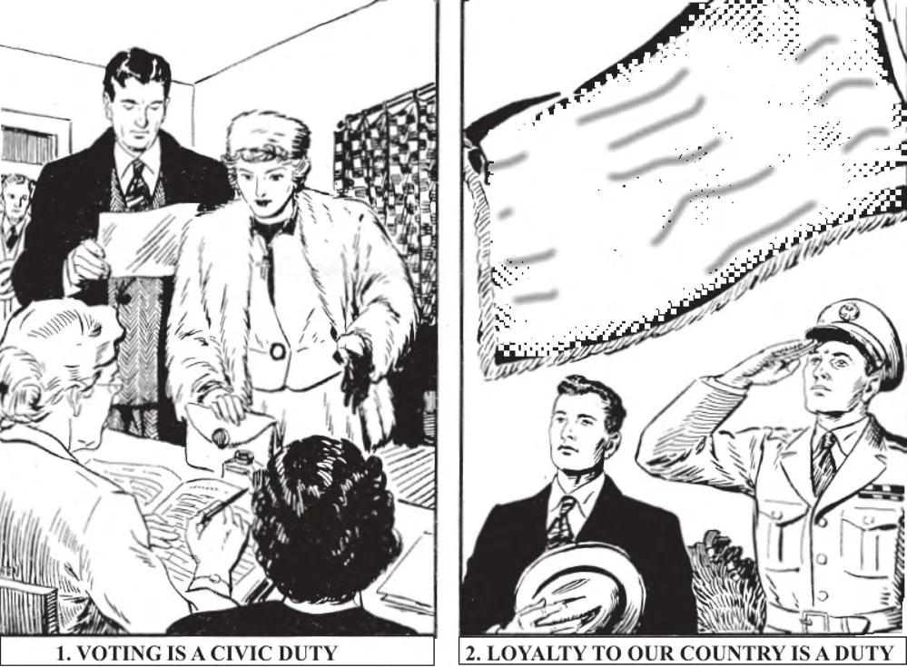

# 105. Civic Duties

1. Among the civic duties is that of voting. All who are granted this right should exercise it. They must not prostitute their right, but use it justly for the good of all.

2. It is the duty of every citizen to be loyal to his country, to support its institutions, and to respect its laws and its flag. A good Catholic is a good citizen.

**What are the duties of a citizen toward his country?**

— A citizen must love his country, be sincerely interested in its welfare, and respect and obey its lawful authority.

> God gave us our country, and we show Him our gratitude by rendering it our love and service. Love is shown not by words, but by actions. But true love of country is always subject to the law of Him who gave us our country.

**How does a citizen show a sincere interest in his country's welfare?**

— A citizen shows a sincere interest in his country's welfare by voting honestly and without selfish motives, by paying just taxes, and by defending his country's rights when necessary. 1. We are responsible to God for the men we elect to office, for He has permitted us to have the right and duty to select the men we want. Every one who has the right to vote has likewise a serious obligation to use that right properly. Electors must choose men of experience and Christian principles. If we elect men with no religious principles, we should not be surprised if later in office they turn out unsatisfactory.

> It is wrong to sell one's vote; it is selling one's convictions. Persons who buy votes are not likely to use the office they might thereby gain for the good of anyone else but themselves.

2. Every Catholic who has the right to vote should exercise that right. Matters closely connected with the life of the people are the constant subject of legislation or debate. Even if your vote does not enable the good candidate to win, at least it will lessen the margin of his defeat. A Catholic elector who gives his vote to a candidate hostile to Christian principles, or by abstaining from voting contributes towards the success of such a candidate, has much to answer for.

> It is the Catholic voter's duty to vote for candidates that will act justly in questions of morals, and have the Christian principles at heart. Those who do not have the right to vote ought to pray for a result in the election favourable to upright men and the country in general.

3. A Catholic elector must not vote for any candidate who despises the teachings of Christianity. Before voting, he should find out the candidate's views on education, marriage, etc.

> It may happen that all the candidates for an office are indifferent or hostile to religion. In that case, if no other candidate can be made available, the Catholic should vote for the one least hostile to Christian principles, most moral in his qualities.

4. We are bound to contribute towards the expenses of government by paying taxes. It is wrong to cheat the State in the matter of taxation.

> It is only just that the citizens should contribute towards the maintenance of peace, order, good works, the army, etc. Our Lord Himself paid taxes (Matt. 17: 26). It is only just that we should help support the government that secures us protection.

5. In case of a just war, men should be ready to render military service for the defence of their country.

> A war of conquest in which the just rights of other peoples are overridden is not just. Those who during wartime offer their lives for the defence of their homeland will receive an eternal reward if they are in God's grace.

**Why must we respect and obey the lawful authority of our country?**

— We must respect and obey the lawful authority of our country because it comes from God, the Source of all authority. 1. God has entrusted the maintenance of peace and order in human society to the secular authorities. It is His will that among so many, some should rule and the others be subject to that rule, for law and order.

> "By God kings reign and lawgivers decree just things" (Prov. 8: 15). "There exists no authority except from God" (Rom. 13: 1). "Be subject whether to the king as supreme, or to governors as sent through him ... .for such is the will of God" (1 Pet. 2: 13-15).

2. Our civil rulers or superiors are those who have the authority in the government.

We call them civil officials. Most of our officials obtain their offices by the vote of qualified electors. Therefore if we get a bad government, it is our own fault.

> Our civil officials are the President, Senators, Representatives, Justices of the Supreme Court and other judges, governors, mayors, etc. Others, such as sheriffs, policemen, etc. are also civil officials.

3. We should be loyal to our civil officials, obey their just laws, and pray for them. We are bound to obey just laws, because all lawful authority comes from God (Rom. 13: 1-7). We are not bound to obey unjust and wicked laws. Laws contrary to divine law, opposed to the law of God, cannot be just. If, therefore, we are commanded to do what God forbids, or to desist from doing what He commands, we "must obey God rather than men" (Acts 5: 29).

> We should pray for our civil superiors, as St. Paul urges us: "I urge therefore, first of all, that supplications, prayers, intercessions and thanksgivings be made for all men; for kings, and for all in high positions, that we may lead a quiet and peaceful life in all piety and worthy behaviour" (1 Tim. 2: 1-2). We have a serious obligation towards our civil officials even if they are not the ones that we voted for. If God permitted them to obtain the post, we must render them support.

4. It is a sin to plot against our government and country. Treason is a crime against God and our fellow men. We are bound to love our country and defend it against all its enemies, within and without.

> "Therefore he who resists the authority resists the ordinance of God; and they that resist bring on themselves condemnation" (Rom. 13: 2).

**Why are we obliged to take an active part in works of good citizenship?**

— We are obliged to take an active part in works of good citizenship, because right reason requires citizens to work together for the public welfare of the country.

> The citizens of a State are mutually dependent: the welfare of all depends on the active contribution made by all. A country is like an anthill: all the members should be working, to increase the food store, to protect the hill from the weather and from enemies, etc. Those who take no interest in the work of the nation are dead weights that the others must bear; they contribute nothing to the welfare of the country in which they live. It is in a State where the citizens have no interest that evil men get into the public service in order to loot it, and enrich themselves at the expense of the public.
