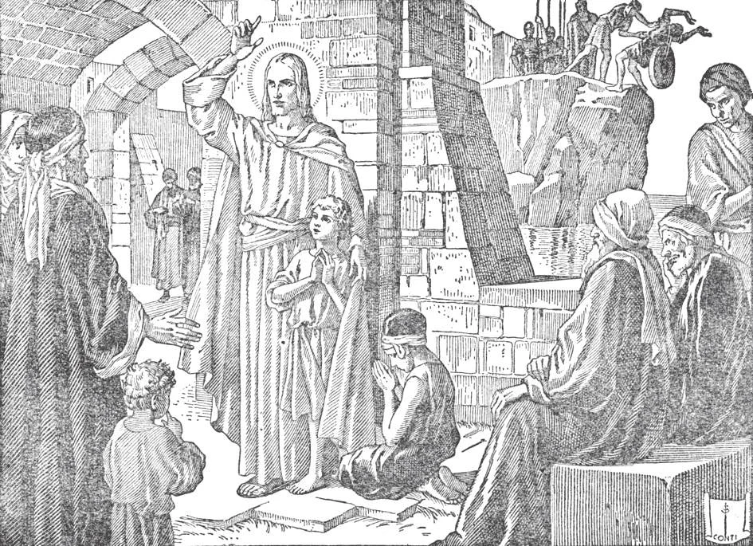

# 108. Bad Example and Scandal

Christ said, concerning scandalizing children: "But whoever causes one of these little ones who believe in me to sin, it were better for him to have a great millstone hung around his neck, and to be drowned in the depths of the sea. Woe to the world because of scandals! For it must needs be that scandals come, but woe to the man through whom scandal does come!" (Matt. 18: 6-7).

**What is bad example?**

— Bad example is doing wrong in the presence of others. 1. Bad example is the principal occasion of scandal, which is occasioning the sin of another by any word or deed having at least the appearance of evil. If any help or encouragement is given in any way to cause another to do wrong, scandal is committed or given.

> Bad example and scandal are sins against the soul included in the Fifth Commandment. They injure our neighbour's soul, and so are worse evils than injuring his body. They do the devil's work and draw souls into hell. If by deliberate scandal and bad example we cause another to commit a grave sin, we are worse than murderers. One who hurts or destroys the spiritual life of his neighbour commits the sin of murder. St. Augustine said, "If thou persuade thy neighbour to sin, thou art his murderer."

2. Our Lord condemned scandal in no uncertain terms, saying: "Woe to the man through whom scandal does come! And if thy hand or thy foot is an occasion of sin to thee, cut it off and cast it from thee! It is better for thee to enter life maimed or lame, than, having two hands or two feet, to be cast into the everlasting fire" (Matt. 18: 7-8).

> Grievous indeed must scandal be, to make our gentle Lord use such strong words of condemnation. "The Son of man will send forth his angels, and they will gather out of his kingdom all scandals and those who work iniquity, and cast them into the furnace of fire" (Matt. 13: 41-42).

3. Some ways of giving bad example or scandal are: by indecent talk, by selling or circulating bad books or pictures, by singing improper songs, by dressing immodestly, by appearing in public in a state of drunkenness, by profanity and cursing, by doing servile work publicly on Sunday, by behaving in decorously in church, by ridiculing religion and priests, by writing against religion, by publicly violating one of the commandments of God or the Church, etc.

> We should be very careful in our actions, however innocent, so that they may not be the cause of scandal to others. "And if thy eye is an occasion of sin to thee, pluck it out and cast it from thee! It is better for thee to enter into life with one eye, than, having two eyes, to be cast into the hell of fire" (Matt. 18: 9).

4. By committing scandalous acts, a person influences others to do the same. This is specially true of children, who easily imitate their parents and elders. He who gives scandal is like a man who digs a pit into which others fall and break their necks.

> Parents who quarrel in the presence of their children, however great the provocation, set them a bad example, and commit scandal. Public officials who break the law by gambling or immorality give scandal. Older brothers who go to forbidden shows and other places, or take their younger brothers with them are guilty of scandal. Older sisters who are excessively vain in their toilettes give bad example to their younger sisters.

5. We should avoid giving scandal as far as possible. We even ought to abstain from good actions of counsel if they may give scandal. For example, if one is dispensed from abstinence on account of bad health, he should refrain from eating meat before others, in order to prevent their being scandalized. Otherwise, he should explain why he eats meat.

> The aged Eleazar preferred to die rather than give the mere appearance that he was eating swine's flesh, which was forbidden by the Law. He feared to scandalize young persons, who might think he had gone over to the ranks of the heathen (2 Mach. 6: 24).

**What must we do if we have been the occasion of scandal or bad example?**

— If we have been the occasion of scandal or bad example, we are bound to repair the mischief done.

> A public scandal must be repaired in a public manner. Even then, we usually cannot begin to repair the greater part of the evil we have caused.

We must try our best to save those we have scandalized from the effects of our example. We must perform the contrary virtue, incite them by good example, and pray for them. We ought to be more careful about giving scandal, because of the difficulty, nay, almost the impossibility, of repairing the effects of scandal.

## The Cross

The crucifix is a symbol of the Redemption, and of Christianity in general. The crucifix differs from a cross, in that it has on it an image of Christ's body. Every home should have a crucifix displayed in a prominent place. The symbol INRI at the top of the crucifix is made up of the first letters of the Latin inscription meaning Jesus of Nazareth King of the Jews. Pontius Pilate ordered this inscription on a tablet placed on the cross over Jesus' head. It was written in Hebrew, Latin, and Greek.

> Most common forms of the cross are: the Latin cross, the Greek cross, the tau cross, the Celtic cross, and the archiepiscopal or patriarchal cross. The Latin cross is the most common, what we almost always see. The Greek cross has four arms of equal length. The tau cross resembles the letter T: it is called "tau" because that is the Greek word for our letter T. The Celtic cross has the arms connected by a circle. The archiepiscopal or patriarchal cross has two cross bars. Another variety, called St. Andrew's cross, is in the form of the letter X, and is so called because the Apostle Andrew was put to death on such a cross.
