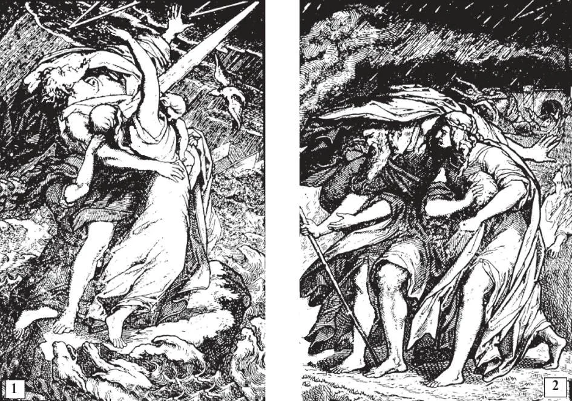

# 109. The Sixth and Ninth Commandments

God punishes the sin of impurity very severely even here on earth. For that , He destroyed all living things except those in the ark of Noe during the great deluge. "And God seeing that the wickedness of men was great said: I will destroy man" (Gen. 6). For the same sin God destroyed Sodom and Gomorrha: "And the Lord rained upon Sodom and Gomorrha brimstone and fire" (Gen. 19). Today the site of these cities is covered by the Dead Sea, an ever present reminder of the evil of impurity.

"THOU SHALL NOT COMMIT ADULTERY." "THOU SHALT NOT COVET THY NEIGHBOUR'S WIFE"

**What are we commanded by the sixth and ninth commandments?**

— By the sixth commandment, we are commanded to be pure and modest in our behaviour; by the ninth, in thought and in desire.

> "Do you not know that your members are the temple of the Holy Spirit, who is in you? Glorify God, and bear him in your body" (1 Cor. 6: 19-20). "Beloved, I exhort you as strangers and pilgrims to abstain from carnal desires which war against the soul" (1 Peter 2: 11).

1. The sixth and ninth commandments are studied together because they both deal with commands about purity. The sixth commandment refers to external acts, and the ninth to wilful thoughts and desires.

> "Oh how beautiful is the chaste generation with glory! For the memory there of is immortal, because it is known both with God and with men" (Wis. 4: 1-2). "The body is not for immorality, but for the Lord, and the Lord for the body" (1 Cor. 6: 13).

2. God has always shown special love for those whose chastity is outstanding. Consider how He chose that purest of all mortals, the Blessed Virgin, as His Mother.

> Our Lord chose St. John, the virgin Apostle, as the Beloved Disciple; it was John who was privileged to lean on His Heart at the Last Supper; it was to him that Christ entrusted His Mother.

**What does the sixth commandment forbid?**

— The sixth commandment forbids all impurity and immodesty in words, looks, and actions, whether alone or with others.

> To distinguish between the virtues of "purity" and "modesty," let us say that purity regulates the expression of the rights of the married and excludes them outside the married state; while modesty is a form of temperance which inclines one to refrain from what may lead to unlawful pleasure.

1. This commandment forbids adultery, which is the unfaithfulness of a married person. It is a duty before God and men for married people to be true to each other. Adultery is a great evil which breaks up the harmony of the family, and brings punishments in this life and the next.

> Adultery is a sin not only against chastity, but also against justice; because it is injustice towards the spouse of the married person. In the Old Law, the adulterer was punished with death. "For God will judge the immoral and adulterers" (Heb. 13: 4) . Married people should be most careful in avoiding even the appearance of unfaithfulness; when the spirit of jealousy enters, conjugal happiness goes out.

2. Matrimony is a holy state, through which Almighty God intends the prop a- gation of the race. Actions in accordance with this purpose of matrimony are permitted to the married, but positively forbidden to the unmarried. Fornication is at all times a grave sin.

> By "the married" is meant those Catholics validly married in the Catholic Church. Catholics who marry before a justice of the peace or a non-Catholic minister, cannot live together as married people, because they are not married either in the eyes of the Church or before God. If those Catholics who are not married before a Catholic priest live together and have children, these are considered illegitimate, and are so registered at Baptism.

3. All impure and immodest actions, whether committed alone or with others, are forbidden. When impurity is committed deliberately, it is always a mortal sin.

> The gravity of the sin of immodesty varies according to its nature, the conditions, and the relationship of the persons committing it. A good rule would be to refrain from doing anything you would be ashamed to have your pure mother or chaste daughter know you do.

**What are the most common occasions of the sin against chastity?**

— The most common occasions are: 1. Idleness. This is the parent of sin. Man is like the earth: if it is not planted to good seed, weeds grow on it fast. So a person is be set by all kinds of evil temptations unless he has some worthwhile occupation.

> Thieves break into a house where everybody is paralysed by idleness. When iron is not used, it begins to rust. And so man, who was made to be active, stagnates and becomes foul when nothing occupies him all day.

2. Bad companions and conversations. Bad companions are the cause for the fall into impurity of numberless young people.

> We should carefully avoid persons whose conversation is unchaste. Those who take pleasure in listening to improper conversation run a serious risk of falling into sins of impurity.

3. Too free companionship with the other sex. Undue familiarity between opposite sexes inflames the passions, just as straw blazes up when brought near the fire. Girls and young women certainly know that if they want to be respected, they must respect themselves, and not permit men to be caressing them at all times.

> A kiss is a demonstration of affection, and there is nothing intrinsically wrong with it; but it becomes sinful when used in such a manner as to provoke the passions. This is true also of other demonstrations, like embracing, etc. Undue familiarity rubs off the delicacy from girls, and the protective and gallant instinct from boys.

4. Immoral books, magazines, and newspapers. Many are in attractive garb, but en kindle the passions and do harm.

> Today we have the National Organization for Decent Literature, and may be guided by its advice.

5. Indecent shows, pictures, games. Bad shows, whether on the stage or in the films, corrupt more subtly than immoral conversation, because what one sees leaves a stronger impression. Moreover, bad shows represent evil in attractive garb.

> By attending only shows approved by the National Legion of Decency, we not only avoid bad shows, but compel producers to make good ones.

6. Immoral dances. In itself, dancing is not a reprehensible practice; it is the manner that should be carefully guarded. At bad dances there are often women present who are very immodestly dressed. There is a further danger of excessive drinking.

> A modern curse associated with bad dances is the fad of boys and girls going out alone in cars and driving to roadhouses. This can be a source of danger.

7. Immodesty and excessive luxury in dress. A beautifully dressed girl is pleasing to look at. But the "art of looking nice" should not be indulged in to excess. Women whose aim in life is to deck themselves in order to attract the attention of men are putting themselves in the way of un chastity.
