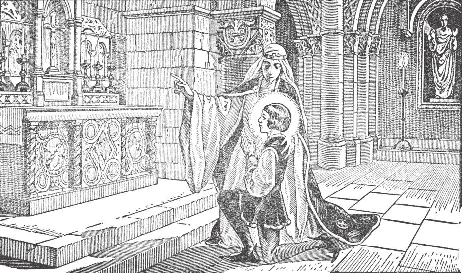

# 110. Sinful Desires Against Chastity

*The illustration shows the holy queen Blanche of France and her young son, later St. Louis, King of France. From babyhood, the queen brought up her son in the love of God. She used to say to him over and over that she would rather see him dead than have him commit sin. She guarded him particularly, so that he grew up chaste in body and soul. All mothers should imitate Queen Blanche; the training she gave helped her son in living a pure and holy life, and in becoming a great saint.*

**What is forbidden by the ninth commandment?**

— The ninth commandment forbids all thoughts and desires contrary to chastity.

> "You have heard that it was said to the ancients, 'Thou shalt not commit adultery.' But I say to you that anyone who even looks with lust at a woman has already committed adultery with her in his heart" (Matt. 5: 27-28).

An impure desire is the wish or intention to do something unchaste or impure. Almost always, sins against purity, thoughts and desires as well as acts, are grave or mortal sins. Whenever we are beset by temptation, we should immediately pray, especially to our beloved Mother, the purest of mortals.

> An impure desire, however, is a venial sin if committed through lack of attention or reflection, through negligence or slowness in rejecting a thought, or by giving only a partial consent. Only full and deliberate consent makes a sin mortal.

**Are mere thoughts about impure things always sinful in themselves?**

— Mere thoughts about impure things are not always sinful in themselves, but such thoughts are dangerous.

1. It is a mistake to suppose that all impure thoughts and desires are sinful. We are not responsible for the wicked thoughts that enter our mind unless we bring them in ourselves. But as far as we can, we should try to avoid all such thoughts, by occupying ourselves in something useful. Thinking about impure things is dangerous because in that way, we walk on the brink of the abyss of sin, and any little push may throw us in.

> Thinking often of something makes us used to that thing; we are in danger of losing our fear of impurity by familiarizing ourselves with thoughts of impure things.

2. A mere temptation to impurity, even when accompanied by bodily feeling, is not sinful unless there is wilful consent, at least to some degree. The stronger the temptation, the more merit we gain if we are faithful and resist. No matter how long the temptation lasts, even if it lasts our whole life, as long as we give it no consent, we are free from sin.

> St. Catherine of Siena was once severely tempted against purity. Shortly after Our Lord appeared to her, she asked: "Where wert Thou, Lord, when those evil thoughts were in my mind?" Jesus replied, "I was in thy heart, taking pleasure in the victorious battle thou were waging."

3. By resisting an impure thought or desire is not meant thinking of and pondering over it. In temptation of this nature, the most effective means is to reject it at once, then to ignore it, to do something else to distract the mind. Thinking of and worrying about the temptation only makes it more persistent.

**When do thoughts about impure things become sinful?**

— Thoughts about impure things become sinful when a person thinks of an unchaste act and deliberately takes pleasure in so thinking, or when unchaste desire or passion is aroused and consent is given to it. An impure thought or desire becomes sinful when instead of rejecting it we take pleasure in it and keep it in our mind. Impure desires, if not rejected, lead to impure acts and a life of vice.

> It is said that the model the great artist Leonardo da Vinci used for the figure of Jesus Christ in his painting "The Last Supper" was a young man of exceptional beauty, whose countenance expressed innocence and purity in a remarkable degree. Some years after, when Leonardo da Vinci was ready to draw the figure of Judas the traitorous Apostle, he had a difficult time trying to find a model. So he went into the most disreputable haunts of the city, in the places where the worst criminals congregated, to seek a suitable model. He saw all sorts of criminals, immoral men altogether lost to all sense of decency, but still he was not satisfied. At last one day, he espied a wreck of a man, slinking in a corner of a low resort. His face had an expression so vicious and diabolical that the artist knew his search for a model for Judas was ended. Going near, he prevailed upon the fellow, with the offer of a great sum of money, to sit as a model. The series of sittings was about to end, when one day Leonardo da Vinci said, "You know, since you came, I have always had a feeling that I have seen you somewhere before. I must be wrong, but the feeling persists. ..." Thereupon the man in an outburst of despair cried, "Yes, you have seen me before! I was the innocent young man who sat as a model for the figure of that Christ there. ... And now, see how I am sitting for Judas, for Judas ..."

**What are the chief means of preserving the virtue of chastity?**

— The chief means of preserving the virtue of chastity are: to avoid carefully all unnecessary dangers, to seek God's help through prayer, frequent confession, Holy Communion, and assistance at Holy Mass, and to have a special devotion to the Blessed Virgin.

1. In all things form the habit of temperance. Avoid all unnecessary dangers; do not take any chances with unchastity; do not experiment. If you put a match to gunpowder, it is sure to explode; there is no necessity to try and see whether it will not.

> Shun the company of those that are impure. Impurity is no wonderful achievement to be proud about: any idiot can be impure. It is the strong soul that resists temptation and keeps himself clean. It is the chaste person that possesses manly strength.

2. Always remember that God sees us. Let us therefore seek His help through prayer.

> "Watch and pray that you may not enter into temptation. The spirit indeed is willing, but the flesh is weak" (Mark 14: 38). For instruction about matters of sex, go to your parents or to your pastor or older people whom you know are good.

3. Be always modest and pure in your dress, posture, and conversation. This is not only to save yourself from immodesty, but to avoid giving occasion to others to sin, or being even an unwitting cause for others to sin.

> Women who waste hours looking at themselves in the mirror, painting their faces and varnishing their nails, or choosing clothes to put on, care more for their body than for their soul. They should remember that after death, they will become skull and bones just like the rest, and all their finery will avail them nothing.

4. Receive the sacraments of Penance and Holy Eucharist often, and attend Holy Mass frequently.

Thus we follow the injunction: "Walk in the spirit, and you shall not fulfil the lusts of the flesh" (Gal. 5: 16).

5. We should have a special love and devotion for our Blessed Mother, and daily ask her to preserve us in the chastity that she so greatly cherished.
