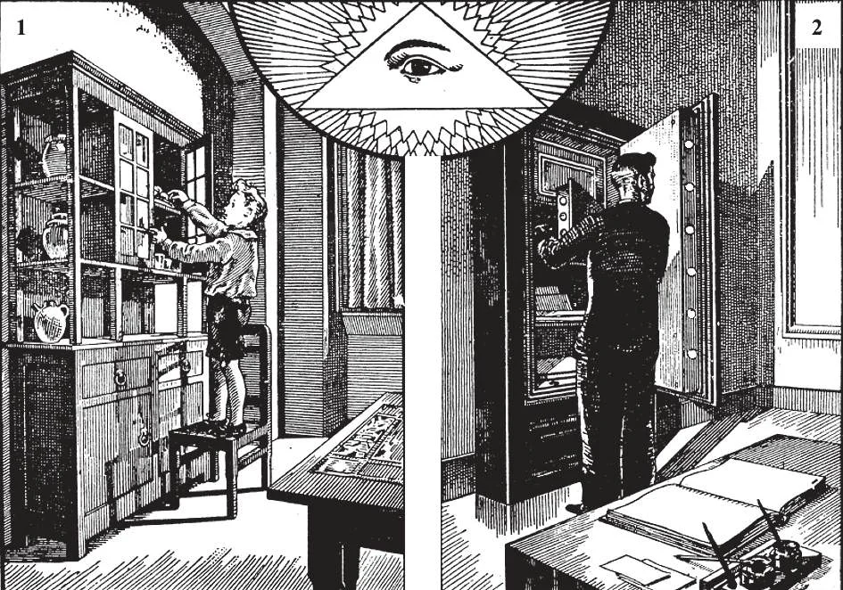

# 111. The Seventh and Tenth Commandments

*Parents should be most careful to teach their children honesty in thought, word, and deed. As the child, so the man. If parents laugh indulgently at their child stealing food from the cupboard (1), keeping back change after errands, copying in examinations, throwing stones to break windows, defacing walls and books, picking flowers and fruits from another person's garden, etc., then those parents must not be surprised if when the child is grown up, he steals from the bank (2), forges signatures, cheats his employers, becomes a usurer, etc.*

"THOU SHALL NOT STEAL" "THOU SHALT NOT COVET THY NEIGHBOR'S GOODS"

**What does God forbid in the seventh commandment?**

— In the seventh commandment God forbids all dishonesty, such as stealing, cheating, unjust keeping of what belongs to others, unjust damage to the property of others, and the accepting of bribes by public officials.

> "Do not any unjust thing in judgement, in rule, in weight, or in measure. Let the balance be just and the weights equal, the bushel just, and the sextary equal... (Lev. 19:35-36).

1. The seventh and tenth commandments are treated together because both deal with commands about property. The seventh commandment refers to external acts, and the tenth to intentions or desires against honesty.

> One who is starving may; however, take what he absolutely needs. The right to live is above the right of property. But this permission must be used only in rare and extreme cases, when all other means have been exhausted.

2. The obligations regarding honesty are imposed on us in conscience, even though the civil laws may not compel us.

> "Take heed and guard yourself from all covetousness, for a man's life does not consist in the abundance of his possessions" (Luke 12:15). Violations of these commandments are opposed to natural law and justice, and are an attack on society, a menace to public security and peace.

**What are the chief violations of the seventh commandment?**

— The chief violations of the seventh commandment are the following:

1. Stealing or theft is the secret taking of another person's property.

> Few sins are more common than theft. Covetousness leads to theft. Those who like to show themselves off in luxury but have not the means frequently resort to theft. One must be very careful in avoiding even petty thefts, or he will contract a vice, and in a short time will find himself stealing more valuable things.

2. Robbery is the open and forcible taking of another person's property. Robbery or stealing is a slight or grave sin according to the injury done. Stealing a day's wages from a person is usually a mortal sin.

> Stealing even a very small amount from a poor person is a mortal sin. A number of different small thefts from the same person or different persons within the space of one or two months and amounting to a considerable sum, may be a mortal sin.

3. Cheating is depriving another of his property by crafty means. Included in cheating are: using false weights and measures, issuing counterfeit money, adulterating food and other products for sale, forgery, falsification of documents, smuggling, tampering with boundary lines, overcharging, excessive profits, arson with a view to collection of insurance money, etc.

> Copying during an examination, or copying the work of another and presenting it as one's own work is also cheating. By it one obtains credit for what does not belong to him, and often gets what justly belongs to another. Copyrights are a form of property that must be respected.

4. Usury is the charging of excessive interest on money. A usurer takes unjust advantage of the need of another in order to make excessive profits. Under the appearance of helping the needy, a usurer involves them in greater hardships, taking from them their means of livelihood.

> Another form of dishonesty is cornering the market which consists in buying up the entire supply of one product, such as wheat, for the purpose of forcing up prices, and thus making excessive profits.

5. Unjust damage done to the property of others is against the seventh commandment. One may injure another's property by setting it on fire, treading down his crops, fishing or shooting on his grounds without permission, pulling down fences, defacing books, furniture, and buildings, etc. One who does wilful damage to another's property must make good the loss. Accidental damage need not be made good, unless it came about through culpable negligence.

> Thoughtless persons who pass through a farm sometimes pick fruit, vegetables, or corn. Some travellers have the bad habit of taking towels, dishes, pens, and similar things from trains, boats, and hotels as souvenirs. Children pick flowers from other people's gardens, throw stones at houses, write on desks, walls, and fences. They should be taught not to injure the property of others.

6. Public officials must be very careful not to accept bribes; they must guard against all signs of embezzlement.

> Officials are placed in office not to enrich themselves, but to serve the public. They must treat all the citizens fairly and justly, reject all dishonest efforts to sway them from honesty, shun all kinds of peculation, and be most careful in their duty.

7. It is a sin to contract debts beyond one's ability to pay, and not to pay debts when due, even if able.

> Young people should not go into debt; most of them, not having as yet any means of earning, would have no sure source from which to repay their debts. It is very wrong to get into debt to satisfy a craving for amusement, in order to buy more and more fashionable clothes, etc. But once in debt, to pay is a moral obligation.

8. Employers who do not pay a just living wage defraud others, and are guilty of injustice. Employees who waste time, do bad work wilfully, or neglect to take reasonable care of their employers' property violate the seventh commandment.

> (Regarding relations between employers and employees, see more on pages 230-231.)

9. Another sin against this commandment is the violation of business contracts.

> One may be guilty of dishonesty by obtaining money or goods from others for a specific purpose and using the donated articles for other purposes. One who borrows books, instruments, etc. must take care of them and return them in proper condition and in the proper time. Children must not steal from parents, or keep change from purchases.

10. Buying or receiving stolen goods is a sin against the seventh commandment; those who buy or receive stolen goods help and encourage thieves for the sake of gain.

> Receiving all or a portion of the estate of a deceased person contrary to the expressed wishes of that person is a sin of dishonesty, even if done with the approval of civil courts.
