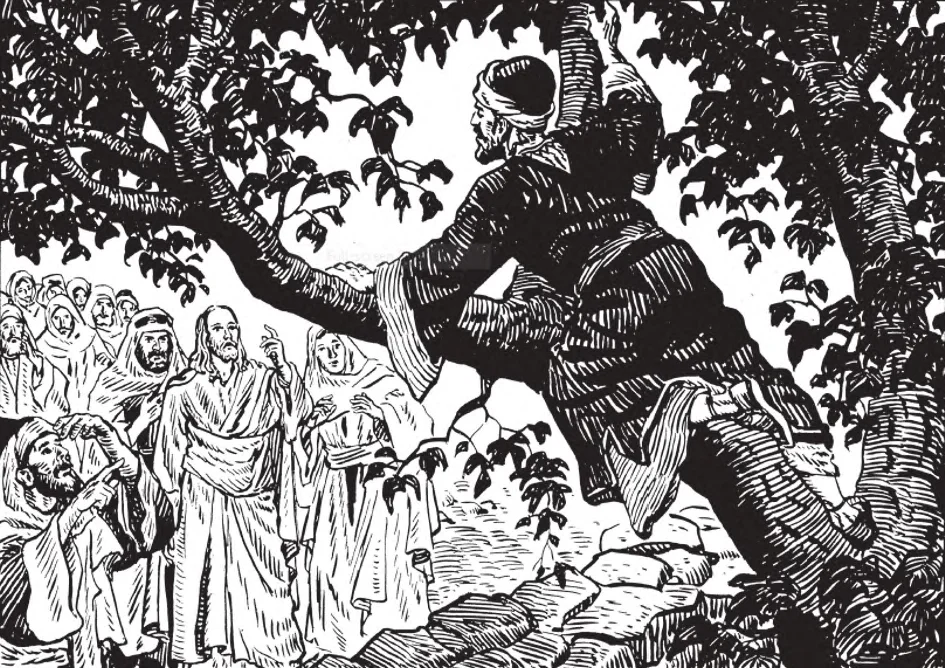

# 112. Reparation of Damage to Property

Once our Lord was walking through Jericho. A rich publican Zacheus, wished to see Him, but the crowd was so great that he could not. He therefore climbed up a tree along the path of our Lord. Jesus saw Zacheus and told him to come down, for He would be his guest. Zacheus told Jesus that he would restore fourfold whatever he had taken wrongly from anyone. Upon this Jesus called Zacheus a son of Abraham (Luke 19: 1-10). Thus he determined to make reparation for his usury.

**Are we obliged to repair damage unjustly done to the property of others?**

— We are obliged to repair damage unjustly done to the property of others, or to pay the amount of the damage, as far as we are able.

> "If any man hurt a field or a vineyard, and put in his beast to feed upon that which is other men's: he shall restore the best of whatsoever he hath in his own field, or in his vineyard, according to the estimation of the damage" (Ex. 22: 5).

1. If we have unknowingly, by purchase or gift, obtained possession of stolen property, we are bound to restore it to the rightful owner, as soon as we learn the truth.

> We are just possessors only as long as we do not know the goods were stolen. As soon as we become aware of that fact, we must give up the property. "The beginning of a good way is to do justice; and this is more acceptable with God, than to offer sacrifices . . . Better is a little with justice, than great revenues with iniquity" (Proverbs 16: 5, 8).

2. If one refuses to restore stolen property or to repair damage, he has unjustly done to the property of others, he cannot be forgiven. He will not obtain pardon from God, nor absolution from the priest, even if he confess his sin over and over again.

> As long as one does not sincerely intend to make reparation, his sin will not be remitted, even though he entreat divine pardon with weeping, or seek to appease divine justice by fasts and penances. It was not till Zacheus declared his determination to make restitution that Our Lord called him a son of Abraham (Luke 19: 9).

3. Justice requires reparation of the evil we do, in so far as we have ability to make that reparation. Without restitution or reparation, there is no forgiveness.

> St. Alphonsus relates the story of a rich man who had an ulcer in the arm and was near death. The priest urged him to restore the property he had unjustly acquired, but the man refused, saying that if he did so, his three sons would be left penniless. The priest then said he knew of a cure for the rich man's disease: a living person must allow his hand to be burned, and while still raw, be applied to the ulcer. Eager to get well, the rich man had his three sons called, but not one of them was willing to have his hand burned. The priest then said: "See, not one of your sons will burn a hand for you; yet you are willing to burn in hell-fire for all eternity, only to leave them your wealth." The rich man's eyes were opened, and he consented to make restitution.

4. A person who has accidentally damaged the property of another through no fault of his own is not obliged to repair the damage unless required to do so by civil law. Employees are bound to take reasonable care of the property of employers.

**Are we obliged to restore to the owner stolen goods, or their value?**

— We are obliged to restore to the owner stolen goods, or their value, whenever we are able.

> "If any man steal an ox or a sheep, and kill or sell it: he shall restore five oxen for one ox, and four sheep for one sheep" (Ex. 22: 1).

1. If the rightful owner is dead, the property must be restored to his heirs. If there are no heirs, it must be given to the poor or for some other charitable purpose.

> If the thief cannot restore all he has stolen, he must restore all he can. If he has used what has been stolen, he must repair the damage done by restoring the equivalent. If he cannot restore anything, he must at least pray for the person he has wronged.

2. If poverty or some other circumstance prevent the thief from making restitution immediately, he must resolve to do so as soon as possible, and must make an effort to fulfil his resolution.

> Restitution may be made secretly, without letting the owner know that restitution is being made. For instance, a money-order may be sent with a fictitious name; or the priest, who is pledged to secrecy, may be entrusted with the property to be restored.

3. If we find an article of value, we must strive to discover the owner, in order to restore the article. The more valuable it is, the greater our obligation to discover the owner and restore it to him. If after all our earnest efforts, we fail to find the rightful owner, we may keep the article.

> A mason, engaged in repairing the stone wall of a building, found a metal box hidden in a cavity in the wall. He broke open the box and found that it contained jewels of all descriptions. He at once concealed the box and took it home without telling anyone what he had found. A few days afterwards, wishing to realize some money on the jewels, he took out several from the box and offered them to a jeweller for sale. The jeweller immediately had him arrested. The jewels he had offered were recognized as having belonged to a rich merchant who had been robbed and murdered a month before. The mason was unable to prove that he had merely found the box of jewels. He was tried and imprisoned for life for the murder of the merchant.

**What does the tenth commandment forbid?**

— The tenth commandment forbids all desire to take or to keep unjustly what belongs to others, and also forbids envy at their success.

1. We are permitted to desire the property of others only when we propose to obtain it by legitimate means, such as by purchase or exchange.

> "For covetousness is the root of all evils, and some in their eagerness to get rich have strayed from the faith and have involved themselves in many troubles" (1 Tim. 6: 10).

2. Among those guilty of violating the tenth commandment are;

(a) Those who desire or resolve to steal or cause loss to others, even if the resolution is not carried out;

(b) Children who wish for the death of their parents in order to obtain their property;

(c) Those who wish for war, epidemics, storms, fire, legal troubles, social outbreaks or other calamities, in order to profit from the resulting high prices of their products; and

(d) Those who deny the right of private property such as Socialists or Communists.

> Communism is an extreme form of Socialism, a form of politico-economic system in which ownership of all property is vested in civil society, which then would control both production and distribution. It has repeatedly been condemned in papal encyclicals, notably those of Leo XIII and Pius XI.
