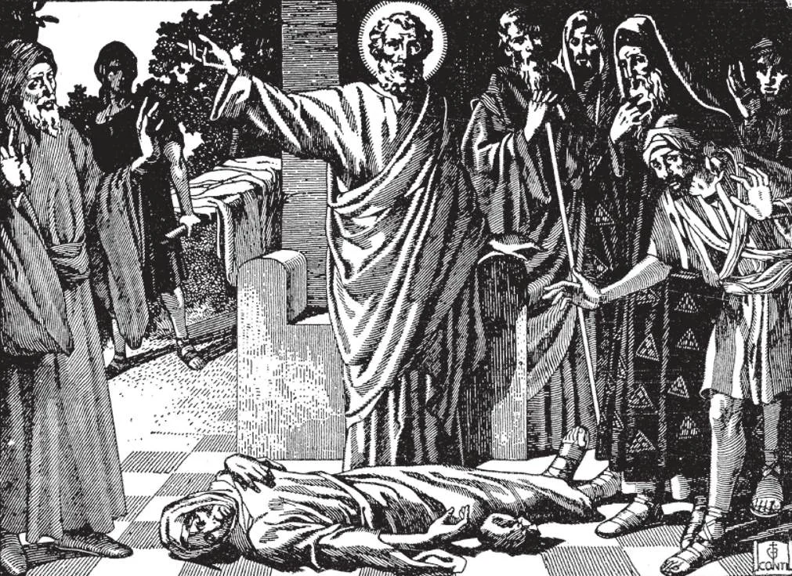

# 115. The Eighth Commandment

It was the custom among the first Christians for the rich to sell their property and give the money to the Apostles to be shared among all. Ananias and his wife Saphira, two disciples, sold their land. But they plotted to keep back some of the money. Giving the rest to St. Peter, Ananias pretended that it was the whole price that had been received for the land. St. Peter rebuked him and said that he lied against the Holy Ghost. Ananias fell down dead. Later, Saphira, not knowing what had happened to her husband, told the same lie to St. Peter. She also fell and died immediately after.

"THOU SHALL NOT BEAR FALSE WITNESS AGAINST THY NEIGHBOUR."

**What are we commanded by the eighth commandment?**

— By the eighth commandment, we are commanded to speak the truth in all things, but especially in what concerns the good name and honour of others. 1. God is the God of truths and we are obliged to respect that truth. If we would prove ourselves children of God, we should, like Him, always respect the truth.

> "I am the way, and the truth, and the life" says Our Lord (John 14: 6). "You shall not lie" (Lev. 19: 11). This is why a lie, even when told for a good purpose, is always a sin, because it is contrary to the nature of God.

2. The lover of truth is like God, and well-pleasing to Him. The lover of truth is also held in esteem by his fellow men, who know that they can trust him, for in him as in Nathaniel (John 1: 47), is no guile.

> Even if we suffer from telling the truth, we shall be saved trouble and shall possess a clear conscience.

3. A habitual liar not only is often led into grave sin, but forfeits the trust of his fellow-beings, and is the cause of a great deal of harm. When people know that one is a habitual liar, they do not believe him even when he tells the truth.

> The liar is almost always guilty of other sins. "A thief is better than a man that is always lying. Lying men are without honour" (Ecclus. 20: 27-28),

4. In the eighth commandment, God forbids us to detract in any way from our neighbour's honour or reputation. It is our good reputation that keeps us well-thought of and well-spoken of among our fellow men.

> "A good name is better than great riches: and good favour is above silver and gold" (Prov. 22: 1). The esteem of others is essential to real happiness; those who know they are despised by their fellow men are not likely to be happy in this life. One who brings another into disrepute is a thief, stealing a good name.

5. A good name is acquired by consistent struggle, by making our good works known, by defending ourselves whenever false accusations are made against us. This is why, in ordinary cases, we do our good works openly in accordance with Our Lord's injunction, "So let your light shine before men, in order that they may see your good works, and give glory to your Father in heaven" (Matt. 5: 16).

> Good works are the best means of defending a good name. We must, however, be sure we do not do our good works only to make a show before men, but chiefly to please God. When our name is in danger, we should defend ourselves and justify ourselves; but it is foolish to make too much fuss over trifles, as going to court over nothing.

6. If we would not speak so often, we would avoid many sins into which we habitually fall, consisting of sins of the tongue. Most of the sins committed are sins of the tongue: lying, backbiting, slander, gossip, calumny, detraction, the telling of secrets, all the results of talkativeness.

> Let us try an experiment: For one whole day do not speak unless absolutely necessary, but each time you would have talked, jot down what you had wanted to talk about. At the end of the day you will see how many useless things, things wasteful of time, not to mention unkind and sinful things, you had wanted to say. If people would only hold their tongues, how much more useful they could be!

7. Truthfulness promotes the general welfare of society, and mutual trust among men. The orderliness of the social order depends greatly on members speaking the truth.

> Let us imagine our own special community, with our favourite friends and tradesmen, with those we contact every day on various matters. Let us imagine the situation if we were not certain they were telling the truth all the time, but only a probable ten percent of the time.

**What is an evasion?**

— An evasion is a statement that may be interpreted in two ways.

1. We are permitted to give an evasive or double meaning answer when there is no obligation to answer, and in order: (a) to conceal a secret we have an obligation or a right to keep; and (b) to shield ourselves or others from harm. In an evasive reply, the hearer deceives himself by his interpretation of what he hears.

> St. Athanasius, Bishop of Alexandria, was concealed in a vessel on the Nile, when the soldiers of the Emperor Julian overtook and stopped it. On their inquiring where Athanasius was, his servant replied: "He is not gone far." The soldiers went onward.

2. We are not supposed or expected to tell everybody our private affairs or those of our friends or superiors. Many persons out of carelessness or curiosity have a most irritating habit of asking very personal questions, such as "Where have you been?" "Where are you going?" "Did you have a visitor?" "How old are you?" "What is your salary?" "Where do you get so much money?" "What do you do all day?" "What is your work now?" "How much did you pay for your dress?" "Why did you leave home?" etc. If we are asked indiscreet questions by such curious or ill-bred people, we have a right to give such an evasive answer as: "I do not' remember" (meaning, I do not remember to tell you.)

> At best, these questions are a sign of extreme ill-breeding. We should be more thoughtful and discreet, and give everybody the right to his own private affairs. Answering, "He is not at home" is a social custom understood to mean that the person is not receiving callers, even if he is in the house. If a person we cannot trust tries to borrow money from us we can say: "I have no money" (meaning, have none to lend you).

3. When another has the right to the truth, we must answer simply and openly. Such is the case in buying or selling, or in drawing up an agreement. It would be against justice if two persons about to marry were to deceive each other by evasions about money matters and other things.

**What does the eighth commandment forbid?**

— The eighth commandment forbids lies, rash judgement, detraction, calumny, and the telling of secrets we are bound to keep.

> "Lying lips are an abomination to the Lord" (Prov. 12: 22). "Wherefore, put away lying and speak truth each one with his neighbour, because we are members of one another" (Eph. 4: 25).
