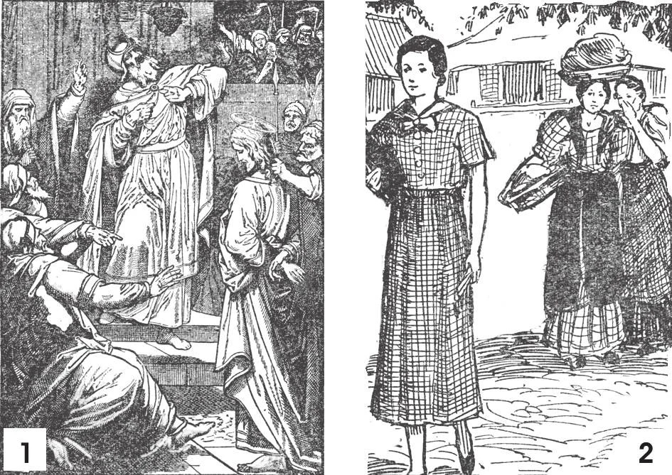

# 116. Sins Against Truth

1. The greatest calumnies were spoken when 2. People who gossip and spread tales that false witnesses testified against Jesus before detract from the reputation of someone have much to answer for. "Brethren, do not speak Ca ip has. The high priest gave ear to the calumnies and condemned Our Lord to death, against one another. He who speaks against a brother, or judges his brother, speaks against the although he knew Him to be innocent. law and judges the law" (Jas, 4: 11).

**What is lying?**

— Lying is saying, for the purpose of deceiving others, what we know or suspect to be untrue.

> Lying is a sin even when it may be the means of effecting much good. The end does not justify the means, and we must not commit evil in order to obtain good. (a) A malicious lie is told for the purpose of injuring someone. It is by its nature a mortal sin, and becomes venial only when the injury done is slight. A lie taken under oath is perjury, a mortal sin. (b) An officious lie is told to avert evil from oneself or others. It is called a "white" lie. (c) A jocose lie is told to amuse others. Very often it is no sin at ail, as when we relate an imaginary narrative for the amusement or instruction of others, tell a joke which we made up, relate fables and fairy tales, etc. But if a jocose lie has harmful results, it becomes sinful. (d) Sins related to lying, as violations of the respect due to truth, are hypocrisy, and flattery.

1. Hypocrisy or dissimulation is acting a lie. It is hypocrisy to pretend to be better than we are.

> It was hypocrisy of Judas to kiss Our Lord like a friend, when it was only to betray Him. Those who are outwardly pious but lead lives of sin are hypocrites. They resemble Satan, who can assume the form of an angel of light. Jesus called hypocrites "whited sepulchres", beautiful outside, but within full of dead men's bones.

2. Flattery consists in praising a person immoderately, against one's conviction, for an ulterior motive. A flatterer lies in order to secure an advantage for himself.

> "A man that speaketh to his friend with flattering and dissembling words spread eth a net for his feet" (Prov. 29: 5). "It is better to be rebuked by a wise man than to be deceived by the flattery of fools" (Ecclus. 7: 6). "Woe to you that call evil good!" (Is. 5: 20). Flatterers criticize and ridicule a man behind his back, but they praise him before his face.

**When does a person commit the sin of rash judgement?**

— A person commits the sin of rash judgement when, without sufficient reason, he believes something harmful to another's character.

> People judge others by themselves; he who is not evil will less likely think evil quickly of others; he who is a sinner will interpret the actions of others in an evil manner at once. One's judgement of others is a reflection of his own character. "Charity thinks no evil" (1 Cor. 15: 5). A just person, even when he sees evil, tries to avoid thinking of it, and leaves the judgement to God. A person is guilty of rash suspicion when he suspects on insufficient grounds. "Do not judge, that you may not be judged. For with what judgement you judge, you shall be judged" (Matt. 7: 1-2).

**When does a person commit the sin of detraction?**

— A person commits the sin of detraction when, without good reason, he makes known the hidden faults of another. 1. To speak of what everybody knows or of what appeared in the newspapers is not detraction. It is however contemptible for newspapers to publish family troubles that are of no public concern.

> Tale-bearing is a most despicable form of detraction. It consists in repeating to a person unfavourable remarks made about him.

2. Uncharitable conversation is commonly termed backbiting, a cowardly act of discussing the known faults of another without necessity, and behind his back.

> It is wrong to listen to detraction and uncharitable conversation, if we take pleasure in it or encourage it. When the conversation turns to another person's faults, we should try to excuse him or change the subject. "Hast thou heard a word against thy neighbour? Let it die with thee" (Ecclus. 19: 10).

**When does a person commit the sin of calumny or slander?**

— A person commits the sin of calumny or slander when by lying he injures the good name of another.

> Any public defamatory accusation, maliciously made, whether the facts be true or not, is called libel. Exaggerating faults is a form of calumny. Gossip is a form of calumny because it usually exaggerates a person's faults or sins with malice. The sin of slander is a double one: lack of charity and a violation of the tenth commandment.

**When are we obliged to keep a secret?**

— We are obliged to keep a secret when we have promised to do so, when our office requires it, or when the good of another demands it. 1. A priest may never reveal anything confided to him in confession, even if keeping it secret will result in death for himself or others. This rule has no exception. 2. A secret may be revealed when: (a) it is for the good of the guilty person; (b) it will save ourselves or others from evil; (c) keeping it secret is against justice or the welfare of society; and (d) the person to whom it is revealed has a right to know.

> When there is just reason for revealing a secret, we may do so to persons in authority, such as parents, superiors, teachers, or courts of law. Serious faults should be made known to parents, teachers, and superiors, who may be able to correct them. Care should be taken to avoid exaggerating faults.

3. It is wrong to read another person's letters without permission. Eavesdroppers are contemptible. A tattletale is despicable.

**What must a person do who has sinned by detraction or calumny, or has told a secret he is bound to keep?**

— A person who has sinned by detraction or calumny, or who has told a secret he is bound to keep, must repair the harm he has done to his neighbour, as far as he is able. 1. If the offence was made in private, we must apologize, and take back what we said.

> If the offence was made before others, we must retract publicly. If we do not endeavour to repair the harm we have done, we cannot obtain God's pardon or the priest's absolution.

2. It is very difficult, and sometimes impossible, to make perfect reparation for calumny and detraction. Words once spoken are not forgotten by those who hear. This fact should make us very careful about avoiding sins against the eighth commandment. God gave us a tongue to speak kind and useful words. We should make a rule never to speak ill of anyone.

> A story is told of the saintly Cure d'Ars and a penitent at the confessional, who had confessed having gossiped about an acquaintance. The penitent thought he got off very easily indeed when all the penance he was given was to drop one by one ten blades of straw on the yard before his house, at a distance of five meters apart, and then to go back and pick up the ten blades. Going home, he proceeded to perform the penance. But he realized the lesson the saintly priest wished him to learn when, upon returning to pick up the blades of straw, he could find none; the wind had blown them all away.
