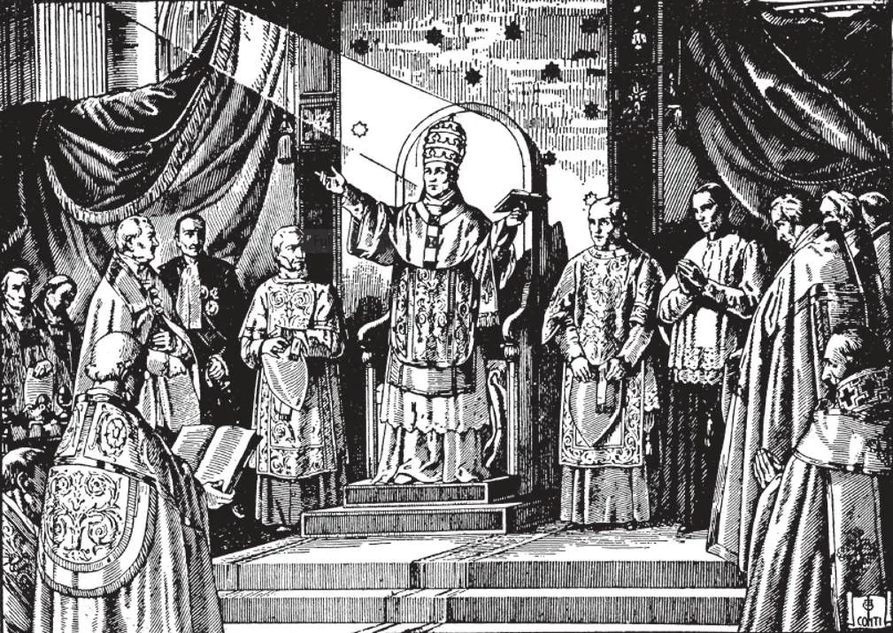

# 117. Commandments of the Church

*Our Lord Jesus Christ gave His Church the power to teach, to sanctify, and to rule its members, in order to lead them to their eternal salvation. And to fulfil these ends, the Church has power to make laws. Our Lord gave the Apostles full power; He sent them as God the Father had sent Him. Disobedience to the Church is therefore disobedience to God.*

**Whence has the Catholic Church the right to make laws?**

— The Catholic Church has the right to make laws from Jesus Christ, Who said to the Apostles, the first bishops of His Church: "Whatever you bind on earth shall be bound also in heaven."

1. No society can exist without the power to govern its members. No government is possible without laws. Unless the Church had the power and right to make laws, it could not lead its members to heaven.

> Our Lord said: "If he refuse to hear even the Church, let him be to thee as the heathen and the publican. Amen I say to you, whatever you bind on earth shall be bound also in heaven; and whatever you loose on earth shall be loosed also in heaven" (Matt. 18:17-18). This power to bind and loose is called the "power of the keys."

2. Authority to make laws includes power to enforce them. Hence the Church has the right to punish disobedient members. This it does by refusing them the sacraments, excommunicating them, denying them Catholic burial, and other penalties.

> "He therefore said to them again, 'Peace be to you! As the Father has sent me, I also send you' (John 20:21).

3. We are under a rigorous obligation to obey the laws or precepts of the Church. Disobedience to the Church is disobedience to God Who gave it full authority.

> A bad Catholic once said to a friend, "God will not punish me for not keeping the Church laws on fasting and abstinence. I observe all the Ten Commandments, and I do not need to obey the laws made only by the Church." But the friend answered, "Did not God command us to hear the Church? Then if we do not obey its laws, we disobey Him as well."

**By whom is this right to make laws exercised?**

— This right to make laws is exercised by the bishops, the successors of the Apostles, and especially by the Pope, who as the successor of the chief of the Apostles, Saint Peter, has the right to make laws for the universal Church.

1. The Pope can make and unmake laws for the entire Church; his authority is supreme and unquestioned. Every bishop, every priest, every member of the Church is subject to him.

> This authority comes from Jesus Christ, the Son of God, Who chose Peter as Head of His Church. The Holy Father is our St. Peter, his direct successor; we must obey him as Christ commanded all to obey Peter.

2. Laws are also made by each bishop for his own diocese, and by a general council of bishops for the entire Church. These last have no efficacy without the Pope's approval.

> Those who appeal from the decisions of the Pope to a general council are excommunicated.

3. A good Catholic shows obedience to God by conforming himself not only to the letter, but to the spirit of the laws of the Church. He obeys strictly what the Church commands, praises what it praises, condemns what it condemns. The Church is our Mother, good and wise, who looks only to our temporal and spiritual welfare; let us show our love for her by the obedience we render.

> The Church is our Mother, given us by Christ Himself, to guide us until He comes again. If we obey this guide, we shall have peace on earth, and eternal happiness with God in heaven. The Church can truly say with our Divine Saviour: "My yoke is easy, and my burden light" (Matt. 11:30).

4. The laws of the Church, in general, do not command things which are of their nature obligatory. For example, abstinence for certain days is not a natural law, but a human law. Therefore, this being the case, the Church that made such human laws can also dispense from them, change them, or abolish them altogether.

> This is why bishops can excuse from fasting and abstinence when they find good reason; this is why the holydays of obligation are not uniform throughout the entire world. The Church cannot abolish or change the Commandments of God, but it can its own commandments. All natural laws are included in the Ten Commandments; these everybody, everywhere, must obey at all times.

**Which are the chief commandments, or laws, of the Church?**

— The chief commandments, or laws, of the Church are these six:

1. To assist at Mass on all Sundays and holydays of obligation.

2. To fast and to abstain on the days appointed.

3. To confess our sins at least once a year.

4. To receive Holy Communion during the Easter time.

5. To contribute to the support of the Church.

6. To observe the laws of the Church concerning marriage.

**Are there any other commandments, or laws, of the Church, besides these six?**

— There are many other commandments, or laws, of the Church besides these six; but these are the principal ones, and the ones with which the ordinary life of Catholics is concerned.

1. A Catholic is bound to observe all of the precepts of the Church. Some of them forbid: (a) The reading or possession of bad books, magazines, and other publications. (b) Membership in Masonic or other anti-Catholic associations. (c) Cremation of the bodies of the dead. (d) The education of Catholic children in non-Catholic schools; etc.

> Laws for the government of the Catholic Church are contained in the Code of Canon Law, which at present contains 2414 canons. From time to time, as necessity arises, the Pope through the different Roman Congregations issues decrees, laws, or regulations for the welfare of the Church. Catholics are obliged to obey these laws.

2. The Church, through its rulers, has the power to dispense from its precepts. The Pope, the bishops, and the parish priests may for weighty reasons release or excuse the faithful from the observance of particular Church laws.

> It may happen that in a certain community the patronal feast may fall on a Friday of Lent. Because of the unusually great number of people, it would be difficult to provide abstinence food for everybody. In such cases, the Bishop may grant a dispensation from abstinence, and even fasting, locally.
