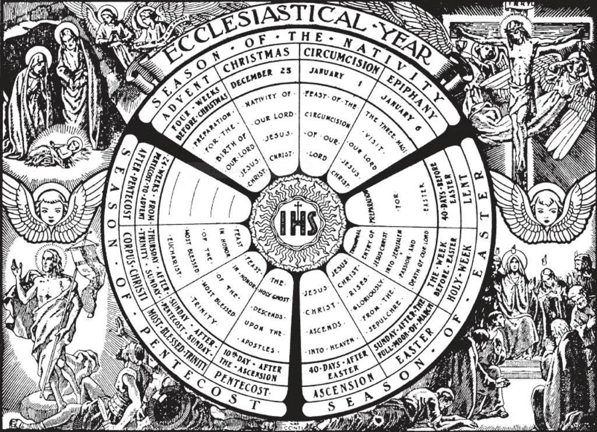

# 119. The Ecclesiastical Year

*The entire year is divided by the Church into periods and seasons, some of rejoicing, some of penance, and others of ordinary prayer and work. By following the cycle of feasts and fasts and living in the spirit of each time, we shall sanctify the whole year and make it bear fruit pleasing to God. In observing the seasons, we should look upon the events as actually occurring. The Church is the Mystical Body of Christ; she lives over every year the mysteries of His life. Thus we unite ourselves with Christ.*

**What is the ecclesiastical year?**

— The ecclesiastical year is the succession or cycle of seasons, including all the feasts, celebrated by the Church during the year.

1. The ecclesiastical year is made up of six seasons or periods of unequal length: Advent, Christmastide, Septuagesima, Lent, Paschal time, and the period from Pentecost to Advent. These periods are regulated in their occurrence by the three principal feasts of the year: Christmas, Easter, and Pentecost. The Epistles and Gospels, as well as the Hymns and Sequences of the Mass, are in consonance with the seasons and periods of the ecclesiastical year.

> The ecclesiastical year differs somewhat from the civil year. Instead of beginning on a fixed date, January 1 as the civil year does, the ecclesiastical year begins with the first Sunday of Advent, four Sundays before Christmas. (See the Appendix) .

2. The three principal feasts of the year are: (a) Christmas, which commemorates the birth of Our Lord; (b) Easter, which celebrates His resurrection; and (c) Pentecost, which celebrates the descent of the Holy Ghost.

> Each of these feasts has a season of preparation preceding, and a season of commemoration following. Easter is always the Sunday after the first full moon following March 21. Its position determines the position of the different seasons and moveable festivals of the entire year.

3. The Church commemorates the different feasts and seasons, placing the various events of the life of Our Lord before us, in order that we may ponder over them and imitate the virtues presented.

> Every day of the year, the Church commemorates one or more of her saints, encouraging us to imitate them who imitated Christ, and to implore their intercession. By such commemorations, our thoughts are fixed on God, even amidst life's distractions.

**What is Advent?**

— Advent is the period of preparation for Christmas. "Advent" means coming. It begins with the first Sunday of Advent, and embraces the four Sundays before Christmas. It is a season of penance in preparation for the birth of the Redeemer.

> The four weeks of Advent represent the four thousand years during which the coming of the Messias was expected and prepared for. As a sign of penance, the Church uses purple vestments for the Mass of the season, suppresses the joyous Gloria, omits flowers on the altar, and forbids the saying of the Nuptial Mass, etc.

**What is Christmastide?**

— Christmas-tide is the season of celebration after Christmas, a season of joy. During this period we celebrate events in the child life of Our Lord: the Circumcision, the Epiphany, the Feast of the Holy Family, the Purification, etc. The length of this period is regulated by the position of Septuagesima Sunday, which may occur any time between January 16 and February 22.

> The period after Christmas calls to mind the youth and the beginning of the public life of Jesus. We call this His hidden life in Nazareth.

**What is Septuagesima?**

— Septuagesima is the period of preparation for Lent. The season lasts two weeks and a half, from Septuagesima Sunday to Ash Wednesday, and includes three Sundays, respectively called Septuagesima, Sexagesima, and Quinquagesima (70th, 60th, and 50th).

> These were so named because in the early years of Christianity, many began fasting fifty, sixty, or seventy days before Easter.

**What is Lent?**

— Lent is the period of penance preceding Easter.

1. Lent begins with the Wednesday after Quinquagesima, which is called Ash Wednesday, because on that day takes place the marking with ashes of the foreheads of the faithful.

> Ash Wednesday is forty-six days before Easter; but we say Lent is forty days in length, because we do not count the six Sundays, on which no fasting is prescribed anywhere throughout the Church.

2. The last two weeks of Lent are called Passion Week and Holy Week respectively. Then the Church follows Christ closely through the last stages of His mortal life.

> During the period of Lent, the public life of Our Lord is set before us, including His fasting, His Passion, and His death. In consonance with the penitential spirit of the season, from Ash Wednesday to Easter Sunday inclusive, the Church forbids the saying of the Nuptial Mass.

3. In keeping with the spirit of Lent, Catholics are expected to abstain from worldly amusements, such as shows, feasting, etc. They should devote more time to prayer, penance, and religious exercises.

**What is the Paschal Time?**

— The Paschal Time is the time from Easter untill the eve of Trinity Sunday.

1. Paschal Time is a most important period, including the Ascension, and then days between that feast and Pentecost. The forty days between Easter and the Ascension commemorate the forty days Christ spent on earth after His Resurrection.

> The three days before the Ascension are called Rogation days. On these days, processions are held to implore God's blessings for an abundant harvest.

2. The ten days after the Ascension are a preparation for Pentecost, the feast commemorating the descent of the Holy Ghost on the Apostles.

> Paschal Time is a time of rejoicing. Its joyful character is shown by the constant repetition in the Church liturgy of the word of joy, *Alleluia* (Praise ye the Lord). During this period, we say the Regina Coeli instead of the Angelus three times a day.

**How long is the Period after Pentecost?**

— The Period after Pentecost is the longest of the liturgical seasons, varying between 23 and 28 weeks. It begins with the Feast of the Blessed Trinity, the Sunday after Pentecost, and extends to Advent. It takes up the main part of the year, and is devoted to the festivals of the saints, to Christian work and prayer.

> The period after Pentecost represents the time that shall elapse before the Last Judgement. On the last Sunday after Pentecost, the Gospel of the Mass is that which speaks of the Second Coming of Jesus Christ as Judge of the living and the dead.
