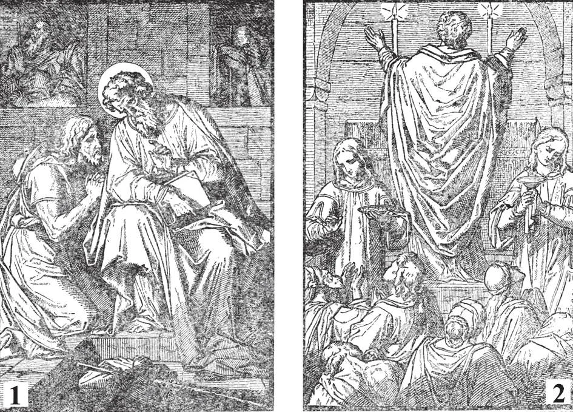

# 121. 3rd and 4th Commandments of the Church

The Sacrament of Penance was instituted by Our Lord. The Apostles administered it. Thus in their time, as the Scriptures say, the Christian converts came to them, "confessing and declaring their deeds." (1) Thus they came to St. Paul in Ephesus (Acts 19: 18). (2) The first Christians received the Body of Our Lord daily. It is the wish of the Church that if we cannot imitate them, we should at least receive Holy Communion as frequently as possible at least every time we hear Mass, on Sundays and holydays of obligation. We should not need to go to Confession for each Communion.

"TO CONFESS OUR SINS AT LEAST ONCE A YEAR" "TO RECEIVE HOLY COMMUNION DURING THE EASTER TIME."

**What is meant by the commandment to confess our sins at least once a year?**

— By the commandment to confess our sins at least once a year is meant that we are strictly obliged to make a good confession within the year, if we have a mortal sin to confess. Those who have reached the age of reason, generally at the seventh year, are bound by this law, under pain of mortal sin. We are not bound to confess to our parish priest. We may go to any confessor who is lawfully approved, whomever we prefer, in whatever church he may be.

> No special time is ordered for the yearly confession, but it is usually made in preparation for the annual Easter Communion. The annual confession and communion is what we call "Easter duty".

2. Although the requirement is only once a year, good Catholics will not be satisfied with such a meagre partaking of the sacrament of penance. It need hardly be said that if anyone has the misfortune to fall into mortal sin, he should go to confession without any delay. Should this not be possible, he must make an act of perfect contrition, and have the desire to receive the sacrament.

> We should strive to go to confession at least once a month. Many Catholics go to confession once a week, to the great benefit of their souls.

3. When in danger of death, baptised persons in the state of mortal sin have the obligation of receiving the sacrament of Penance.

**Why should we go to confession frequently?**

— We should go to confession frequently because frequent confession greatly helps us to overcome temptation, to keep in the state of grace, and to grow in virtue. 1. The graces that we receive from confession are given abundantly if we receive the sacrament frequently. Our soul is like a house undergoing cleaning at confession; the more often the house is swept and scrubbed, the cleaner it is bound to be.

> The devil, expelled from the soul at confession, tries to return again and again; but there will be no danger of his breaking in if the soul is barred and protected by the graces of confession, a strong defence against evil. "Confess, therefore, your sins to one another" (James 5: 16).

2. Confession not only serves to cleanse us from past offences, but helps to strengthen us against sin, and increases us in virtue. It is a potent medicine that not only gives thorough cleaning, but also injects powerful nourishment.

> Converted sinners are generally careful to go to confession frequently, because from confession they obtain strength to resist their former sins that try to tempt them back to the wrong path. Confession is like the Prodigal Son's father, who is filled with joy upon his return, and who brings out to offer him everything the house contains, in order to make him glad he has returned.

3. It is not necessary to go to confession for each Holy Communion, so long as one has no mortal sin. For prudent advice, one should consult one's confessor.

**What sin does a Catholic commit who neglects to receive Holy Communion worthily during the Easter time?**

— A Catholic who neglects to receive Holy Communion worthily during the Easter time commits a mortal sin. 1. All who have come to the use of reason are bound by this law of Easter Communion. Parents, teachers, and pastors are obliged to see that the children under their care comply with their Easter duty.

> The obligation of the Easter Communion binds under pain of mortal sin. One does not fulfil the duty if his communion or confession is unworthy.

2. Catholics should not be satisfied with receiving the Body of Our Lord only once a year. The early Christians used to receive Holy Communion every day.

> We should endeavour to receive Holy Communion frequently, as the Church urges. It does not seem very generous to make Our Lord wait one whole year when we may receive Him every day. If we only thought over our faith and realized what a great privilege it is for us to receive God Himself into our hearts, we would not need to be obliged to go to Holy Communion.

3. The Church prescribes annual communion in order that we may comply with the divine command to receive the Blessed Eucharist, and that the life of grace may be preserved in our souls.

> Christ Himself commanded: "Except you eat the Flesh of the Son of Man and drink His Blood, you shall not have life in you" (John 6: 54). Holy Communion is the food of our souls. Let us not starve our souls by denying them this heavenly food.

When we are sick, we are eager enough to rush here, there, and everywhere, seeking remedies. But Holy Communion is a supernatural remedy for sick souls; and how many are there who seek it?

**What is the Easter time?**

— According to the 1917 Code of Canon Law (859 §2), Easter time is from Palm Sunday to the Sunday within the Octave of Easter or *Dominica In Albis*.

> However, for the good of the faithful the bishop can anticipate it; but not before the fourth Sunday of Lent and can also postpone it; but not beyond the Feast of the Holy Trinity. Generally, one has to refer to the general custom of the place. For it may happen, like in the Philippines as *lex contra legem*, Easter time is from Septuagesima Sunday to the Sunday before the first Sunday of Advent.

1. However it is fitting to receive Holy Communion on the very day of Easter, because it was just a few days before Easter, during the Last Supper, that Our Lord instituted the Holy Eucharist.

> In the early days of Christianity, Christians generally received Holy Communion as often as they could hear Mass. The law prescribing the reception of Holy Communion at Easter time was made in the thirteenth century.

2. As Christ died and rose again in the Easter time, it is fitting that Christians should at this time die to sin by the Sacrament of Penance, and rise to the life of grace through the Sacrament of the Holy Eucharist, which is a pledge of the future resurrection.

> "As Christ has arisen from the dead, ... so we also may walk in newness of life" (Rom. 6: 4). (Note. Full explanations of the Sacraments of Penance and Holy Eucharist are to be found on pages 294 to 317, inclusive. They explain the manner of going to Confession and receiving Holy Communion.)
