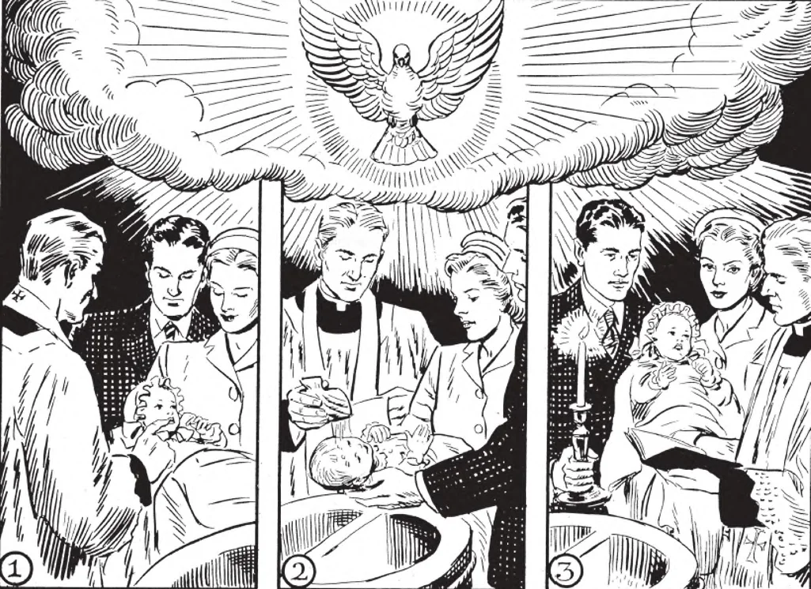

# 126. Ceremonies and Sponsors of Baptism

The essential part of Baptism is the pouring of water (1) together with the saying of the words of baptism. At that moment, the godparents must be touching the child. Blessed salt is put in the child's mouth (2) to signify wisdom received through Baptism, A lighted candle is given to the person baptised, or if an infant, to the sponsors (3), to denote the light of the Holy Ghost received.

**What ceremonies are used in Baptism?**

— The ceremonies used in Baptism are summarized as follows: 1. Reception of the candidate. At the church door, the candidate is questioned as to his purpose in wishing admission into the Church. He is told what such admission involves. He is commanded to keep the commandments, to love God and his neighbour. The priest then breathes three times upon his face to signify the spiritual breath of life that is to be infused into his soul, signs him with the cross to show that he is henceforth to belong to Christ, imposes his hand on him as a sign that the Church takes him as a ward, and then puts blessed salt, symbol of spiritual wisdom, in his mouth.

> The exorcisms follow, by which the devil is cast out, with his power over the soul of the candidate. The priest signs the forehead with a cross, as a seal, and commends the soul to God.

2. Admittance into the church or baptistery. The priest then lays his stole on the child as a sign of his ecclesiastical powers, and leads him into the baptistery, that he may have part with Christ in everlasting life. The godparents and the priest, together with the candidate if he already is an adult, recite the "Apostles' Creed" and the "Our Father" in sign of acceptance of the Faith.

> Prayers of exorcism are read to break the power of Satan over the child. The priest touches the ears and nostrils of the candidate with his moistened thumb, to signify that the hearing should be opened to the Word of God, and that 'the candidate should live in the odour of sanctity.

3. The baptismal vows. The candidate's good will is tested in the baptismal vows, in which he renounces Satan and all his works and pomps, that is, all sins and all occasions of sin.

> If the person baptised is an infant, his godparents take the baptismal vows for him, in his name. These vows take the form of answers to six questions concerning the renunciation of Satan and all his works and pomps, and belief in the chief doctrines of the Christian faith. Then the candidate is anointed with the oil of catechumens, touched on the breast that wisdom may thrive in his heart, and on the shoulders, that he may patiently bear the yoke of Christ. Then the priest changes his violet stole for a white one. to show that the separation from God of the soul is about to give way to a life of grace. Follows the profession of faith, a reiteration of the Apostles' Creed, and formal petition for Baptism.

4. The main act. The priest pours the baptismal water three times upon the head of the candidate in the form of the cross, at the same time pronouncing the words: "(Name of candidate), I baptise thee in the name of the Father and of the Son and of the Holy Ghost."

> At this actual moment of Baptism, the godparents must touch the candidate, to show that they incur and accept the spiritual relationship.

5. Anointing with chrism. After the pouring of water the person is anointed with chrism on the crown of the head, to show that he is now anointed of God.

> A white garment is placed upon him to show that his soul is now spotless with grace. A lighted candle is put in his hand to impress upon him that he should ever keep burning in his heart the light of faith and virtue. And finally, the newly baptised child of God is dismissed, with the blessings of God and the Church.

**What do we promise through our godparents in Baptism?**

— We promise through our godparents in Baptism to renounce the devil, and to live according to the teachings of Christ and of His Church.

> The godparents make the responses for an infant being baptised. These are called the baptismal vows. By them, the person renounces Satan and all his works and pomps; that is, sin and all occasions.

1. To the first three questions, we reply through our godparents in Baptism, "I do renounce him (or them)." To the last three questions we reply, "I do believe."

> (1) Dost thou renounce Satan? (2) And all his works? (3) And all his pomps? (4) Dost thou believe in God the Father almighty, creator of heaven and earth? (5) Dost thou believe in Jesus Christ, His only Son, our Lord, Who was born and Who suffered for us? (6) Dost thou believe also in the Holy Ghost, the Holy Catholic Church, the communion of Saints, the forgiveness of sins, the resurrection of the body, and life everlasting?

2. We should renew the baptismal vows on our First Communion. It is also praiseworthy to renew them every year on New Year's Day or on the Epiphany, and after a mission or spiritual retreat.

**What is the duty of a godparent after Baptism?**

— The duty of a godparent after Baptism is to see that the child is brought up a good Catholic, if this is not done by the parents. 1. In solemn baptism, there must be at least one godparent, of the same sex as the one baptised. It is permitted to have two sponsors: a godfather and a godmother.

> It is not permitted to have more than two godparents, and these two must be of different sexes. Others who may be present are only witnesses. The godfather must be at least 14 years old; the godmother must be at least 12 years old.

2. A godparent has the duty of looking upon the baptised person as his spiritual child, of providing for him, when necessary, the proper religious education, and of guarding him spiritually even when he is grown.

> For this reason, those who neither know nor practice their Catholic faith should not be chosen for godparents. Too many people pick godparents for their children for reasons other than spiritual.

3. A spiritual relationship is established between the person baptised and his sponsor, as well as between him and the one who baptises him.

> This relationship, called spiritual affinity, forbids marriage between the persons thus related. No spiritual affinity is contracted between the godfather and the godmother of a person, nor between his parents and his godparents.

4. If the person chosen godparent cannot be present at the Baptism, another can act in his place: that is, he can be sponsor by proxy. The absent godparent must, however, have the intention of being godparent.

**Who should be chosen as godparents for Baptism?**

— Only Catholics who know their faith and live up to the duties of their religion should be chosen as godparents for Baptism.

> A godparent is supposed to be a practical Catholic. Non-Catholics, Masons, those who married out of the Church, and all other excommunicated persons cannot be sponsors.
