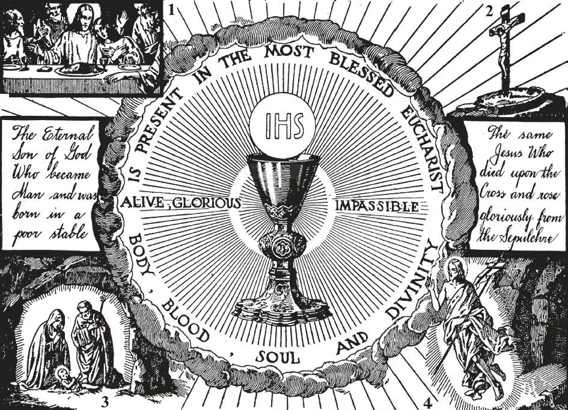

# 128. The Sacrament of the Holy Eucharist

At the consecration at Mass, the bread and wine are changed into the Body and Blood, Soul and Divinity of our Lord Jesus Christ. This is the Sacrament that Jesus instituted at the Last Supper (1). In the Blessed Eucharist is the same Person who was born in Bethlehem (2), crucified on Calvary (3), and rose gloriously from the dead on the first Easter morning (4).

**What is the Holy Eucharist?**

— The Holy Eucharist is a sacrament and a sacrifice in which Our Saviour Jesus Christ, body and blood, soul and divinity, is contained, offered, and received under the appearances of bread and wine.

> Eucharist in Greek means thanksgiving. The sacrament is so called because when Christ instituted it, He gave thanks. Today, it is the chief means by which we give thanks to God.

1. The Holy Eucharist is also called the Blessed Sacrament, because it is the most excellent of all sacraments. It gives us Christ Himself. "My delight is to be with the children of men" (Prov. 8: 31).

> It is called the Sacrament of the Altar because it is consecrated and reserved upon an altar. It is offered up on the altar in the Holy Sacrifice of the Mass.

2. The Holy Eucharist is called Holy Communion when it is received, usually in church. It is called Holy Viaticum when it is received during a serious illness, or at the hour of death.

> The Holy Eucharist is also called the Bread of Heaven, and the Bread of Angels, — this because in it, God Himself comes down from heaven to be our food, thus making us like unto the angels.

**How did Christ institute the Holy Eucharist?**

— Christ instituted the Holy Eucharist in this way: He took bread, blessed and broke it, and giving it to His Apostles, said: "Take and eat; this is My body"; then He took a cup of wine, blessed it, and giving it to them, said: "All of you drink of this; for this is My blood of the new covenant which is being shed for many unto the forgiveness of sins"; finally, He gave His Apostles the commission: "Do this in remembrance of Me." 1. When Our Lord said, "This is My body," the entire substance of the bread was changed into His body; and when He said, "This is My blood," the entire substance of the wine was changed into His blood.

> In the Holy Eucharist, we find the three essentials of a sacrament. The institution took place at the Last Supper; the visible sign is the matter of bread and of wine, while the audible sign consisting in the words of Our Lord is the form; the grace granted is the receiving of the very body and blood of the Living Christ.

2. After the substance of the bread and wine had been changed, only the appearances of bread and wine remained.

> By the appearances of bread and wine we mean their colour, taste, weight, shape, and whatever else appears to the senses.

**Why do we believe that Christ changed bread and wine into His own Body and Blood?**

— We believe that Christ changed bread and wine into His own Body and Blood, because: 1. His words clearly say so. At the Last Supper He said: "This is My Body" not "This is a symbol of My Body," or "This represents My Body."

> "And while they were at supper, Jesus took bread, and blessed and broke, and gave it to his disciples, and said,

take and eat; this is my body.

> And taking a cup, he gave thanks and gave it to them, saying,

all of you drink of this; for this is my blood of the new covenant, which is being shed for many unto the forgiveness of sins

> " (Matt. 26: 26-28).

2. Previously, on the day after the first multiplication of the loaves and fishes, Our Lord had promised to give His Flesh to eat and His Blood to drink. On this occasion, it is clear that the Jews took Our Lord's words literally. Many of the disciples left Jesus and "walked no more with Him," because they could not believe such a thing as He promised. But Jesus, although very sad at their leaving, did not take back His words or explain them differently.

> "I am the bread of life. Your fathers ate the manna in the desert, and have died. This is the bread that comes down from heaven, so that if anyone eat of it he will not die. I am the living bread that has come down from heaven. If anyone eat of this bread he shall live forever; and the bread that I will give is my flesh for the life of the world." "The Jews on that account argued with one another, saying;

how can this man give us his flesh to eat?

> " "Jesus therefore said to them, Amen, amen. I say to you, unless you eat the flesh of the Son of Man, and drink his blood, you shall not have life in you. He who eats my flesh and drinks my blood has life everlasting and I will raise him up on the last day. For my flesh is food indeed, and my blood is drink indeed. He who eats my flesh, and drinks my blood, abides in me and I in him. As the living Father has sent me, and as I live because of the Father, so he who eats me, he also shall live because of me. This is the bread that has come down from heaven; not as your fathers ate the manna, and died. He who eats this bread shall live forever." (John 6: 48-59).

3. The Apostles understood that Christ meant His words at the Last Supper to be literal. St. Paul writes:

> "The cup of blessing that we bless, is it not the sharing of the blood of Christ? And the bread that we break, is it not the partaking of the body of the Lord? ... Therefore whoever eats this bread or drinks the cup of the Lord unworthily, will be guilty of the body and the blood of the Lord. But let a man prove himself, and so let him eat of that bread and drink of the cup; for he who eats and drinks unworthily, without distinguishing the body, eats and drinks judgement to himself" (1 Cor. 10: 16; 11: 27-29).

4. It has been the continuous belief of Christians from the beginning of Christianity. St. Augustine said, "Our Lord held Himself in His own hands, when He gave His Body to the disciples." It was only in the sixteenth century that Protestants, breaking away from the True Church, denied it and introduced a different doctrine.

> The churches which separated in the early centuries from the Catholic Church all believe in the doctrine of the Holy Eucharist as being the very Body and Blood of Christ.

**How was Our Lord able to change bread and wine into His body and blood?**

— Our Lord was able to change bread and wine into His body and blood by His almighty power.

> If God made the universe out of nothing, He certainly could change bread and wine into His Body and Blood. Christ Himself changed water into wine at the marriage feast of Cana, by a mere act of His Divine Will. Every day we can see the results of God's power in the miracle of growth: people grow, the trees grow; inanimate or dead matter is assimilated as food and continues as living beings or vegetation, — all by the power of God. He, the uncreated One, can do anything He wills. Can we doubt that He worked the change, in the bread and wine, if He Himself told us so?
