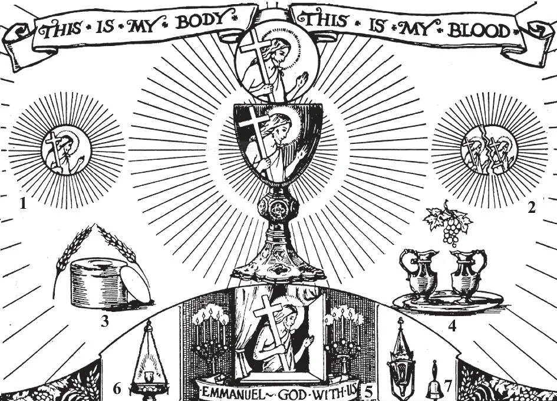

# 129. The Real Presence

*In the Holy Eucharist, Our Lord is present whole and entire, Body, Blood, Soul and Divinity. When the Blessed Sacrament is reserved in the tabernacle (5), a sanctuary lamp (6) is kept burning before it.*

**When did Christ give His priests the power to change bread and wine into His body and blood?**

— Christ gave His priests the power to change bread and wine into His body and blood when He made the Apostles priests at the Last Supper by saying to them: "Do this in remembrance of Me."

> Thus He commanded them and their successors to renew till the end of time what He had just performed. This change of bread and wine into the body and blood of Christ continues to be made in the Church by Jesus Christ, through His priests.

**How do priests exercise their power to change bread and wine into the body and blood of Christ?**

— Priests exercise their power to change bread and wine into the body and blood of Christ by repeating at the consecration of the Mass the words of Christ: "This is My body. . . .this is My blood."

> Over the bread are pronounced the words: Hoc est enim corpus meum, or "this is My Body." Over the wine are pronounced the words: Hic est enim calix sanguinis mei, or "this is the chalice of My Blood."

1. At Mass, at the words of consecration, transubstantiation takes place; that is, the entire substance of the bread and wine is changed into our Lord's Body and Blood.

> After the words of consecration, there is no longer any bread or wine on the altar, for they have been changed into Christ's Body and Blood. If it be asked how transubstantiation can possibly be effected, we reply, "By the almighty power of God."

2. The appearances of bread and wine remain. The consecrated Host continues to look like bread, tastes and feels like bread; but it is not bread, for the entire substance of bread is changed into Christ's Body.

> The same thing is true of the consecrated chalice, which continues to look, smell, and taste like wine, but there is no more wine, only Christ's blood.

**Is Jesus Christ present, whole and entire, both under the appearances of bread, and under the appearances of wine?**

— Jesus Christ is present, whole and entire, both under the appearances of bread and under the appearances of wine.

1. In the Holy Eucharist, Christ is present wholly. Body, Blood, Soul, and Divinity.

> A little child preparing for her first Holy Communion was asked the difference between a crucifix and the Blessed Sacrament. "Why," the innocent child answered, "the crucifix looks like Our Lord, but is not He. The Blessed Sacrament does not look like Our Lord, but It is He Himself!"

2. Christ is whole and entire under the appearances of bread or wine. As Christ's Body is a living body, and a living body has blood, so Christ's Blood is there wherever His Body is.

> Where Christ's living Body and Blood are, there so must be His soul, for the body and blood cannot live without the soul. And where Christ's Soul is, there also is His Divinity, which cannot be separated from His humanity.

3. Christ is whole and entire in each part of the Host and in each drop in the chalice. When the Host is broken, the Body of Christ is not broken, but He exists whole and entire in each fragment.

> In a similar way, even when we break a mirror into many pieces, each piece reflects our face.

4. Christ's Body and Blood are present in the consecrated species as long as the appearances of bread and wine remain.

> When, therefore, we receive Holy Communion, we bear within us, as long as the appearances of bread remain, the Living Christ, Son of God.

**Why does Christ give us His own body and blood in the Holy Eucharist?**

— Christ gives us His own body and blood in the Holy Eucharist:

1. To be offered as a sacrifice commemorating and renewing the sacrifice of the cross.

> "For as often as you shall eat this bread, and drink the cup, you proclaim the death of the Lord, until he comes" (1 Cor. 11: 26). In the Mass, Jesus offers Himself as a Victim to His heavenly Father.

2. To be received in Holy Communion.

> "I am the bread of life . . . He who eats my flesh, and drinks my blood, abides in me, and I in him. . . He who eats me, he also shall live because of me" (John 6: 48, 56, 58). The Holy Eucharist is food to nourish the soul. By this food we are united to Christ, Who nourishes us with His divine life; sanctifying grace and all virtues increase in our souls; our evil inclinations are lessened. The Holy Eucharist is a pledge of everlasting life: "If any man eat of this Bread, he shall live forever." Holy Communion needs the Mass to supply the consecrated species; for this reason Mass and Communion are inseparable.

3. To remain ever on our altars as a proof of His love, and to be worshipped by us.

> "Remain with us, Lord, for with Thee is the fountain of life" (Ps. 35: 10). "Come to Me, all you who labour, and are burdened, and I will give you rest" (Matt. 11: 28). We say we love Jesus; do we prove our love? When we have a dear friend, we are ever eager to be in his presence; do we show Jesus the same loving tenderness? Or are we so forgetful of Him that we go to see Him only once a week?

**Since Christ's Real Presence is in the Eucharist, what honour are we bound to render It?**

— We are bound to render the Holy Eucharist the same adoration and honour due God Himself.

1. It is a most wonderful privilege to have Christ actually present every moment of the day and night.

> When the Blessed Sacrament is in the tabernacle, it is covered with a curtain or veil, and a sanctuary lamp is kept burning before it. When we enter or leave the church, we should genuflect on the right knee towards the tabernacle, as a sign of adoration.

2. This is why the tabernacle is the most precious part of a church. Special care should be taken to keep the altar linen clean; in most parishes there are altar societies of women who devote part of their time to the care of altar linen, vestments, etc.

> The Holy Father gives us good example. The chapel of the Blessed Sacrament in the Basilica of St. Peter's is precious, with its unique tabernacle. Dozens of vigil lights burn day and night before Our Lord, as prayers for His people.

3. We can show Jesus our love and gratitude by every day paying Him a visit in the Blessed Sacrament, by attending Benediction, by hearing Holy Mass and receiving Holy Communion, by spending an hour of adoration when the Blessed Sacrament is exposed, and by other devotions.

> When we pass by a church where the Blessed Sacrament is reserved, we should bow our heads as a sign of respect, and say a short aspiration in honour of Our Lord; men should raise their hats. If we are not ill-bred enough to pass by a friend without a word or gesture of greeting, shall we be thus ill-bred towards Our Lord!
