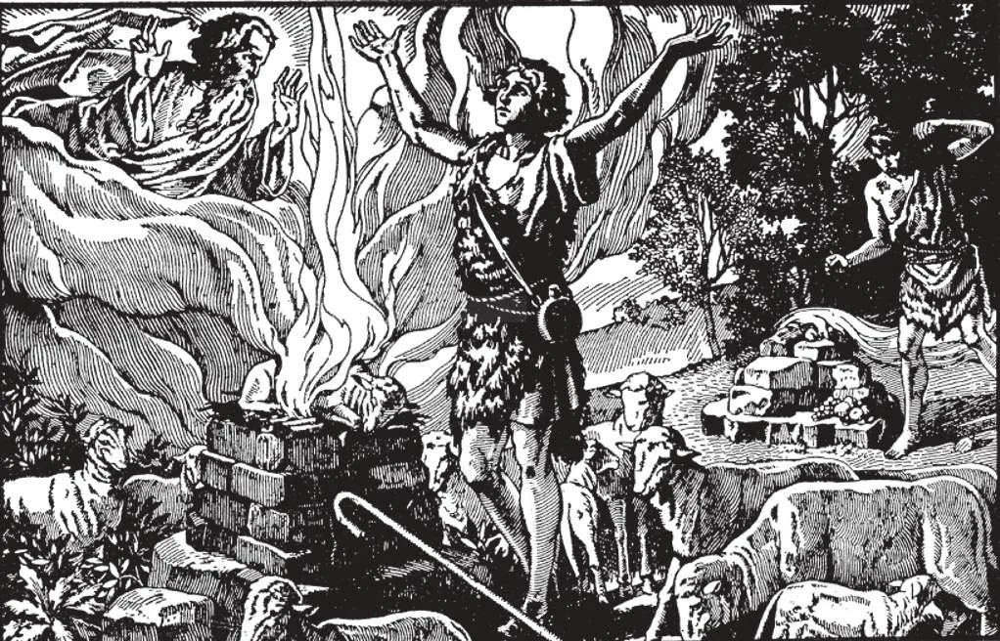

# 130. Nature and History of Sacrifice

From the beginning of man's existence, sacrifices have been offered to God. The children of Adam and Eve, Abel and Cain, offered sacrifice to God. Abel offered sheep; Cain, fruits of the earth.

**What is a sacrifice?**

— A sacrifice is the offering of a victim by a priest to God alone, and the destruction of it in some way, to acknowledge that He is the Creator and Lord of all things. 1. Man offers sacrifice to God, in acknowledgement of His supreme power, and in gratitude for His gifts, especially for the gift of life. The need for offering sacrifice is innate in human nature, as natural as breathing. Since man was made for God, his soul flies to Him if unchecked, as a balloon soars up into the air unless tied down.

> God gave us life; He breathed into us a soul that is immortal, like God Himself. Without life and a soul, we would be non-existent, nothing; we would not be able to do anything, not even to recognize God. Our life and soul therefore is our most precious possession, and for it we must thank God.

2. We must repay God for His gifts, especially for the invaluable gift of life.

> But because our life is so precious, we cannot give God enough for it, to repay him. If someone gave us a diamond ring worth five thousand dollars, and we gave him two cents in payment, that would not be as great a difference between the value of what we receive and the amount we pay as there would be when God gives us life and we repay Him with material things. But because we have nothing with which we can repay God adequately, we do our best, by offering Him what we can. This is what men do when they offer sacrifice.

3. From the very beginning of the world, men have acknowledged God's existence and power by offering sacrifice. It was first offered, then destroyed or changed, as by consuming or by fire. The oblation of a visible object is a symbol of the interior adoration and offering, by which the soul gives itself completely to its Creator.

> In common language we speak of "sacrificing" for the sake of another: for example, a mother sacrifices herself for her children, a soldier sacrifices himself for his country. The meaning is that some valuable thing is given up — time, luxuries, health, life — for the sake of another. So in offering a sacrifice to God, we give it up, for love of Him.

4. The offering of sacrifice is an honour reserved to God alone, since the formal act of

Because they did not have a knowledge of the true God, the ancient Greeks and Egyptians offered human sacrifices. The Caan a nites used to offer human victims to their idol Moloch, heating the brazen statue of the god red-hot, and casting the victims into its arms. Even today, some pagan peoples offer human sacrifices. Thus we see how perversion enters when the true God is not known.

offering and destroying an oblation is an act of worship or adoration. In order to make a solemn religious act of sacrifice to God, men have from earliest days asked priests, those consecrated to the service of God, to offer their sacrifices, to be the intermediary between man and God.

> In ordinary life, we offer valuable things to those we love or respect, as a sign of gratitude or affection. In this way we give Christmas and birthday presents, commemoration gifts, etc. But these offerings are a "sacrifice" only in the common sense of the term, and are not included in the formal sacrifice that can be offered to God alone. This last is the offering and destroying or changing of something, in acknowledgement of God's infinite majesty.

**What are the purposes of sacrifice?**

— The purposes of sacrifice are; to give honour or adoration to God, to offer Him thanks, to beg a favour, or to make propitiation.

> In other words, the purposes of sacrifice are: adoration, thanksgiving, petition, and atonement. It is natural for man to give outward expression to the feelings that move his interior being. For this reason, he bursts out in praise when he thinks of the greatness and holiness of God; he must give something up as a sign of gratitude: he must offer a gift when he feels his insignificance in begging a favour; and he tries ail kinds of penitential works when he realizes his iniquities.

**In what forms is sacrifice offered?**

— Sacrifice is offered in either the bloody or the un bloody form. 1. A sacrifice of living animals, such as an ox, a lamb, or a dove, is a bloody sacrifice. A sacrifice of some food, such as fruit, wine, or wheat, is an un bloody sacrifice.

> Among the Jews, the animals used to be slaughtered, their blood poured out upon the altar, and their flesh consumed by fire or eaten by the priests and those for whom the sacrifice was offered. The un bloody oblation was burned up or eaten by the priests after being offered; the wine was poured out on the altar.

2. The heathen, with perverted ideas, offered human sacrifices to their idols.

> The King of Moab (4 Kings 5: 27) offered his own son as a sacrifice, to obtain help against the Israelites. As St. Paul says, "What the Gentiles sacrifice, they sacrifice to devils and not to God" (1 Cor. 10: 20).

God gave to Moses detailed instructions on sacrificial offerings (Lev. 1-7; 16; 22). Among the Jews, the high-priest, in the name of the people, offered morning and evening an un bloody sacrifice of incense, flour, oil, and frankincense. Then he offered a bloody sacrifice of a lamb, together with food and drink. On the Sabbath, two lambs, with bread and wine, were offered in addition as sacrifice.

On certain solemn feasts, the Jews sacrificed hundreds of victims amidst impressive ceremonies. Their chief feasts were: (a) the Pasch or Passover, which commemorated their deliverance from Egypt; (b) the Pentecost, in remembrance of the Law received on Mount Sinai; (c) the Tabernacles, to commemorate their wanderings in the desert; and (d) the Expiation or Atonement, in which the priest sacrificed for his own and the people's sins. These sacrifices typified the sacrifice of Christ.

Among the Jews there were different ranks or orders of priests, as the high-priest, the priests, and the Levites: These ranks were a figure or type of the different orders that were to be in the Church founded by Jesus Christ. The people faithfully obeyed their priests, and supported them with alms. The Jewish sacrifices were merely types of the Sacrifice of Christ on Calvary, and ceased with the passing of the Old Law. In the New Law, we have the True Sacrifice, the same that Christ offered on Calvary by His death. The High Priest is Christ Himself, and Christ, too, is the Victim. St. Paul said, "It is impossible that sins should be taken away with blood of bulls and of goats" (Heb. 10: 4).
